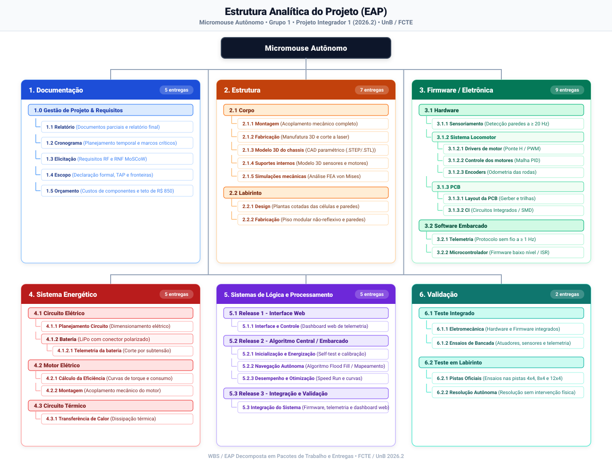

# Estrutura Analítica do Projeto (EAP)

A **Estrutura Analítica do Projeto (EAP)** — ou *Work Breakdown Structure (WBS)* — é a ferramenta central de decomposição hierárquica do escopo global do projeto **Micromouse Autônomo (Grupo 1 - PI1 2026.2, FCTE/UnB)**. 

A sua finalidade é desmembrar o trabalho total da equipe multidisciplinar (integrando as engenharias de Software, Eletrônica, Energia, Aeroespacial e Automotiva) em componentes menores e gerenciáveis, denominados **pacotes de trabalho e entregas**, assegurando a rastreabilidade direta com os objetivos do projeto e o cumprimento integral da **Regra dos 100%**.

---

## 1. Diagrama Hierárquico da EAP

A representação gráfica a seguir consolida a estrutura de decomposição do sistema, abrangendo desde a documentação de gerência até os subsistemas físicos, lógicos e de validação em pista.

=== "🌳 Visão Geral (Todas as Branches)"

    ```mermaid
    flowchart LR
        %% Hues Temáticos por Branch
        classDef root fill:#f1f5f9,stroke:#475569,stroke-width:2.5px,color:#0f172a;
        classDef docH fill:#bae6fd,stroke:#0284c7,stroke-width:2.5px,color:#0f172a;
        classDef doc fill:#e0f2fe,stroke:#0284c7,stroke-width:1.5px,color:#0f172a;
        classDef estH fill:#fed7aa,stroke:#ea580c,stroke-width:2.5px,color:#0f172a;
        classDef est fill:#ffedd5,stroke:#ea580c,stroke-width:1.5px,color:#0f172a;
        classDef eleH fill:#bbf7d0,stroke:#16a34a,stroke-width:2.5px,color:#0f172a;
        classDef ele fill:#dcfce7,stroke:#16a34a,stroke-width:1.5px,color:#0f172a;
        classDef eneH fill:#fecdd3,stroke:#e11d48,stroke-width:2.5px,color:#0f172a;
        classDef ene fill:#ffe4e6,stroke:#e11d48,stroke-width:1.5px,color:#0f172a;
        classDef logH fill:#e9d5ff,stroke:#9333ea,stroke-width:2.5px,color:#0f172a;
        classDef log fill:#f3e8ff,stroke:#9333ea,stroke-width:1.5px,color:#0f172a;
        classDef valH fill:#99f6e4,stroke:#0d9488,stroke-width:2.5px,color:#0f172a;
        classDef val fill:#ccfbf1,stroke:#0d9488,stroke-width:1.5px,color:#0f172a;

        %% Raiz
        ROOT["Micromouse Autônomo"]:::root

        %% Macro-Pacotes
        ROOT --> N1["1. Documentação"]:::docH
        ROOT --> N2["2. Estrutura"]:::estH
        ROOT --> N3["3. Firmware / Eletrônica"]:::eleH
        ROOT --> N4["4. Sistema Energético"]:::eneH
        ROOT --> N5["5. Sistemas de Lógica e Processamento"]:::logH
        ROOT --> N6["6. Validação"]:::valH

        %% 1. Documentação (Azul)
        N1 --> N1_1["1.1 Relatório"]:::doc
        N1 --> N1_2["1.2 Cronograma"]:::doc
        N1 --> N1_3["1.3 Elicitação"]:::doc
        N1 --> N1_4["1.4 Escopo"]:::doc
        N1 --> N1_5["1.5 Orçamento"]:::doc

        %% 2. Estrutura (Laranja)
        N2 --> N2_1["2.1 Corpo"]:::estH
        N2 --> N2_2["2.2 Labirinto"]:::estH
        N2_1 --> N2_1_1["2.1.1 Montagem"]:::est
        N2_1 --> N2_1_2["2.1.2 Fabricação"]:::est
        N2_1 --> N2_1_3["2.1.3 Modelo 3D do chassis"]:::est
        N2_1 --> N2_1_4["2.1.4 Modelo 3D dos suportes internos"]:::est
        N2_1 --> N2_1_5["2.1.5 Simulações de resistência mecânica"]:::est
        N2_2 --> N2_2_1["2.2.1 Design"]:::est
        N2_2 --> N2_2_2["2.2.2 Fabricação"]:::est

        %% 3. Firmware / Eletrônica (Verde)
        N3 --> N3_1["3.1 Hardware"]:::eleH
        N3 --> N3_2["3.2 Software Embarcado"]:::eleH
        N3_1 --> N3_1_1["3.1.1 Sensoriamento"]:::ele
        N3_1 --> N3_1_2["3.1.2 Sistema Locomotor"]:::eleH
        N3_1 --> N3_1_3["3.1.3 PCB"]:::eleH
        N3_1_2 --> N3_1_2_1["3.1.2.1 Drivers de motor"]:::ele
        N3_1_2 --> N3_1_2_2["3.1.2.2 Controle e acionamento dos motores"]:::ele
        N3_1_2 --> N3_1_2_3["3.1.2.3 Encoders"]:::ele
        N3_1_3 --> N3_1_3_1["3.1.3.1 Layout da PCB"]:::ele
        N3_1_3 --> N3_1_3_2["3.1.3.2 CI (Circuitos Integrados)"]:::ele
        N3_2 --> N3_2_1["3.2.1 Telemetria"]:::ele
        N3_2 --> N3_2_2["3.2.2 Microcontrolador"]:::ele

        %% 4. Sistema Energético (Vermelho)
        N4 --> N4_1["4.1 Circuito Elétrico"]:::eneH
        N4 --> N4_2["4.2 Motor Elétrico"]:::eneH
        N4 --> N4_3["4.3 Circuito Térmico"]:::eneH
        N4_1 --> N4_1_1["4.1.1 Planejamento do Circuito"]:::ene
        N4_1 --> N4_1_2["4.1.2 Bateria"]:::eneH
        N4_1_2 --> N4_1_2_1["4.1.2.1 Telemetria da bateria"]:::ene
        N4_2 --> N4_2_1["4.2.1 Cálculo da Eficiência Energética"]:::ene
        N4_2 --> N4_2_2["4.2.2 Montagem"]:::ene
        N4_3 --> N4_3_1["4.3.1 Cálculo da Transferência de Calor"]:::ene

        %% 5. Sistemas de Lógica e Processamento (Roxo)
        N5 --> N5_1["5.1 Release 1 - Interface Web"]:::logH
        N5 --> N5_2["5.2 Release 2 - Algoritmo Central e Software Embarcado"]:::logH
        N5 --> N5_3["5.3 Release 3 - Integração e Validação"]:::logH
        N5_1 --> N5_1_1["5.1.1 Interface e Controle do Usuário"]:::log
        N5_2 --> N5_2_1["5.2.1 Inicialização e Energização do Sistema"]:::log
        N5_2 --> N5_2_2["5.2.2 Navegação Autônoma"]:::log
        N5_2 --> N5_2_3["5.2.3 Desempenho e Otimização"]:::log

        %% 6. Validação (Teal)
        N6 --> N6_1["6.1 Teste Integrado"]:::val
        N6 --> N6_2["6.2 Teste em Labirinto"]:::val
    ```

=== "📋 1. Documentação"

    ```mermaid
    flowchart LR
        classDef root fill:#f1f5f9,stroke:#475569,stroke-width:2.5px,color:#0f172a;
        classDef docH fill:#bae6fd,stroke:#0284c7,stroke-width:2.5px,color:#0f172a;
        classDef doc fill:#e0f2fe,stroke:#0284c7,stroke-width:1.5px,color:#0f172a;

        ROOT["Micromouse Autônomo"]:::root
        ROOT --> N1["1. Documentação"]:::docH
        N1 --> N1_1["1.1 Relatório"]:::doc
        N1 --> N1_2["1.2 Cronograma"]:::doc
        N1 --> N1_3["1.3 Elicitação"]:::doc
        N1 --> N1_4["1.4 Escopo"]:::doc
        N1 --> N1_5["1.5 Orçamento"]:::doc
    ```

=== "🔧 2. Estrutura"

    ```mermaid
    flowchart LR
        classDef root fill:#f1f5f9,stroke:#475569,stroke-width:2.5px,color:#0f172a;
        classDef estH fill:#fed7aa,stroke:#ea580c,stroke-width:2.5px,color:#0f172a;
        classDef est fill:#ffedd5,stroke:#ea580c,stroke-width:1.5px,color:#0f172a;

        ROOT["Micromouse Autônomo"]:::root
        ROOT --> N2["2. Estrutura"]:::estH
        N2 --> N2_1["2.1 Corpo"]:::estH
        N2 --> N2_2["2.2 Labirinto"]:::estH

        N2_1 --> N2_1_1["2.1.1 Montagem"]:::est
        N2_1 --> N2_1_2["2.1.2 Fabricação"]:::est
        N2_1 --> N2_1_3["2.1.3 Modelo 3D do chassis"]:::est
        N2_1 --> N2_1_4["2.1.4 Modelo 3D dos suportes internos"]:::est
        N2_1 --> N2_1_5["2.1.5 Simulações de resistência mecânica"]:::est

        N2_2 --> N2_2_1["2.2.1 Design"]:::est
        N2_2 --> N2_2_2["2.2.2 Fabricação"]:::est
    ```

=== "⚡ 3. Firmware / Eletrônica"

    ```mermaid
    flowchart LR
        classDef root fill:#f1f5f9,stroke:#475569,stroke-width:2.5px,color:#0f172a;
        classDef eleH fill:#bbf7d0,stroke:#16a34a,stroke-width:2.5px,color:#0f172a;
        classDef ele fill:#dcfce7,stroke:#16a34a,stroke-width:1.5px,color:#0f172a;

        ROOT["Micromouse Autônomo"]:::root
        ROOT --> N3["3. Firmware / Eletrônica"]:::eleH
        N3 --> N3_1["3.1 Hardware"]:::eleH
        N3 --> N3_2["3.2 Software Embarcado"]:::eleH

        N3_1 --> N3_1_1["3.1.1 Sensoriamento"]:::ele
        N3_1 --> N3_1_2["3.1.2 Sistema Locomotor"]:::eleH
        N3_1 --> N3_1_3["3.1.3 PCB"]:::eleH

        N3_1_2 --> N3_1_2_1["3.1.2.1 Drivers de motor"]:::ele
        N3_1_2 --> N3_1_2_2["3.1.2.2 Controle e acionamento dos motores"]:::ele
        N3_1_2 --> N3_1_2_3["3.1.2.3 Encoders"]:::ele

        N3_1_3 --> N3_1_3_1["3.1.3.1 Layout da PCB"]:::ele
        N3_1_3 --> N3_1_3_2["3.1.3.2 CI (Circuitos Integrados)"]:::ele

        N3_2 --> N3_2_1["3.2.1 Telemetria"]:::ele
        N3_2 --> N3_2_2["3.2.2 Microcontrolador"]:::ele
    ```

=== "🔋 4. Sistema Energético"

    ```mermaid
    flowchart LR
        classDef root fill:#f1f5f9,stroke:#475569,stroke-width:2.5px,color:#0f172a;
        classDef eneH fill:#fecdd3,stroke:#e11d48,stroke-width:2.5px,color:#0f172a;
        classDef ene fill:#ffe4e6,stroke:#e11d48,stroke-width:1.5px,color:#0f172a;

        ROOT["Micromouse Autônomo"]:::root
        ROOT --> N4["4. Sistema Energético"]:::eneH
        N4 --> N4_1["4.1 Circuito Elétrico"]:::eneH
        N4 --> N4_2["4.2 Motor Elétrico"]:::eneH
        N4 --> N4_3["4.3 Circuito Térmico"]:::eneH

        N4_1 --> N4_1_1["4.1.1 Planejamento do Circuito"]:::ene
        N4_1 --> N4_1_2["4.1.2 Bateria"]:::eneH
        N4_1_2 --> N4_1_2_1["4.1.2.1 Telemetria da bateria"]:::ene

        N4_2 --> N4_2_1["4.2.1 Cálculo da Eficiência Energética"]:::ene
        N4_2 --> N4_2_2["4.2.2 Montagem"]:::ene

        N4_3 --> N4_3_1["4.3.1 Cálculo da Transferência de Calor"]:::ene
    ```

=== "💻 5. Sistemas de Lógica e Processamento"

    ```mermaid
    flowchart LR
        classDef root fill:#f1f5f9,stroke:#475569,stroke-width:2.5px,color:#0f172a;
        classDef logH fill:#e9d5ff,stroke:#9333ea,stroke-width:2.5px,color:#0f172a;
        classDef log fill:#f3e8ff,stroke:#9333ea,stroke-width:1.5px,color:#0f172a;

        ROOT["Micromouse Autônomo"]:::root
        ROOT --> N5["5. Sistemas de Lógica e Processamento"]:::logH
        N5 --> N5_1["5.1 Release 1 - Interface Web"]:::logH
        N5 --> N5_2["5.2 Release 2 - Algoritmo Central e Software Embarcado"]:::logH
        N5 --> N5_3["5.3 Release 3 - Integração e Validação"]:::logH

        N5_1 --> N5_1_1["5.1.1 Interface e Controle do Usuário"]:::log

        N5_2 --> N5_2_1["5.2.1 Inicialização e Energização do Sistema"]:::log
        N5_2 --> N5_2_2["5.2.2 Navegação Autônoma"]:::log
        N5_2 --> N5_2_3["5.2.3 Desempenho e Otimização"]:::log
    ```

=== "✅ 6. Validação"

    ```mermaid
    flowchart LR
        classDef root fill:#f1f5f9,stroke:#475569,stroke-width:2.5px,color:#0f172a;
        classDef valH fill:#99f6e4,stroke:#0d9488,stroke-width:2.5px,color:#0f172a;
        classDef val fill:#ccfbf1,stroke:#0d9488,stroke-width:1.5px,color:#0f172a;

        ROOT["Micromouse Autônomo"]:::root
        ROOT --> N6["6. Validação"]:::valH
        N6 --> N6_1["6.1 Teste Integrado"]:::val
        N6 --> N6_2["6.2 Teste em Labirinto"]:::val
    ```

???+ info "Visualizar representação gráfica vetorial completa (SVG)"

    <div align="center" style="margin: 1.2em 0;">
        <a href="../figs/eap.svg" target="_blank" class="md-button md-button--primary">
            :material-open-in-new: Abrir SVG em Alta Resolução (Nova Aba)
        </a>
    </div>

    

---

## 2. Estrutura Textual da EAP

Abaixo é apresentada a organização hierárquica completa em formato tabular e arbóreo:

```text
Micromouse Autônomo
├── 1. Documentação
│   ├── 1.1 Relatório
│   ├── 1.2 Cronograma
│   ├── 1.3 Elicitação
│   ├── 1.4 Escopo
│   └── 1.5 Orçamento
├── 2. Estrutura
│   ├── 2.1 Corpo
│   │   ├── 2.1.1 Montagem
│   │   ├── 2.1.2 Fabricação
│   │   ├── 2.1.3 Modelo 3D do chassis
│   │   ├── 2.1.4 Modelo 3D dos suportes internos
│   │   └── 2.1.5 Simulações de resistência mecânica
│   └── 2.2 Labirinto
│       ├── 2.2.1 Design
│       └── 2.2.2 Fabricação
├── 3. Firmware / Eletrônica
│   ├── 3.1 Hardware
│   │   ├── 3.1.1 Sensoriamento
│   │   ├── 3.1.2 Sistema Locomotor
│   │   │   ├── 3.1.2.1 Drivers de motor
│   │   │   ├── 3.1.2.2 Controle e acionamento dos motores
│   │   │   └── 3.1.2.3 Encoders
│   │   └── 3.1.3 PCB
│   │       ├── 3.1.3.1 Layout da PCB
│   │       └── 3.1.3.2 CI (Circuitos Integrados)
│   └── 3.2 Software Embarcado
│       ├── 3.2.1 Telemetria
│       └── 3.2.2 Microcontrolador
├── 4. Sistema Energético
│   ├── 4.1 Circuito Elétrico
│   │   ├── 4.1.1 Planejamento do Circuito
│   │   └── 4.1.2 Bateria (e Telemetria da bateria 4.1.2.1)
│   ├── 4.2 Motor Elétrico
│   │   ├── 4.2.1 Cálculo da Eficiência Energética
│   │   └── 4.2.2 Montagem
│   └── 4.3 Circuito Térmico
│       └── 4.3.1 Cálculo da Transferência de Calor
├── 5. Sistemas de Lógica e Processamento
│   ├── 5.1 Release 1 - Interface Web
│   │   └── 5.1.1 Interface e Controle do Usuário
│   ├── 5.2 Release 2 - Algoritmo Central e Software Embarcado
│   │   ├── 5.2.1 Inicialização e Energização do Sistema
│   │   ├── 5.2.2 Navegação Autônoma
│   │   └── 5.2.3 Desempenho e Otimização
│   └── 5.3 Release 3 - Integração e Validação
└── 6. Validação
    ├── 6.1 Teste Integrado
    └── 6.2 Teste em Labirinto
```

---

## 3. Dicionário da EAP (Work Breakdown Structure Dictionary)

O Dicionário da EAP descreve formalmente o escopo e o entregável tangível de cada pacote de trabalho da árvore, garantindo a compreensão inequívoca das entregas de engenharia por todos os membros da equipe e avaliadores.

### 1. Documentação

Gerencia e consolida todo o corpo documental formal do projeto exigido pelas diretrizes da disciplina e boas práticas do PMBOK.

| Código | Pacote de Trabalho / Entrega | Descrição do Escopo da Entrega | Entregável Tangível |
|:---:|---|---|---|
| **1.1** | Relatório | Elaboração dos relatórios técnicos e científicos periódicos (parciais e final) do projeto. | Documentos de Relatório Parcial e Relatório Final de Encerramento (formato PDF/Markdown). |
| **1.2** | Cronograma | Planejamento temporal, sequenciamento de atividades, marcos de entrega (*milestones*) e alocação de responsabilidades. | Cronograma estruturado no GitHub Projects e exportado na documentação do repositório. |
| **1.3** | Elicitação | Levantamento e especificação formal dos requisitos funcionais (RF) e não-funcionais (RNF) com todas as áreas de engenharia. | Documento formal de Requisitos com priorização MoSCoW e critérios mensuráveis de aceitação. |
| **1.4** | Escopo | Delimitação das fronteiras do produto, declaração de escopo e exclusões explícitas (*Won't Have*). | Termo de Abertura do Projeto (TAP) e declaração de escopo aprovada. |
| **1.5** | Orçamento | Levantamento detalhado de custos de aquisição de componentes, materiais, fretes e ferramentas, respeitando o teto orçamentário. | Planilha orçamentária detalhada com estimativa de custos versus despesas reais consolidadas. |

---

### 2. Estrutura

Compreende a arquitetura mecânica física do robô (chassi, suportes, rodagem e acoplamentos) e a infraestrutura física de testes (labirinto).

| Código | Pacote de Trabalho / Entrega | Descrição do Escopo da Entrega | Entregável Tangível |
|:---:|---|---|---|
| **2.1** | Corpo | Conjunto estrutural completo do robô móvel responsável pela integridade física e fixação de todos os componentes embarcados. | Chassi estrutural montado com sensores, atuadores e eletrônica acoplados. |
| **2.1.1** | Montagem | Procedimento e ferramental de união mecânica, parafusamento, colagem e acomodação de hardware e bateria no chassi. | Robô fisicamente montado em ordem de marcha sem folgas ou interferências estruturais. |
| **2.1.2** | Fabricação | Processamento e conformação das peças físicas via manufatura aditiva (impressão 3D) ou usinagem/corte laser. | Lote de componentes físicos estruturais fabricados com tolerâncias dimensionais nominais. |
| **2.1.3** | Modelo 3D do chassis | Modelagem computacional em software CAD da base estrutural de sustentação do robô. | Arquivos de modelagem CAD parametrizados (.STEP / .STL) e desenhos técnicos cotados. |
| **2.1.4** | Modelo 3D dos suportes internos | Modelagem computacional dos suportes específicos de sensores ópticos/ultrassônicos, baterias e mancais de motores. | Modelos CAD 3D (.STEP / .STL) dos suportes dedicados de fixação. |
| **2.1.5** | Simulações de resistência mecânica | Análise numérica por elementos finitos (FEA) de esforços mecânicos, vibrações e impactos toleráveis pelo chassi. | Relatório de simulação estrutural com mapas de tensão de von Mises e fatores de segurança. |
| **2.2** | Labirinto | Infraestrutura de pista física modular para ensaios, calibração de sensores e provas do robô. | Pista física de testes com piso plano e paredes ortogonais destacáveis. |
| **2.2.1** | Design | Projeto dimensional, plantas executivas e modulação das células, paredes e pinos de junção do labirinto. | Desenho técnico executivo cotado das células, paredes e traçados (4x4, 8x4 e 12x4). |
| **2.2.2** | Fabricação | Construção e pintura da base do piso (preto fosco com acabamento não reflexivo) e paredes (brancas com topo vermelho). | Conjunto físico completo de piso e paredes modulares para montagem de pistas 4x4, 8x4 e 12x4. |

---

### 3. Firmware / Eletrônica

Engloba a instrumentação sensorial, condicionamento de sinais, atuadores, placa de circuito impresso e firmware embarcado básico.

| Código | Pacote de Trabalho / Entrega | Descrição do Escopo da Entrega | Entregável Tangível |
|:---:|---|---|---|
| **3.1** | Hardware | Conjunto de subsistemas eletroeletrônicos físicos integrados para acionamento, sensoriamento e processamento embarcado. | Circuito eletrônico integrado com sensores, controladores de motor e microcontrolador em funcionamento. |
| **3.1.1** | Sensoriamento | Módulos e transdutores de medição de distância às paredes (frontal e laterais) para mapeamento e prevenção de colisão. | Conjunto de sensores calibrados com cablagem/trilhas e circuito de condicionamento de sinal. |
| **3.1.2** | Sistema Locomotor | Subsistema mecânico-elétrico responsável pela conversão de energia elétrica em tração controlada. | Conjunto integrado de motores de tração, caixas de redução, acoplamentos e rodas motrizes. |
| **3.1.2.1** | Drivers de motor | Circuitos integrados de ponte H dedicados à comutação de potência e controle bidirecional dos motores via PWM. | Módulo/circuito de drivers de potência soldado e protegido contra sobreaquecimento. |
| **3.1.2.2** | Controle e acionamento dos motores | Malhas de controle e condicionamento elétrico para linearização de torque e velocidade angular dos atuadores. | Malha de controle PID embarcada regulando a velocidade de cada roda motriz. |
| **3.1.2.3** | Encoders | Sensores de contagem de pulsos por revolução acoplados aos eixos dos motores para odometria angular. | Conjunto de encoders ópticos/magnéticos instalados e condicionados eletricamente. |
| **3.1.3** | PCB | Placa de circuito impresso dedicada para interconexão segura de todos os componentes eletrônicos. | Placa física industrial fabricada, montada e montada com componentes soldados. |
| **3.1.3.1** | Layout da PCB | Roteamento das trilhas elétricas, separação de planos de terra (lógico e potência) e posicionamento de conectores. | Arquivos industriais de manufatura Gerber, esquema elétrico e layout em CAD eletrônico. |
| **3.1.3.2** | CI (Circuitos Integrados) | Seleção, aquisição, soldagem e validação dos componentes e circuitos integrados auxiliares (reguladores, transceivers, etc.). | Componentes SMD/DIP soldados e validados nos pontos de teste da placa. |
| **3.2** | Software Embarcado | Camada de software de baixo nível responsável pela interface com o hardware, periféricos e despacho de telemetria. | Código-fonte C/C++ dos drivers de baixo nível e rotinas de leitura de sensores e rádio. |
| **3.2.1** | Telemetria | Protocolo de comunicação serial/sem fio e rotinas de empacotamento de dados operacionais do robô. | Pacote de firmware transmissor de telemetria via rádio/Wi-Fi/Bluetooth a 1 Hz. |
| **3.2.2** | Microcontrolador | Configuração de relógio, temporizadores, interrupções, conversores analógico-digitais (ADC) e interfaces de comunicação do chip. | Código de inicialização (*Board Support Package*) e configuração de registradores/periféricos. |

---

### 4. Sistema Energético

Responsável pelo armazenamento de energia, conversão e regulação elétrica, dissipação térmica e telemetria de consumo.

| Código | Pacote de Trabalho / Entrega | Descrição do Escopo da Entrega | Entregável Tangível |
|:---:|---|---|---|
| **4.1** | Circuito Elétrico | Arquitetura elétrica global de distribuição, filtragem, chaveamento geral e proteções do sistema. | Diagrama unifilar e esquemático da distribuição de potência com fusíveis e chaves de corte. |
| **4.1.1** | Planejamento do Circuito | Especificação e dimensionamento elétrico das linhas de alimentação, capacitores de desacoplamento e diodos de roda livre. | Memorial descritivo de dimensionamento elétrico e esquemático conceitual do sistema de energia. |
| **4.1.2** | Bateria | Conjunto de células eletroquímicas (LiPo/Li-Ion) dimensionadas para fornecer a corrente de partida e autonomia exigida. | Banco de baterias com conector polarizado assimétrico e sistema de carregamento balanceado. |
| **4.1.2.1** | Telemetria da bateria | Circuito divisor de tensão e amostragem analógica/digital para monitoramento contínuo da carga e proteção por subtensão. | Rotina de leitura e circuito analógico de monitoramento de tensão das células integrado ao firmware. |
| **4.2** | Motor Elétrico | Unidades de conversão eletromecânica de potência para propulsão do micromouse. | Par de motores DC com redução devidamente selecionados, testados e caracterizados. |
| **4.2.1** | Cálculo da Eficiência Energética | Análise teórica e experimental da curva de rendimento dos motores, perdas ôhmicas e consumo por ciclo de operação. | Relatório técnico com memorial de cálculo de eficiência energética, torque e consumo de corrente. |
| **4.2.2** | Montagem | Fixação física dos motores no chassi, acoplamento aos eixos das rodas motrizes e isolamento elétrico. | Conjunto motor-redutor fixado mecanicamente ao chassi e com fiação conectada à placa de potência. |
| **4.3** | Circuito Térmico | Análise do perfil de aquecimento e estratégias de dissipação passiva de calor dos componentes de potência. | Sistema de arrefecimento passivo (dissipadores térmicos e convecção pelo chassi). |
| **4.3.1** | Cálculo da Transferência de Calor | Modelagem matemática da resistência térmica entre junção, encapsulamento e ambiente sob corrente máxima contínua. | Memorial de cálculo de transferência térmica e dissipação de potência nos semicondutores. |

---

### 5. Sistemas de Lógica e Processamento

Engloba a inteligência computacional do sistema: o painel web de monitoramento, os algoritmos autônomos de navegação embarcada e a integração das releases do produto.

| Código | Pacote de Trabalho / Entrega | Descrição do Escopo da Entrega | Entregável Tangível |
|:---:|---|---|---|
| **5.1** | Release 1 - Interface Web | Primeira versão funcional da plataforma web com exibição visual dos dados de corrida e painel do operador. | Aplicação web responsiva com servidor local/nuvem conectada ao fluxo de recepção de dados. |
| **5.1.1** | Interface e Controle do Usuário | Componentes visuais do painel (grid do labirinto, velocímetro, indicador de bateria, cronômetro e histórico). | Interface gráfica interativa (frontend) com componentes visuais reativos para o operador. |
| **5.2** | Release 2 - Algoritmo Central e Software Embarcado | Núcleo de lógica decisória embarcada para exploração, mapeamento matricial e resolução do labirinto. | Firmware de navegação autônoma compilado e gravado no microcontrolador do robô. |
| **5.2.1** | Inicialização e Energização do Sistema | Rotinas de autoteste (*power-on self-test*), calibração estática dos sensores ópticos e confirmação de largada. | Sequência de inicialização e rotina de calibração automática de fundo e sensores no firmware. |
| **5.2.2** | Navegação Autônoma | Implementação do algoritmo de busca e resolução de labirintos (ex.: *Flood Fill* ou seguidor inteligente de paredes). | Módulo algorítmico de tomada de decisão, atualização de matriz de paredes e cálculo de rota. |
| **5.2.3** | Desempenho e Otimização | Algoritmo de rota rápida (*Speed Run*), suavização de curvas ortogonais e otimização de tempo de travessia. | Algoritmo de cálculo de trajetória ótima computado após a exploração inicial. |
| **5.3** | Release 3 - Integração e Validação | Integração completa do firmware de navegação autônoma com a transmissão de telemetria e o painel web. | Versão final consolidada e congelada do software do sistema (embarcado + web). |

---

### 6. Validação

Conjunto de protocolos, baterias de ensaios laboratoriais e testes em pista real para comprovação do cumprimento dos requisitos do edital.

| Código | Pacote de Trabalho / Entrega | Descrição do Escopo da Entrega | Entregável Tangível |
|:---:|---|---|---|
| **6.1** | Teste Integrado | Ensaios de bancada e em ambiente controlado para validação de interoperabilidade entre mecânica, eletrônica, energia e software. | Relatório técnico de ensaios integrados com registros osciloscópicos, telemetria e logs de erro. |
| **6.2** | Teste em Labirinto | Baterias formais de corridas autônomas nas pistas físicas oficiais (4x4, 8x4 e 12x4 células). | Relatório de validação em pista com vídeos de evidência, tempos cronometrados e mapas reconstruídos. |

---

## 4. Matriz de Rastreabilidade com os Requisitos

A tabela abaixo sintetiza a correspondência entre os macro-pacotes da EAP e os requisitos de engenharia definidos no documento de requisitos:

| Macro-Pacote da EAP | Subsistemas Atendidos | Requisitos Funcionais (RF) | Requisitos Não-Funcionais (RNF) |
|---|---|---|---|
| **1. Documentação** | Gerência / Todos | Governança de escopo e qualidade | Cumprimento de prazos, orçamento e edital |
| **2. Estrutura** | Estruturas / Labirinto | RF-EST01, RF-EST02, RF-EST03 | RNF-EST01, RNF-EST02, RNF-EST03, RNF-EST04, RNF-EST05, RNF-EST06 |
| **3. Firmware / Eletrônica** | Eletrônica / Embarcado | RF-ELE01, RF-ELE02, RF-ELE03, RF-ELE04, RF-ELE05, RF-ELE06 | RNF-ELE01, RNF-ELE02, RNF-ELE03, RNF-ELE04, RNF-ELE05 |
| **4. Sistema Energético** | Energia | RF-ENE01, RF-ENE02, RF-ENE03, RF-ENE04 | RNF-ENE01, RNF-ENE02, RNF-ENE03, RNF-ENE04, RNF-ENE05 |
| **5. Sistemas de Lógica e Processamento** | Software (Embarcado e Web) | RF-SFT01, RF-SFT02, RF-SFT03, RF-SFT04, RF-SFT05, RF-SFT06, RF-SFT07, RF-SFT08, RF-SFT09, RF-SFT10, RF-SFT11 | RNF-SFT01, RNF-SFT02, RNF-SFT03, RNF-SFT04, RNF-SFT05, RNF-SFT06 |
| **6. Validação** | Todos os Subsistemas | Verificação de missão e desafio cumprido | Cumprimento integral dos requisitos de engenharia e edital |
