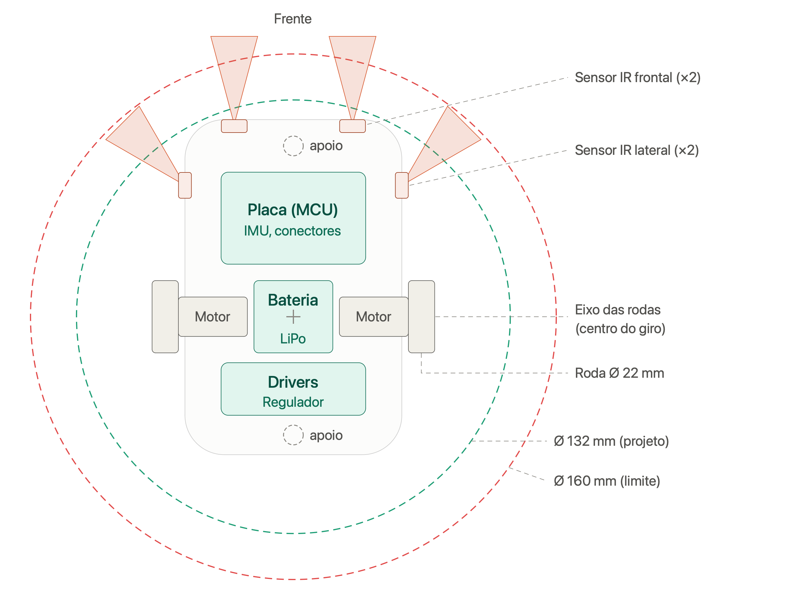
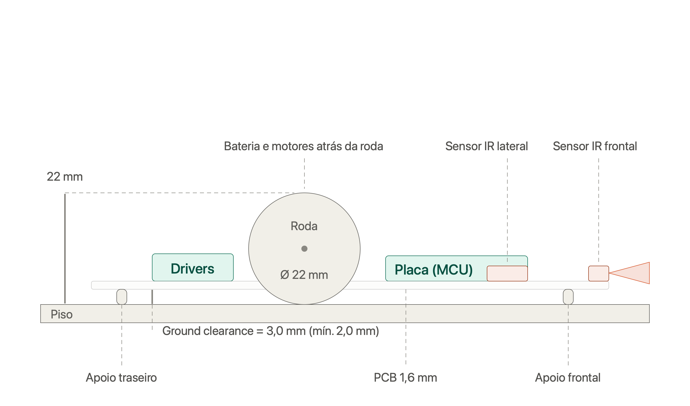
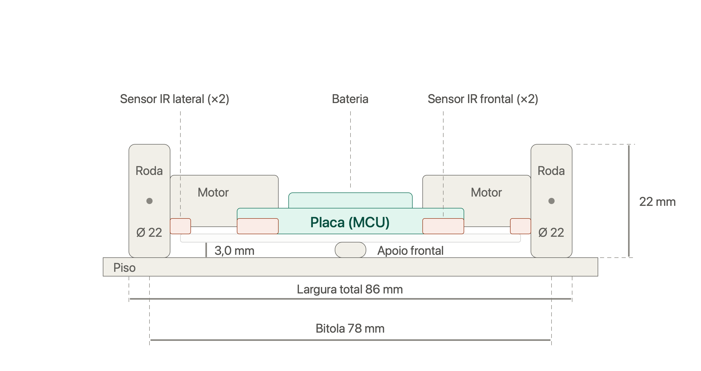
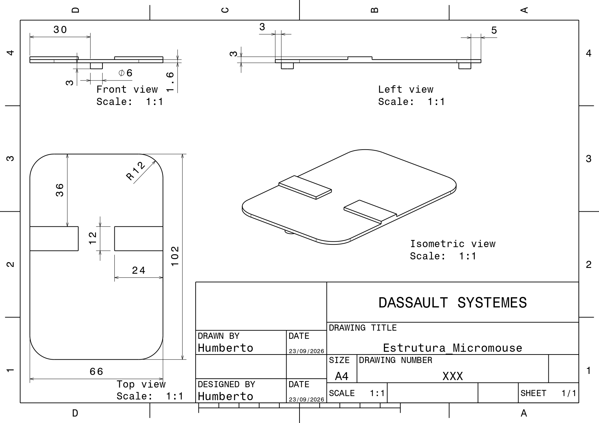

# 4.1 — Projeto Conceitual de Estruturas

Documento que consolida as duas sub-issues do núcleo de Estruturas: **Modelagem CATIA e Restrições Dimensionais** (chassi) e **Especificação do Sistema de Tração e Rodagem** (rodas, acoplamento, posicionamento e manutenção).

---

## 1. Objetivo e Requisitos de Referência

Definir conceitualmente a base mecânica (chassi) do Micromouse — posicionamento de bateria, placa eletrônica, sensores e motores — e o sistema de tração e rodagem responsável pela sua locomoção, em conformidade com:

- **RF-EST01** — Acomodação e fixação dos componentes;
- **RF-EST02** — Tração mecânica e transmissão de movimento;
- **RF-EST03** — Posicionamento fixo e desobstruído de sensores;
- **RNF-EST01** — Dimensões físicas e envelope de giro (diâmetro de giro < 160 mm, comprimento e largura ≤ 165 mm);
- **RNF-EST03** — Preservação da integridade da pista (sem cantos vivos, sem manchar);
- **RNF-EST04** — Altura livre do solo (*ground clearance*) ≥ 2,0 mm;
- **RNF-EST06** — Acessibilidade para limpeza da rodagem (≤ 120 s).

---

## 2. Desenho em CATIA

### 2.1 Vista Superior

*Contorno da PCB, posicionamento dos componentes, cones de campo óptico dos sensores e os círculos de giro (Ø 132 mm de projeto / Ø 160 mm limite regulamentar).*

### 2.2 Vista Lateral

*Perfil de alturas dos componentes e o ground clearance (altura livre do solo).*

### 2.3 Vista Frontal

*Bitola das rodas e largura total do robô.*

### 2.4 Vista Isométrica

*Visão geral tridimensional do conjunto montado.*

---

## 3. Conceito Adotado (Chassi)

O chassi usa a **própria PCB como estrutura** (contorno arredondado, cantos R12), reduzindo massa e altura. A tração é **diferencial**, com duas rodas motrizes no eixo central e dois apoios de baixo atrito (*skids*), um na frente e um atrás, mantendo o chassi nivelado sem adicionar um segundo par de motores. A bateria fica sobre o eixo das rodas para aproximar o centro de massa do centro de giro.

**Sistema de coordenadas:** origem no centro do eixo das rodas; X para a direita; Y para a frente.

### 3.1 Dimensões e Posicionamento

| Elemento | Posição / dimensão (mm) |
|---|---|
| Contorno da PCB | X ±33, Y de −42 a +60, cantos R12, espessura 1,6 |
| Rodas | Ø 22, largura 8, centros em X ±39 (bitola 78) |
| Motores (tipo N20) | 24 × 12 × 10, X de ±14 a ±35, Y ±6 |
| Bateria (LiPo) | 24 × 22 × 8, centrada em (0, 0) |
| Placa/MCU | 44 × 28, Y de +16 a +44 |
| Drivers e regulador | 44 × 16, Y de −30 a −14 |
| Apoio frontal (*skid*) | Ø 6, em (0, +52) |
| Apoio traseiro (*skid*) | Ø 6, em (0, −36) |
| Sensores IR frontais (×2) | (±18, +58), apontados a 0° |
| Sensores IR laterais (×2) | (±33, +40), apontados a 45° |

**Dimensões gerais:** largura 86 mm, comprimento 102 mm, altura 22 mm (até o topo da roda).

### 3.2 Perfil de Alturas (a partir do piso)

| Elemento | Altura |
|---|---|
| Face inferior da PCB | 3,0 mm |
| Topo da PCB | 4,6 mm |
| Eixo das rodas | 11 mm |
| Topo dos sensores IR | ≈ 7,6 mm |
| Topo das placas (drivers) | ≈ 10 mm |
| Topo da bateria | ≈ 12,6 mm |
| Topo da roda (altura total do robô) | 22 mm |

---

## 4. Materiais Utilizados

| Componente | Material | Observação |
|---|---|---|
| Chassi | PCB (FR-4), 1,6 mm de espessura | A própria placa eletrônica atua como estrutura, reduzindo massa e número de peças |
| Cubos das rodas, suportes de eixo, apoios (*skids*) | Impressão 3D — PLA ou PETG | PETG preferido onde há maior exigência dimensional (furo tipo D) |
| Pneus | O-ring de silicone (item comercial) | Compressível, alto atrito, não mancha o piso |
| Motores | N20 (corpo metálico + caixa de redução plástica), eixo tipo D | Padrão de mercado, já inclui a interface de acoplamento |
| Bateria | LiPo 2S | Fixada sobre o eixo das rodas |
| Sensores | Infravermelho (IR), montados em SMD na própria PCB | Frontais e laterais |
| Elementos de fixação | Parafusos de aço (*grub screw*) | Reforço do acoplamento eixo–roda |

---

## 5. Partes Fundamentais

- **Chassi:** a própria PCB, com contorno arredondado (R12 nos cantos) fazendo o papel de estrutura mecânica — não há chassi separado da eletrônica.
- **Rodas (atuadas):** duas rodas motrizes centralizadas no eixo transversal, com pneu de O-ring de silicone sobre cubo impresso em 3D.
- **Apoios deslizantes (*skids*):** dois pontos de apoio de baixo atrito, um dianteiro e um traseiro, mantendo o chassi nivelado sem necessidade de rodas adicionais.
- **Transmissão/acoplamento:** eixo tipo D do motor N20 encaixado por pressão no cubo da roda, reforçado com parafuso lateral.
- **Atuadores:** dois motores N20 com caixa de redução, um por roda motriz (tração diferencial).
- **Eletrônica embarcada:** placa/MCU, drivers de motor e regulador de tensão, todos integrados à própria PCB estrutural.
- **Bateria:** LiPo 2S, posicionada sobre o eixo das rodas para aproximar o centro de massa do centro de giro.
- **Sensores:** dois sensores IR frontais (0°) e dois laterais (45°), com campo óptico desobstruído por chassi ou rodas.

*(Não há carenagem/cobertura própria no conceito atual — a rodagem permanece exposta, decisão justificada na seção 9.)*

---

## 6. Explicação do Desenho

O robô é modelado a partir de um sistema de coordenadas com origem no centro do eixo das rodas (X para a direita, Y para a frente). A PCB ocupa toda a extensão do chassi (Y de −42 a +60 mm), funcionando como base estrutural: sobre ela ficam fixados a bateria (centralizada, sobre o eixo das rodas), a placa/MCU (parte traseira-superior) e os drivers/regulador (parte inferior-central), enquanto os motores N20 ficam alojados nas laterais, entre o centro e as rodas.

As rodas motrizes ficam no eixo central (X ±39 mm), permitindo tração diferencial com giro no próprio eixo. Dois apoios deslizantes — um na extremidade dianteira (Y +52) e outro na traseira (Y −36) — sustentam o chassi nos dois pontos restantes, formando uma base de 4 pontos de contato com o piso (2 rodas + 2 apoios).

Os sensores infravermelhos ficam distribuídos na borda: dois frontais na ponta dianteira (Y +58), apontados para frente, e dois laterais mais recuados (Y +40), apontados a 45° para fora — posicionamento que garante campo óptico livre tanto do próprio chassi quanto das rodas.

O contorno externo é arredondado (raio R12 nos cantos da PCB, e raio ≥ 1,0 mm em todas as peças impressas próximas às rodas), evitando arestas vivas que possam arranhar as paredes do labirinto durante o giro.

---

## 7. Sistema de Tração e Rodagem

### 7.1 Rodas e Atrito

**Decisão:** pneus de **O-ring de silicone** (Ø externo 22 mm, largura 8 mm — compatível com as cotas definidas no chassi) montados sobre cubos (*hubs*) impressos em 3D.

| Aspecto | Justificativa |
|---|---|
| Material do pneu | Silicone (O-ring comercial) em vez de borracha convencional: atrito elevado sobre o piso preto liso, sem deixar resíduo escuro ou manchar as paredes brancas em contatos acidentais — atende **RNF-EST03**. |
| Diâmetro/largura | Ø 22 mm / 8 mm, já validados no perfil de alturas do chassi (eixo a 11 mm do piso = raio da roda) e na bitola de 78 mm que resulta na largura total de 86 mm. |
| Cubo (hub) | Impresso em PLA/PETG, com canaleta para encaixe justo do O-ring — permite trocar o pneu isoladamente sem trocar a roda inteira. |

Alternativas descartadas: pneus de borracha comum (risco de manchar a pista) e rodas lisas de plástico/impressão 3D sem pneu (atrito insuficiente, risco de patinação — viola **RF-EST02**).

### 7.2 Acoplamento (eixo do motor → roda)

**Decisão:** encaixe por **eixo tipo "D" (D-shaft)**, padrão do motor N20 já definido no chassi, com furo correspondente no cubo da roda, fixado por interferência (pressão) e reforçado com parafuso de fixação (*grub screw*) ou gota de adesivo estrutural removível.

- Evita escorregamento angular entre eixo e roda mesmo sob torque de arranque.
- Furo do cubo impresso com folga controlada (~0,1–0,2 mm) para montagem por pressão sem ferramentas na operação normal.
- Reforço lateral garante fixação segura durante a corrida, sem comprometer o tempo-alvo de troca (**RNF-EST06**).

### 7.3 Posicionamento (geometria de rodagem)

**Decisão:** tração diferencial com as duas rodas motrizes centralizadas (X ±39, conforme item 3.1) + dois apoios deslizantes (*skids* Ø6) dianteiro (Y +52) e traseiro (Y −36), já definidos na modelagem do chassi.

| Elemento | Função |
|---|---|
| 2 rodas motrizes (centralizadas) | Permitem giro no próprio eixo (raio de giro ≈ 0), essencial para navegação em corredores de 168 mm sem tocar as paredes — atende **RNF-EST01**. |
| 2 *skids* (frente/trás) | Mantêm o chassi nivelado e estável sem adicionar atrito de rotação significativo nem exigir segundo par de motores. |

### 7.4 Manutenção e Limpeza da Rodagem

**Decisão:** rodas expostas nas laterais do chassi (fora do contorno da PCB, X ±39 vs. contorno ±33), sem carenagem que as encubra, com fixação *tool-less* na operação de rotina.

- Limpeza de rotina: passar um pano/escova diretamente sobre o O-ring já montado, sem remover a roda.
- Limpeza profunda (substituição do O-ring): desmontagem por pressão, sem ferramentas especiais.
- Meta de verificação: **< 120 segundos**, medida em bancada com 3 execuções por membros distintos — atende **RNF-EST06**.

### 7.5 Prevenção de Cantos Vivos

Todas as peças impressas relacionadas à rodagem (cubos, suportes de eixo, contorno lateral próximo às rodas) devem ter **raio de curvatura mínimo de 1,0 mm** em qualquer aresta que possa tocar as paredes — mesmo critério já aplicado ao contorno da PCB (R12 nos cantos), reforçando **RNF-EST03** e evitando desqualificação por dano à pista.

---

## 8. Verificação dos Requisitos

| Requisito | Verificação | Resultado |
|---|---|---|
| Largura/comprimento ≤ 165 mm | 86 mm × 102 mm | OK -  Folga de 79 mm (largura) e 63 mm (comprimento) |
| Diâmetro de giro < 160 mm | Ponto mais distante do centro de giro: canto frontal arredondado, a ~64,4 mm → diâmetro ≈ **129 mm** (círculo de projeto Ø 132 mm, já envolvendo sensores e rodas) | OK -  Folga de ~31 mm |
| Ground clearance ≥ 2,0 mm | Face inferior da PCB a **3,0 mm** do piso (raio da roda 11 mm − altura do eixo acima da face inferior da PCB, 8 mm = 3 mm). Sem componentes ou soldas na face inferior. | OK -  Margem de 1,0 mm |
| Campo óptico dos sensores desobstruído | Frontais: nada à frente invade o cone de ±15°. Laterais: ficam ~29 mm à frente da borda da roda (que fica atrás), cone aponta para fora/frente — a roda nunca entra no campo. Nenhum componente mais alto que os sensores (≈7,6 mm) fica à frente deles. | OK |
| Tração sem patinar e sem manchar a pista | Pneu de O-ring de silicone | OK |
| Limpeza da rodagem em < 120 s | Rodas expostas, sem desmontagem necessária | OK |
| Sem cantos vivos que arranhem a pista | Raio ≥ 1,0 mm em todas as arestas de contato | OK |

> **Atestado do limite dimensional:** o robô, com largura de 86 mm e comprimento de 102 mm, está integralmente dentro do limite máximo de **16,5 cm (165 mm)** de comprimento e largura exigido pelo edital da disciplina.

---

## 9. Justificativa das Principais Decisões de Projeto

**PCB como estrutura (chassi único):** elimina a necessidade de uma peça estrutural separada, reduzindo massa, altura total e número de componentes a fabricar — direto benefício para o diâmetro de giro e para o *ground clearance*.

**Tração diferencial centralizada + apoios deslizantes (em vez de 4 rodas ou direção tipo automotiva):** é a configuração que permite giro no próprio eixo (raio ≈ 0), essencial para navegar nos corredores de 168 mm de largura sem tocar as paredes, com metade do hardware (motores/drivers) de uma tração 4WD.

**Pneu de O-ring de silicone (em vez de borracha comum ou roda de PU/TPU):** é a única opção, entre as avaliadas, que garante boa aderência no piso preto sem risco de manchar a pista — critério que desqualificaria o robô — mantendo custo e prazo compatíveis com o orçamento do projeto.

**Acoplamento por eixo D + fixação removível (em vez de fixação só por parafuso, luva flexível ou engrenagens):** aproveita a interface que o motor N20 já oferece de fábrica, transmite torque por encaixe geométrico (sem escorregamento) e ainda permite desmontagem rápida para manutenção.

**Rodagem exposta, sem carenagem (em vez de tampa removível, roda com trava rápida ou sistema de autolimpeza):** é a alternativa mais simples que já atende ao requisito de limpeza em menos de 120 segundos, sem adicionar peças ou passos extras.

**Arredondamento de cantos já no projeto (R ≥ 1,0 mm), em vez de chanfro, lixamento isolado ou revestimento protetor:** resolve o risco de dano à pista na origem (geometria), em vez de mascará-lo depois — a alternativa com menor risco de desqualificação.

**Posicionamento dos sensores (frontais a 0°, laterais a 40 mm à frente da roda, a 45°):** garante que nenhum sensor tenha seu campo óptico obstruído pelo próprio chassi ou pelas rodas, condição necessária para o mapeamento confiável do labirinto.

---

## 10. Matriz de Rastreabilidade

| Decisão de Projeto | Requisito Atendido |
|---|---|
| PCB como estrutura do chassi | RF-EST01 |
| Posicionamento e orientação dos sensores IR | RF-EST03 |
| Pneu de silicone (O-ring), sem resíduo | RNF-EST03 |
| Diâmetro/largura da roda (Ø22×8) coerente com o perfil de alturas do chassi | RNF-EST01, RNF-EST04 |
| Acoplamento por eixo D (motor N20) + fixação removível | RF-EST02, RNF-EST06 |
| Tração diferencial centralizada + *skids* dianteiro/traseiro | RF-EST02, RNF-EST01 |
| Rodagem exposta e sem ferramentas para limpeza | RNF-EST06 |
| Raio de curvatura ≥ 1,0 mm nas peças da rodagem | RNF-EST03 |
