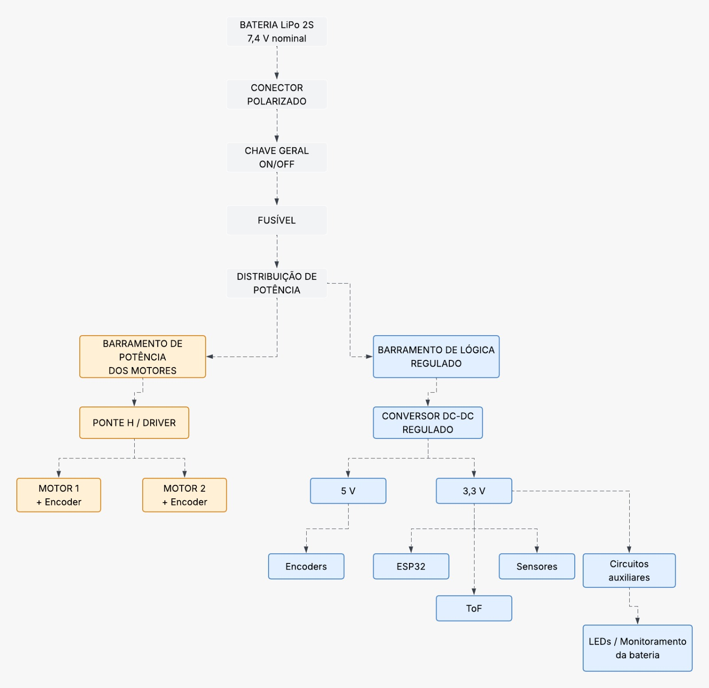
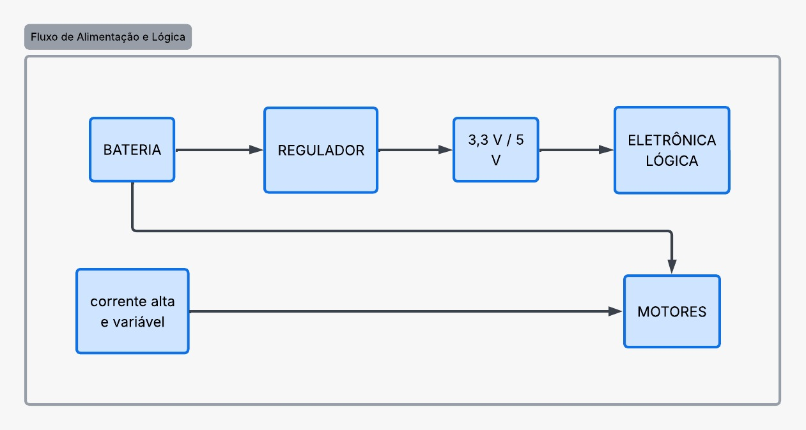
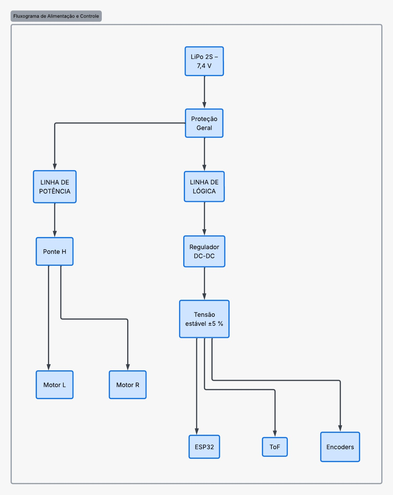

# Projeto Conceitual de Energia

## Dimensionamento Preliminar v1 — Bateria e Demanda Energética

**Projeto Integrador 1 — 2026.2**  
**Micromouse UnB — Grupo 1**  
**Documento de apoio à issue:** `[AP5] Dimensionamento da Bateria e Proteções #19 e [AP5] Diagrama de Distribuição de Potência #18 `

!!! note "Status do documento"
    Este documento apresenta uma **estimativa conceitual preliminar** do sistema de alimentação e está sujeito à revisão após a seleção dos componentes definitivos.

---

## 1. Objetivo e escopo

Este documento consolida o **Dimensionamento Preliminar v1** do sistema de alimentação do **Micromouse UnB — Grupo 1**.

O objetivo desta etapa é:

- estimar a energia necessária para **15 minutos de navegação ativa**;
- comparar diferentes condições de consumo;
- estabelecer uma faixa inicial de capacidade para uma bateria **LiPo 2S**;
- estruturar conceitualmente a distribuição de energia entre os subsistemas;
- identificar as informações necessárias para o dimensionamento definitivo.

O dimensionamento apresentado nesta versão é conceitual. Como os modelos definitivos de motores, driver, microcontrolador, sensores, reguladores e bateria ainda não foram selecionados, parte dos valores de corrente empregados constitui **hipótese preliminar de engenharia**.

Esses valores deverão ser posteriormente substituídos por dados provenientes dos respectivos *datasheets* e por medições experimentais realizadas no protótipo.

!!! important "Limitação da V1"
    Nenhum valor desta versão deve ser interpretado como uma especificação final de compra.

    O Dimensionamento Preliminar v1 tem como finalidade orientar a seleção dos componentes e permitir o avanço do projeto enquanto os modelos definitivos ainda estão em processo de escolha.

---

## 2. Requisitos do projeto que orientam o cálculo

O dimensionamento energético foi estruturado considerando os requisitos previamente estabelecidos para o subsistema de Energia e suas interfaces com Eletrônica e Software.

| Requisito | Implicação para o sistema de Energia |
|---|---|
| **RNF-ENE01** | Garantir autonomia operacional contínua mínima de **15 minutos** em navegação ativa, com sensores e comunicação funcionando. |
| **RF-ENE02** | Realizar medição contínua da tensão do banco de baterias e disponibilizar essa informação para processamento e telemetria. |
| **RF-ENE03** | Proteger a bateria contra descarga profunda, com desligamento da tração em menos de **200 ms** após a detecção do limiar crítico. |
| **RF-ELE01 / RF-ELE02** | Alimentar o sistema de sensoriamento de paredes em três direções e a odometria independente das duas rodas motrizes. |
| **RF-SFT05** | Disponibilizar o nível/consumo da bateria como um dos parâmetros obrigatórios de telemetria. |

---

## 3. Premissas do Dimensionamento Preliminar v1

Para a realização dos cálculos preliminares foram adotadas as seguintes hipóteses:

- bateria prevista: **LiPo 2S**;
- tensão nominal do banco de baterias: **7,4 V**;
- autonomia mínima considerada: **15 minutos**;
- tempo equivalente:

$$
t = 15\ min = 900\ s = 0,25\ h
$$

- dois motores DC com encoder;
- uma ponte H capaz de controlar os dois motores;
- um microcontrolador da família **ESP32**, com comunicação Wi-Fi;
- três sensores de distância do tipo **ToF**:
    - frontal;
    - lateral esquerdo;
    - lateral direito;
- dois encoders, um por roda motriz;
- indicadores visuais;
- circuito de monitoramento da bateria.

Os valores de corrente utilizados para motores, encoders, indicadores e circuito de monitoramento são estimativas preliminares e deverão ser revisados após a escolha dos componentes definitivos.

---

## 4. Modelo de cálculo energético

Para cada componente, a energia consumida durante uma execução de 15 minutos é estimada pela relação:

$$
E = V \cdot I \cdot t
$$

onde:

- $E$ = energia consumida, em joules (J);
- $V$ = tensão de operação, em volts (V);
- $I$ = corrente média, em ampères (A);
- $t$ = tempo de operação, em segundos (s).

A conversão da energia de joules para watt-hora é realizada por:

$$
E_{Wh} = \frac{E_J}{3600}
$$

Como os cálculos consideram uma execução de:

$$
t = 0,25\ h
$$

a potência média equivalente de cada cenário pode ser obtida por:

$$
P_{\text{média}} = \frac{E_{Wh}}{0,25}
$$

---

## 5. Três cenários de consumo adotados

Devido à ausência dos modelos definitivos dos componentes, foram definidos três cenários de operação para avaliar a sensibilidade do dimensionamento às variações de corrente.

| Carga | Baixo | Nominal | Conservador |
|---|---:|---:|---:|
| Cada motor DC (6 V) | 0,30 A | 0,50 A | 0,80 A |
| ESP32 + Wi-Fi (3,3 V) | 80 mA | 120 mA | 200 mA |
| Cada sensor ToF (2,8 V) | 12 mA | 19 mA | 25 mA |
| Cada encoder (5 V) | 5 mA | 10 mA | 20 mA |
| Driver ponte H — lógica (3,3 V) | 1,1 mA | 1,5 mA | 2,2 mA |
| LEDs/indicadores (3,3 V) | 10 mA | 20 mA | 40 mA |
| Monitor da bateria (7,4 V) | 0,5 mA | 1,0 mA | 2,0 mA |

!!! tip "Interpretação dos cenários"
    **Baixo:** representa uma condição de operação leve.

    **Nominal:** constitui a principal referência utilizada no Dimensionamento Preliminar v1.

    **Conservador:** considera correntes superiores para reduzir o risco de subdimensionamento enquanto os componentes definitivos ainda não são conhecidos.

---

## 6. Cálculo energético por cenário

### 6.1 Cenário baixo

| Componente | V | I total (A) | t (s) | E (J) | E (Wh) |
|---|---:|---:|---:|---:|---:|
| 2 motores DC | 6,0 | 0,600 | 900 | 3240,00 | 0,9000 |
| ESP32 + Wi-Fi | 3,3 | 0,080 | 900 | 237,60 | 0,0660 |
| 3 sensores ToF | 2,8 | 0,036 | 900 | 90,72 | 0,0252 |
| 2 encoders | 5,0 | 0,010 | 900 | 45,00 | 0,0125 |
| Driver ponte H — lógica | 3,3 | 0,0011 | 900 | 3,27 | 0,0009 |
| LEDs/indicadores | 3,3 | 0,010 | 900 | 29,70 | 0,0083 |
| Monitor da bateria | 7,4 | 0,0005 | 900 | 3,33 | 0,0009 |

**Energia total:**

$$
E_{\text{baixo}} \approx 3649,62\ J
$$

ou:

$$
E_{\text{baixo}} \approx 1,014\ Wh
$$

A potência média correspondente é:

$$
P_{\text{baixo}} \approx 4,06\ W
$$

---

### 6.2 Cenário nominal

| Componente | V | I total (A) | t (s) | E (J) | E (Wh) |
|---|---:|---:|---:|---:|---:|
| 2 motores DC | 6,0 | 1,000 | 900 | 5400,00 | 1,5000 |
| ESP32 + Wi-Fi | 3,3 | 0,120 | 900 | 356,40 | 0,0990 |
| 3 sensores ToF | 2,8 | 0,057 | 900 | 143,64 | 0,0399 |
| 2 encoders | 5,0 | 0,020 | 900 | 90,00 | 0,0250 |
| Driver ponte H — lógica | 3,3 | 0,0015 | 900 | 4,46 | 0,0012 |
| LEDs/indicadores | 3,3 | 0,020 | 900 | 59,40 | 0,0165 |
| Monitor da bateria | 7,4 | 0,0010 | 900 | 6,66 | 0,0019 |

**Energia total:**

$$
E_{\text{nominal}} \approx 6060,56\ J
$$

ou:

$$
E_{\text{nominal}} \approx 1,683\ Wh
$$

A potência média correspondente é:

$$
P_{\text{nominal}} \approx 6,73\ W
$$

---

### 6.3 Cenário conservador

| Componente | V | I total (A) | t (s) | E (J) | E (Wh) |
|---|---:|---:|---:|---:|---:|
| 2 motores DC | 6,0 | 1,600 | 900 | 8640,00 | 2,4000 |
| ESP32 + Wi-Fi | 3,3 | 0,200 | 900 | 594,00 | 0,1650 |
| 3 sensores ToF | 2,8 | 0,075 | 900 | 189,00 | 0,0525 |
| 2 encoders | 5,0 | 0,040 | 900 | 180,00 | 0,0500 |
| Driver ponte H — lógica | 3,3 | 0,0022 | 900 | 6,53 | 0,0018 |
| LEDs/indicadores | 3,3 | 0,040 | 900 | 118,80 | 0,0330 |
| Monitor da bateria | 7,4 | 0,0020 | 900 | 13,32 | 0,0037 |

**Energia total:**

$$
E_{\text{conservador}} \approx 9741,65\ J
$$

ou:

$$
E_{\text{conservador}} \approx 2,706\ Wh
$$

A potência média correspondente é:

$$
P_{\text{conservador}} \approx 10,82\ W
$$

No cenário nominal, os dois motores respondem por aproximadamente **89% da energia estimada**.

Esse resultado demonstra que a escolha dos motores e, principalmente, a corrente real durante a navegação constituem as variáveis de maior impacto no dimensionamento definitivo do sistema de Energia.

---

## 7. Perdas e margem de engenharia

A energia calculada diretamente nas cargas não considera todas as perdas presentes no sistema de alimentação.

Entre essas perdas estão:

- reguladores de tensão;
- conversores DC-DC;
- ponte H;
- trilhas da PCB;
- cabeamento;
- conectores;
- dispositivos de proteção.

Como esses componentes ainda não foram selecionados, o Dimensionamento Preliminar v1 considera provisoriamente um acréscimo de **15%** sobre a energia das cargas para representar as perdas do sistema.

Após essa correção, é aplicada uma margem adicional de engenharia de **30%**, destinada a absorver as incertezas associadas aos componentes ainda não definidos.

!!! note "Margens adotadas"
    Os valores de **15% para perdas** e **30% para margem de engenharia** são hipóteses desta etapa conceitual.

    Eles deverão ser reavaliados no dimensionamento definitivo utilizando as eficiências reais dos conversores, do driver e dos demais componentes selecionados.

| Cenário | Energia nas cargas (Wh) | Após +15% de perdas (Wh) | Após +30% de margem (Wh) |
|---|---:|---:|---:|
| Baixo | 1,014 | 1,166 | 1,516 |
| Nominal | 1,683 | 1,936 | 2,517 |
| Conservador | 2,706 | 3,112 | 4,045 |

Para o cenário conservador:

$$
E_{\text{projeto}} \approx 4,045\ Wh
$$

---

## 8. Conversão para capacidade da bateria LiPo 2S

Considerando uma bateria LiPo 2S com tensão nominal de:

$$
V_{\text{bat}} = 7,4\ V
$$

a capacidade equivalente pode ser determinada por:

$$
C_{Ah} = \frac{E_{Wh}}{V_{\text{bat}}}
$$

Para converter o resultado para miliampère-hora:

$$
C_{mAh} = 1000 \cdot C_{Ah}
$$

Aplicando essa relação aos três cenários:

| Cenário | Energia de projeto (Wh) | Capacidade equivalente em 7,4 V |
|---|---:|---:|
| Baixo | 1,516 | ≈ 205 mAh |
| Nominal | 2,517 | ≈ 340 mAh |
| Conservador | 4,045 | ≈ 547 mAh |

!!! important "Resultado-chave"
    O cenário conservador resulta em uma capacidade mínima preliminar de aproximadamente **547 mAh**, já considerando as hipóteses de perdas e margem de engenharia.

    Esse valor **não representa ainda a capacidade final da bateria a ser adquirida**.

---

## 9. Faixa preliminar de bateria

Com base no cenário conservador, estabelece-se inicialmente como faixa de estudo uma bateria:

**LiPo 2S entre 650 mAh e 1000 mAh.**

Essa faixa fornece reserva energética sobre a capacidade mínima preliminar calculada e permite que a equipe avalie simultaneamente:

- autonomia;
- corrente disponível;
- massa;
- volume;
- dimensões;
- conector;
- integração estrutural ao chassi.

| Bateria considerada | Tensão nominal | Capacidade | Energia nominal |
|---|---:|---:|---:|
| LiPo 2S — 650 mAh | 7,4 V | 0,650 Ah | 4,81 Wh |
| LiPo 2S — 850 mAh | 7,4 V | 0,850 Ah | 6,29 Wh |
| LiPo 2S — 1000 mAh | 7,4 V | 1,000 Ah | 7,40 Wh |

Para esta etapa do projeto, uma bateria de aproximadamente **850 mAh** é utilizada apenas como **referência conceitual intermediária**.

A decisão definitiva deverá considerar simultaneamente:

- consumo energético;
- corrente de pico;
- corrente de *stall* dos motores;
- C-rating;
- massa;
- dimensões;
- conector;
- limitações estruturais do robô.

---

## 10. Capacidade energética e capacidade de fornecimento de corrente

Os cálculos anteriores verificam principalmente a energia necessária para atender ao requisito de autonomia.

Entretanto, possuir energia suficiente não garante, por si só, que a bateria seja capaz de fornecer as correntes instantâneas exigidas pelos motores.

Durante:

- partida;
- aceleração;
- frenagem;
- mudança de sentido;
- eventual travamento das rodas;

a corrente exigida pelos motores pode ser significativamente superior à corrente média utilizada no cálculo energético.

A corrente máxima teórica disponibilizada por uma bateria pode ser relacionada à sua capacidade e ao respectivo C-rating:

$$
I_{\text{máx}} = C_{Ah} \cdot C_{\text{rating}}
$$

Como exemplo exclusivamente matemático, para uma bateria de:

$$
C = 0,85\ Ah
$$

e classificação:

$$
C_{\text{rating}} = 20C
$$

teríamos:

$$
I_{\text{máx}} = 0,85 \cdot 20
$$

$$
I_{\text{máx}} = 17\ A
$$

Esse exemplo não significa que o projeto necessite de uma bateria de 20C.

O C-rating mínimo somente poderá ser determinado após a identificação da corrente de *stall* dos motores selecionados.

!!! warning "Pendência crítica"
    A **corrente de stall dos motores** é uma informação indispensável para:

    - definir o C-rating mínimo da bateria;
    - dimensionar o fusível;
    - verificar a corrente admissível da ponte H;
    - verificar conectores;
    - dimensionar condutores e trilhas de potência.

---

## 11. Arquitetura elétrica conceitual associada ao dimensionamento

A arquitetura elétrica deverá separar a linha de potência destinada aos motores da alimentação utilizada pela eletrônica lógica e pelos sensores.

Essa separação tem como objetivo reduzir a propagação de:

- picos de corrente;
- ruído elétrico;
- transitórios de comutação;
- quedas temporárias de tensão;

para os circuitos mais sensíveis do robô.

A estrutura conceitual pode ser resumida da seguinte maneira:

```text
LiPo 2S — 7,4 V nominal
          │
          ▼
Conector polarizado
          │
          ▼
Chave geral
          │
          ▼
Fusível
          │
          ▼
Distribuição de potência
          │
          ├──► Barramento de potência ──► Ponte H ──► Motores
          │
          └──► Barramento regulado ──► ESP32 + sensores + encoders
```

---

### 11.1 Arquitetura geral do sistema de alimentação

O diagrama a seguir apresenta o caminho conceitual completo da energia no Micromouse.

A bateria LiPo 2S alimenta inicialmente os dispositivos gerais de conexão, seccionamento e proteção:

1. conector polarizado;
2. chave geral;
3. fusível.

Somente após essa etapa ocorre a distribuição da energia para os dois grandes grupos de cargas:

- **barramento de potência dos motores**;
- **barramento regulado de lógica e sensoriamento**.



<p align="center">
  <em>Figura 1 — Arquitetura conceitual detalhada do sistema de alimentação do Micromouse.</em>
</p>

<p align="center">
  <em>Fonte: elaboração da equipe do projeto Micromouse UnB — Grupo 1 (2026).</em>
</p>

!!! note "Tensões indicadas no diagrama"
    Os níveis intermediários de **5 V** e **3,3 V** apresentados são conceituais nesta etapa.

    A configuração definitiva dos barramentos dependerá dos modelos selecionados para ESP32, sensores, encoders, driver e demais componentes.

---

### 11.2 Separação entre potência e lógica e imunidade a transitórios

Os motores representam a principal carga energética do sistema e apresentam comportamento elétrico altamente variável.

Durante eventos como:

**partida → aceleração → frenagem → mudança de sentido → eventual travamento**

podem ocorrer correntes significativamente superiores à corrente média de navegação.

Por esse motivo, a eletrônica lógica deverá utilizar uma alimentação regulada dedicada, enquanto os motores permanecem associados ao barramento de potência de corrente elevada e variável.



<p align="center">
  <em>Figura 2 — Separação conceitual entre alimentação lógica regulada e cargas de potência.</em>
</p>

<p align="center">
  <em>Fonte: elaboração da equipe do projeto Micromouse UnB — Grupo 1 (2026).</em>
</p>

Essa separação tem como objetivo reduzir a propagação dos transitórios produzidos pelos motores para o ESP32 e para os sensores.

No projeto definitivo deverão ser dimensionados:

1. **regulador dedicado para a eletrônica de controle**;
2. **capacitores de desacoplamento próximos aos circuitos integrados**;
3. **capacitor de maior capacidade próximo ao driver dos motores**;
4. **caminhos separados para correntes de potência e lógica**;
5. **retorno de corrente adequadamente organizado**;
6. **trilhas, conectores e condutores compatíveis com a corrente máxima prevista**.

O objetivo é manter a alimentação lógica dentro da tolerância estabelecida mesmo durante transitórios causados pelos motores.

---

### 11.3 Representação simplificada do fluxo de alimentação e controle

A representação seguinte sintetiza a arquitetura elétrica em dois ramos principais após a etapa de proteção geral.

No ramo de potência:

**proteção → linha de potência → ponte H → motores**

No ramo lógico:

**proteção → linha de lógica → regulador DC-DC → ESP32, sensores e encoders**



<p align="center">
  <em>Figura 3 — Fluxograma simplificado de alimentação, proteção e distribuição entre potência e lógica.</em>
</p>

<p align="center">
  <em>Fonte: elaboração da equipe do projeto Micromouse UnB — Grupo 1 (2026).</em>
</p>

Na representação, o bloco **Proteção Geral** sintetiza os dispositivos de proteção e seccionamento localizados antes da divisão entre os barramentos.

Os valores definitivos de:

- tensão;
- corrente;
- reguladores;
- proteções;
- condutores;

serão consolidados após a seleção dos dispositivos reais e a substituição das hipóteses desta V1 por dados de *datasheet* e ensaios.

---

### 11.4 Monitoramento da bateria

A tensão da bateria deverá ser monitorada pelo sistema embarcado.

Entre as alternativas conceituais estão:

- divisor resistivo conectado ao ADC do microcontrolador;
- circuito integrado dedicado de monitoramento;
- sensor combinado de tensão e corrente.

O sistema deverá disponibilizar ao firmware informações suficientes para:

- medir a tensão da bateria;
- registrar o tempo de funcionamento;
- estimar o estado energético;
- alimentar a telemetria;
- identificar condição de subtensão;
- comandar o desligamento da tração quando necessário.

O mecanismo definitivo deverá atender ao requisito de desativação da tração em menos de **200 ms** após a identificação do limiar crítico de subtensão.

---

## 12. Dados necessários para o dimensionamento definitivo

Após a seleção dos componentes do protótipo, o Dimensionamento Preliminar v1 deverá ser atualizado utilizando dados reais provenientes de *datasheets* e medições.

As informações necessárias são apresentadas a seguir.

| Item | Informações necessárias |
|---|---|
| **Motores DC — prioridade máxima** | Modelo exato, tensão nominal, corrente sem carga, corrente nominal sob carga, corrente de *stall*, RPM, relação de redução e torque. |
| **Encoders** | Modelo ou identificação do encoder integrado, tensão de alimentação, tipo de saída e consumo. |
| **Driver / ponte H** | Modelo, tensão VM, tensão lógica, corrente contínua por canal, corrente de pico, RDS(on) ou queda de tensão e limites térmicos. |
| **Microcontrolador / placa** | Modelo exato da placa, incluindo a variante específica do ESP32 utilizada. |
| **Sensores de distância** | Modelo, quantidade e identificação se são sensores isolados ou módulos/*breakouts*. |
| **Outros sensores** | IMU, giroscópio, sensor de corrente/tensão ou qualquer sensor adicional. |
| **Reguladores / conversores** | Modelo, tensão de entrada, tensão de saída, corrente máxima e curva de eficiência. |
| **Bateria candidata** | Marca/modelo, configuração 2S, capacidade, C-rating, corrente máxima, massa, dimensões e conector. |
| **BMS / proteção** | Modelo, corrente máxima, limites de sobrecarga/subtensão e consumo próprio, caso utilizado. |
| **Monitoramento da bateria** | Divisor resistivo, CI monitor, sensor de corrente/tensão ou arquitetura escolhida. |
| **LEDs e buzzer** | Quantidade e corrente prevista de cada indicador ou atuador auxiliar. |
| **Módulos adicionais** | Memória, cartão SD, rádio separado, conversores de nível, display ou qualquer carga adicional. |
| **Conectores e fiação** | Tipo de conector da bateria, bitola e comprimento aproximado dos condutores de potência. |
| **Fusível** | O valor definitivo será dimensionado após o conhecimento das características dos motores, driver, bateria e condutores. |

### Ordem recomendada de definição dos componentes

Para reduzir retrabalho no dimensionamento energético, recomenda-se a seguinte sequência:

```text
MOTORES
   ↓
DRIVER
   ↓
PLACA ESP32
   ↓
SENSORES
   ↓
REGULADORES
   ↓
BATERIA
```

Os **motores** possuem prioridade porque representam a principal parcela do consumo e determinam parte significativa das exigências de corrente do restante do sistema.

---

## 13. Síntese do Dimensionamento Preliminar v1

| Parâmetro | Resultado preliminar |
|---|---|
| Autonomia considerada | **15 min / 900 s / 0,25 h** |
| Bateria considerada | **LiPo 2S — 7,4 V nominal** |
| Energia — cenário baixo | **1,014 Wh** antes das margens |
| Energia — cenário nominal | **1,683 Wh** antes das margens |
| Energia — cenário conservador | **2,706 Wh** antes das margens |
| Hipótese de perdas | **+15%** |
| Margem adicional de engenharia | **+30% após as perdas** |
| Energia conservadora de projeto | **≈ 4,045 Wh** |
| Capacidade mínima preliminar | **≈ 547 mAh** |
| Faixa inicial para estudo | **650 a 1000 mAh** |
| Referência conceitual intermediária | **≈ 850 mAh** |
| Principal incerteza | **Consumo e corrente de stall dos motores** |

---

## 14. Conclusão

O Dimensionamento Preliminar v1 indica que uma bateria **LiPo 2S**, com tensão nominal de **7,4 V** e capacidade situada inicialmente entre **650 mAh e 1000 mAh**, constitui um ponto de partida plausível para o desenvolvimento do Micromouse.

O cenário conservador resultou em uma necessidade energética de aproximadamente:

$$
E_{\text{projeto}} \approx 4,045\ Wh
$$

correspondente a uma capacidade preliminar mínima de:

$$
C_{\text{mín}} \approx 547\ mAh
$$

Considerando a necessidade de reserva energética, uma bateria de aproximadamente **850 mAh** é utilizada nesta etapa apenas como referência conceitual.

A seleção definitiva somente poderá ser realizada após a definição dos principais componentes do sistema, especialmente dos motores.

Na versão definitiva deverão ser avaliados:

- corrente média real;
- corrente de partida;
- corrente de *stall*;
- C-rating;
- eficiência dos reguladores;
- perdas na ponte H;
- consumo efetivo dos sensores;
- massa e dimensões da bateria;
- corrente admissível dos condutores e conectores;
- dimensionamento das proteções elétricas.

Portanto, a V1 não estabelece uma bateria final de compra, mas fornece uma **base quantitativa para orientar as próximas decisões de engenharia**.

---

## 15. Referências internas do projeto

- **Documento de Requisitos do Projeto — Micromouse (PI1 2026.2 — Grupo 1)**.
- **Termo de Abertura do Projeto (TAP) — Micromouse UnB — Grupo 1**.
- **Issue `[AP5] Dimensionamento da Bateria e Proteções #19`**.
- **Issue `[AP5] Diagrama de Distribuição de Potência #18`**.
- **Arquivo `4.2 - Projeto conceitual de energia.md`**.