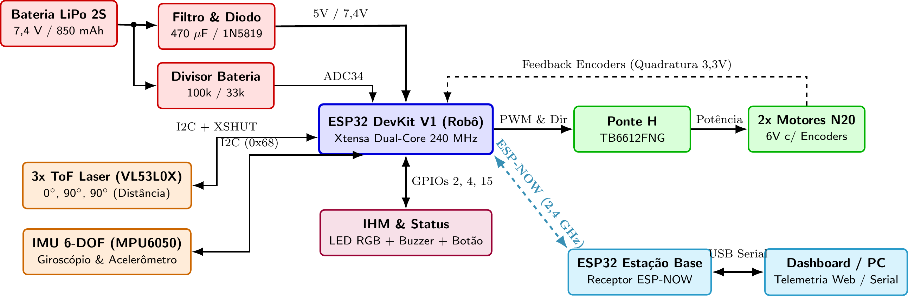
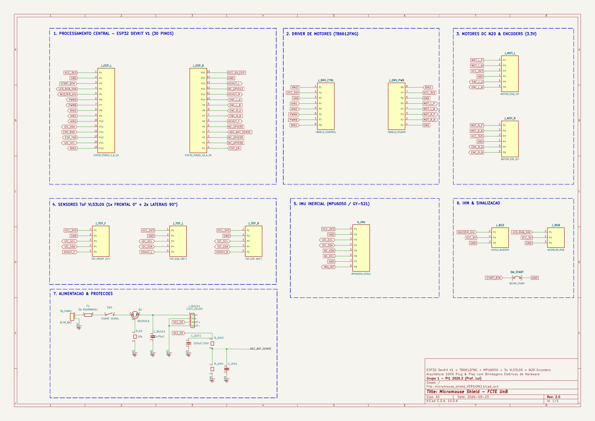

# Projeto Conceitual de Hardware

O projeto conceitual de hardware estabelece a arquitetura eletroeletrônica embarcada do robô autônomo Micromouse (Grupo 1) para a disciplina Projeto Integrador 1 (semestre 2026.2, FCTE/UnB, Prof. Lui). O dimensionamento e a topologia descritos asseguram o cumprimento integral dos requisitos eletroeletrônicos (RF_ELE01 a RF_ELE06 e RNF_ELE01 a RNF_ELE05), viabilizam a navegação autônoma no labirinto (RF_SFT01 a RF_SFT04) e garantem documentação aberta para reprodução integral do sistema.

A concepção adota o princípio de montagem modular Plug and Play: a placa shield customizada utiliza soquetes para todos os circuitos integrados e módulos, pull ups internos ativados por software e chicotes prontos de fábrica com conectores polarizados. Essa abordagem blinda o circuito contra brownout, sobretensão nas portas lógicas, travamentos de boot e curtos acidentais, permitindo montagem e calibração ágeis com alta confiabilidade em bancada e pista.

---

## 1. Visão Geral da Arquitetura e Fronteiras de Subsistema

A arquitetura adota uma placa mãe de soquetes (Shield de encaixe) montada sobre barras de pinos fêmea com passo de 2,54 mm, interligando a unidade central de processamento aos sensores, atuadores, módulos de potência e sinalização com travas mecânicas.

### 1.1 Delimitação de Escopo com o Núcleo de Energia

A divisão de escopo entre Energia e Hardware segue a estrutura da EAP do projeto:

* **Escopo de Energia:** Dimensionamento eletroquímico da bateria LiPo 2S, balanço de consumo total em Joules e Watt hora (RNF_ENE01), chave geral mecânica (RF_ENE04), proteção por fusível contra sobrecorrente (RNF_ENE03) e regulação de tensão nos barramentos principais.
* **Escopo de Hardware (Eletrônica):** Interface física de entrada da Shield, filtragem capacitiva local para atenuação de transientes indutivos (RNF_ELE05), proteção contra retorno de corrente pela conexão USB, circuito atenuador por divisor resistivo para leitura analógica da bateria (RF_ENE02) e distribuição estruturada de sinais e potência.

---

## 2. Diagrama de Blocos do Sistema Eletrônico

O diagrama de blocos a seguir apresenta a topologia global da eletrônica do Micromouse, os barramentos de alimentação e as interfaces de interconexão, destacando o microcontrolador central ESP32 do robô, o sensoriamento ToF e IMU, a ponte H com retorno dos encoders em 3,3 V, a interface de usuário e a telemetria sem fio via ESP NOW em 2,4 GHz com a estação base acoplada ao computador:

*Figura 2.1: Diagrama de blocos da arquitetura eletroeletrônica e interfaces do Micromouse.*

---

## 3. Detalhamento dos Subsistemas e Justificativa de Componentes

### 3.1 Unidade Central de Processamento e Conectividade

A unidade de processamento central é o módulo ESP32 DevKit V1 de 30 pinos, baseado no SoC Espressif ESP WROOM 32.

* **Recursos de Hardware:** Processador dual core Xtensa LX6 de 32 bits a 240 MHz, memória SRAM de 520 kB e memória Flash externa de 4 MB. Periféricos dedicados de contagem de pulsos (PCNT), canais PWM por hardware (LEDC) e módulo WiFi 802.11 b/g/n integrado.
* **Critérios de Seleção:**
  * **Processamento Dual Core:** O Core 1 processa a malha de controle cinemático em tempo real estrito (PID de alinhamento e leitura de encoders a 1 kHz) e o algoritmo de navegação do labirinto; o Core 0 gerencia exclusivamente a comunicação sem fio, o envio de telemetria (RF_ELE04) e o servidor de calibração web. Essa divisão impede atrasos na malha motriz decorrentes de operações de rede.
  * **Isolamento de Pinos de Boot (Strapping Pins):** Os pinos sensíveis de inicialização são protegidos. O pino GPIO 12 permanece totalmente isolado na Shield, prevenindo travamentos de inicialização causados por tensões residuais.
  * **Conexão por Soquete:** O módulo encaixa em barras fêmea, permitindo substituição imediata sem dessoldagem em caso de manutenção.

### 3.2 Subsistema de Sensoriamento de Distância e Orientação Inercial

O sensoriamento periférico mede a proximidade das paredes do labirinto (RF_ELE01, RNF_ELE01, RNF_ELE02) e fornece a velocidade angular de guinada para estabilização de trajetória e curvas ortogonais precisas (RF_SFT01).

#### A. Sensores de Distância Laser ToF Ortogonais (3x VL53L0X)

* **Topologia Ortogonal:** Três módulos laser Time of Flight alocados em geometria perpendicular:
  * 1 sensor frontal apontado para a frente (0 grau longitudinal);
  * 2 sensores laterais ortogonais apontados perpendicularmente para as paredes (90 graus à esquerda e 90 graus à direita).
* **Eliminação de Sensor Traseiro:** O robô avança exclusivamente para a frente. A célula traseira acabou de ser visitada e seu estado já se encontra mapeado em memória. Em becos sem saída, a manobra de rotação de 180 graus posiciona o sensor frontal diante do obstáculo, tornando sensores traseiros redundantes em peso, custo e fiação.
* **Vantagens da Visada Ortogonal:** Em corredores de 168 mm, a leitura ortogonal permite detecção booleana direta (distâncias menores que 130 mm indicam parede presente; distâncias maiores indicam passagem livre). O alinhamento central da pista é obtido por controle proporcional direto da diferença de leitura entre os dois sensores laterais.
* **Endereçamento e Controle via XSHUT:** Os 3 sensores compartilham as linhas I2C (SDA no GPIO 21 e SCL no GPIO 22). Linhas individuais XSHUT controlam a inicialização sequencial: sensor esquerdo no GPIO 13, frontal no GPIO 32 e direito no GPIO 14. O firmware liga um sensor por vez e atribui novos endereços I2C hexadecimais (0x30, 0x31 e 0x32).
* **Proteção contra Travamento I2C:** O firmware aplica timeout de hardware de 25 ms na biblioteca Wire, descartando leituras corrompidas sem bloquear a execução do processador.

#### B. Unidade de Medição Inercial (IMU 6 DOF MPU6050)

* **Funcionalidade:** Giroscópio e acelerômetro integrados em 3 eixos no barramento I2C (endereço 0x68).
* **Trava de Rumo e Controle Angular:** Em cruzamentos abertos sem paredes laterais para apoio dos sensores ToF, o giroscópio monitora a velocidade angular em alta frequência (100 Hz), corrigindo derivas e mantendo o deslocamento retilíneo. Em curvas de 90 e 180 graus, a integração angular inercial encerra a manobra quando o robô alcança exatamente o ângulo alvo, mesmo havendo escorregamento dos pneus.

### 3.3 Subsistema de Potência, Atuação Motriz e Odometria

Responsável pela locomoção diferencial do robô (RF_ELE03, RF_EST02).

#### A. Driver de Motores (Ponte H Dupla TB6612FNG em Soquete)

* **Especificação:** Driver baseado em pontes de MOSFET com capacidade de 1,2 A contínuos por canal (pico de 3,2 A) e resistência interna reduzida (cerca de 0,5 Ohm).
* **Vantagens:** Queda de tensão inferior a 0,25 V sob carga nominal, maximizando o aproveitamento da tensão da bateria sem aquecimento elevado. O circuito é montado em soquete fêmea na Shield para fácil substituição.
* **Controle:** Modulação PWM em 20 kHz nos pinos PWMA (GPIO 16) e PWMB (GPIO 17); controle de direção lógica em AIN1 (GPIO 18), AIN2 (GPIO 19), BIN1 (GPIO 23) e BIN2 (GPIO 5). O pino STBY é conectado permanentemente em nível lógico alto.

#### B. Motores N20 com Redução Metálica e Encoders

* **Especificação dos Motores:** Motores DC modelo N20 de 6 V com caixa de redução metálica de 50:1 ou 75:1, operando com rotação nominal de 200 a 300 RPM.
* **Faixa de Trabalho:** A rotação moderada permite que os motores operem na faixa linear do PWM (40% a 70%) em velocidade de exploração de 0,15 a 0,30 m/s, garantindo partida suave e torque estável.
* **Rodas e Pneus:** Rodas com banda de borracha de silicone macia com coeficiente de atrito superior a 0,8, evitando derrapagens sobre o piso de madeira da pista.
* **Proteção das Entradas dos Encoders:** Os circuitos de efeito Hall dos encoders são alimentados estritamente na linha de 3,3 V da Shield. Isso limita os pulsos dos canais A e B a 3,3 V, eliminando qualquer risco de queima das portas lógicas da ESP32. As saídas conectam aos pinos com interrupção externa GPIO 27 e GPIO 26 (motor esquerdo) e GPIO 25 e GPIO 33 (motor direito), fornecendo resolução superior a 10 pulsos por milímetro.

### 3.4 Interface de Alimentação e Blindagens Elétricas da Shield

A Shield integra proteções físicas para garantir estabilidade operacional:

* **Conector de Entrada por Borne Parafuso:** Terminal de 5,08 mm recebendo VMOT (linha da bateria LiPo 2S), VCC (linha lógica de 5,0 V regulada pelo conversor Buck de energia) e GND de referência unificada.
* **Capacitor Antibrownout (470 µF / 16 V):** Capacitor eletrolítico posicionado imediatamente junto aos pinos de potência da ponte H TB6612FNG, fornecendo corrente instantânea nas acelerações dos motores e evitando quedas na tensão do microcontrolador.
* **Diodo Schottky de Proteção USB (1N5819):** Inserido na entrada lógica de 5,0 V que alimenta o pino VIN da ESP32 DevKit, impedindo retorno de corrente para a porta USB do computador durante ensaios de bancada com a bateria conectada.
* **Operação Térmica do Regulador:** O pino VIN recebe 5,0 V regulados, mantendo baixa a dissipação de potência sobre o regulador linear interno da ESP32 DevKit (inferior a 0,35 W).
* **Filtros Antirruído:** Capacitores cerâmicos de 100 nF soldados nos motores suprimem ruídos de comutação antes de atingirem o chicote da Shield.
* **Divisor de Tensão de Precisão (RF_ENE02):** Composto por resistores de 100 kΩ e 33 kΩ com capacitor de filtro de 100 nF, conectado ao pino GPIO 34 (canal analógico ADC1). A tensão plena da bateria (8,4 V) gera 2,084 V no conversor analógico digital, permitindo monitoramento contínuo sem conflitos com o rádio sem fio.

### 3.5 Interface Homem Máquina (IHM) e Diagnóstico

* **LED RGB WS2812B (GPIO 2):** Módulo endereçável com resistor de proteção de 330 Ω que exibe visualmente os estados do sistema (RF_ELE05): azul para calibração, verde para largada pronta, amarelo para navegação, roxo para labirinto resolvido e vermelho para alerta de bateria ou falha.
* **Buzzer Ativo (GPIO 4):** Módulo com driver de acionamento embutido acoplado a conector de 3 pinos, emitindo alertas sonoros com pressão sonora superior a 60 dB (RF_ELE06).
* **Botão Físico com Pull Up Interno (GPIO 15):** Chave táctil conectada diretamente entre o pino GPIO 15 e o terra GND. O resistor de subida interno é ativado por software com rotina de debounce de 50 ms. O firmware atribui funções de teste: 1 toque ativa autoteste dos motores, 2 toques verifica a resposta dos sensores ToF e pressão contínua por 2 segundos dispara a largada autônoma (RNF_SFT01).
* **Calibração e Atualizações OTA:** Servidor web embarcado acessível via navegador para ajuste de ganhos do controlador PID e suporte a gravação de firmware sem fio (Over The Air via WiFi).

---

## 4. Tabela de Mapeamento de Pinagem do Microcontrolador (Pinout Matrix)

A tabela a seguir consolida a pinagem dos 30 pinos do ESP32 DevKit V1 na placa Shield, sem conflitos com pinos de boot:

| Pino | Identificação | Direção | Nível | Conexão no Micromouse | Observações Técnicas |
|:---:|:---:|:---:|:---:|---|---|
| P1 | 3V3 | Saída | 3,3 V | Alimentação de sensores e encoders | Linha regulada protegida |
| P2 | GND | Terra | 0 V | Referência comum da Shield | Plano de terra unificado |
| P3 | GPIO 15 | Entrada | 3,3 V | Botão de largada e diagnóstico | Pull up interno por software |
| P4 | GPIO 2 | Saída | 3,3 V | LED RGB WS2812B | Sinalização visual de estados |
| P5 | GPIO 4 | Saída | 3,3 V | Buzzer ativo | Alarme acústico de eventos |
| P6 | GPIO 16 | Saída | 3,3 V | Ponte H PWMA | Modulação PWM 20 kHz motor esquerdo |
| P7 | GPIO 17 | Saída | 3,3 V | Ponte H PWMB | Modulação PWM 20 kHz motor direito |
| P8 | GPIO 5 | Saída | 3,3 V | Ponte H BIN2 | Direção lógica motor direito |
| P9 | GPIO 18 | Saída | 3,3 V | Ponte H AIN1 | Direção lógica motor esquerdo |
| P10 | GPIO 19 | Saída | 3,3 V | Ponte H AIN2 | Direção lógica motor esquerdo |
| P11 | GPIO 21 | Bidirecional | 3,3 V | Barramento I2C SDA | Dados compartilhados ToF e IMU |
| P12 | GPIO 3 | Entrada | 3,3 V | RX Serial USB | Depuração serial em bancada |
| P13 | GPIO 1 | Saída | 3,3 V | TX Serial USB | Telemetria serial em bancada |
| P14 | GPIO 22 | Saída | 3,3 V | Barramento I2C SCL | Relógio I2C em modo rápido 400 kHz |
| P15 | GPIO 23 | Saída | 3,3 V | Ponte H BIN1 | Direção lógica motor direito |
| P16 | VIN | Entrada | 5,0 V | Entrada 5V da Shield | Alimentação com diodo Schottky |
| P17 | GND | Terra | 0 V | Terra de potência e lógica | Retorno unificado dos atuadores |
| P18 | GPIO 13 | Saída | 3,3 V | XSHUT ToF Esquerdo | Habilitação do sensor a 90 graus |
| P19 | GPIO 12 | Isolado | N/A | Não conectado na Shield | Proteção de boot do microcontrolador |
| P20 | GPIO 14 | Saída | 3,3 V | XSHUT ToF Direito | Habilitação do sensor a 90 graus |
| P21 | GPIO 27 | Entrada | 3,3 V | Encoder Motor Esquerdo Canal A | Interrupção externa para odometria |
| P22 | GPIO 26 | Entrada | 3,3 V | Encoder Motor Esquerdo Canal B | Interrupção externa para sentido |
| P23 | GPIO 25 | Entrada | 3,3 V | Encoder Motor Direito Canal A | Interrupção externa para odometria |
| P24 | GPIO 33 | Entrada | 3,3 V | Encoder Motor Direito Canal B | Interrupção externa para sentido |
| P25 | GPIO 32 | Saída | 3,3 V | XSHUT ToF Frontal | Habilitação do sensor a 0 grau |
| P26 | GPIO 35 | Entrada | 3,3 V | Entrada analógica reserva | Canal analógico ADC1 livre |
| P27 | GPIO 34 | Entrada | 3,3 V | Monitoramento da bateria | Divisor resistivo no canal ADC1 |
| P28 | GPIO 39 | Entrada | 3,3 V | Entrada analógica VN | Não utilizado no circuito |
| P29 | GPIO 36 | Entrada | 3,3 V | Entrada analógica VP | Não utilizado no circuito |
| P30 | EN | Entrada | 3,3 V | Sinal de reinicialização | Circuito RC integrado da DevKit |

---

## 5. Esquemático Elétrico e Conectores no KiCad (Rev 2.0)

### 5.1 Esquemático Elétrico da Placa Shield

O esquemático modular da Shield foi projetado no software KiCad e contempla os 7 blocos funcionais com blindagens elétricas:

* Arquivo do esquemático: `hw/micromouse_shield/micromouse_shield_VERSION2.kicad_sch` (repositório do projeto)
* Versão vetorial em PDF: [Baixar PDF do Esquemático](figs/micromouse_shield.pdf)

#### Blocos Funcionais do Esquemático:
1. **Processamento Central:** Barras fêmea de 2,54 mm para encaixe do ESP32 DevKit V1 com pino GPIO 12 isolado.
2. **Driver de Motores:** Soquete para TB6612FNG recebendo sinais PWM de 20 kHz e sinais de sentido de rotação.
3. **Motores DC N20 e Encoders:** Conectores com alimentação dos sensores Hall limitada a 3,3 V para proteção da ESP32.
4. **Sensores ToF VL53L0X:** Conexões com barramento I2C compartilhado e linhas de controle XSHUT individuais.
5. **IMU Inercial:** Conector para placa GY 521 (MPU6050) em 3,3 V no barramento I2C.
6. **Interface de Usuário:** Conectores dedicados para buzzer ativo, LED RGB WS2812B e botão de largada.
7. **Alimentação e Proteções:** Fusível rearmável de 3A, chave geral mecânica, proteção contra polaridade reversa por MOSFET Canal P (AO3401A), soquete para módulo Buck regulador de 5V, capacitor antibrownout de 470 µF e divisor resistivo no GPIO 34.

### 5.2 Conectores Padronizados da Placa Shield

A tabela descreve os conectores e serigrafias para montagem direta com chicotes prontos de fábrica:

| Serigrafia na Placa | Tipo do Conector | Vias | Ordem dos Sinais | Destino no Robô |
|---|:---:|:---:|---|---|
| TB_PWR1 BATERIA | Borne ou Conector Polarizado | 2 | 1: VBAT (7,4 V), 2: GND | Entrada da bateria LiPo 2S |
| J_BUCK1 REG 5V | Barra Fêmea 2,54 mm | 4 | 1: VIN+, 2: VIN, 3: VOUT+ (5V), 4: VOUT (GND) | Soquete do conversor Buck 5V |
| MOTOR ESQ | Conector JST 2,0 mm ou Barra 2,54 mm | 6 | 1: M+, 2: M, 3: VCC (3,3V), 4: GND, 5: Canal A, 6: Canal B | Chicote do motor N20 esquerdo |
| MOTOR DIR | Conector JST 2,0 mm ou Barra 2,54 mm | 6 | 1: M+, 2: M, 3: VCC (3,3V), 4: GND, 5: Canal A, 6: Canal B | Chicote do motor N20 direito |
| TOF FRONT 0 | Barra Macho 2,54 mm | 5 | 1: VCC (3,3V), 2: GND, 3: SDA, 4: SCL, 5: XSHUT (GPIO 32) | Sensor ToF dianteiro a 0 grau |
| TOF ESQ 90 | Barra Macho 2,54 mm | 5 | 1: VCC (3,3V), 2: GND, 3: SDA, 4: SCL, 5: XSHUT (GPIO 13) | Sensor ToF lateral a 90 graus |
| TOF DIR 90 | Barra Macho 2,54 mm | 5 | 1: VCC (3,3V), 2: GND, 3: SDA, 4: SCL, 5: XSHUT (GPIO 14) | Sensor ToF lateral a 90 graus |
| IMU MPU6050 | Barra Fêmea 2,54 mm | 8 | 1: VCC (3,3V), 2: GND, 3: SCL, 4: SDA, 5: XDA, 6: XCL, 7: AD0, 8: INT | Módulo GY 521 (IMU inercial) |
| IHM BUZZER | Barra Macho 2,54 mm | 3 | 1: Sinal (GPIO 4), 2: VCC (5V), 3: GND | Módulo buzzer ativo KY 012 |
| IHM RGB | Barra Macho 2,54 mm | 3 | 1: Sinal DIN (GPIO 2), 2: VCC (5V), 3: GND | Módulo LED RGB WS2812B |
| SW_START | Botão Táctil THT | 2 | 1: GPIO 15, 2: GND | Botão de diagnóstico e largada |

---

## 6. Lista de Materiais de Hardware (Bill of Materials)

Relação dos componentes do subsistema de hardware com valores alinhados ao orçamento do TAP:

| Item | Componente e Descrição | Módulo ou Encapsulamento | Quantidade | Custo Unitário (R$) | Custo Total (R$) |
|:---:|---|---|:---:|:---:|:---:|
| 1 | Módulo Microcontrolador ESP32 DevKit V1 | DevKit 30 Pinos | 1 | 42,00 | 42,00 |
| 2 | Driver de Motor Ponte H Dupla TB6612FNG | Módulo com pinos 2,54 mm | 1 | 18,00 | 18,00 |
| 3 | Sensores Laser Time of Flight VL53L0X | Módulos GY 530 | 3 | 28,00 | 84,00 |
| 4 | Unidade de Medição Inercial IMU MPU6050 | Placa GY 521 | 1 | 16,00 | 16,00 |
| 5 | Motores DC N20 de 6V com Encoders Hall | Motor N20 e disco magnético | 2 | 48,00 | 96,00 |
| 6 | Par de Rodas com Pneus de Silicone Macio | Diâmetro de 34 mm | 1 par | 18,00 | 18,00 |
| 7 | Módulo LED RGB Endereçável WS2812B | Placa individual 5050 | 1 | 3,50 | 3,50 |
| 8 | Módulo Buzzer Ativo com Driver Integrado | Módulo 3 pinos KY 012 | 1 | 3,00 | 3,00 |
| 9 | Diodo Schottky de Proteção USB 1N5819 | DO 41 ou SMA | 1 | 0,80 | 0,80 |
| 10 | Capacitor Eletrolítico Antibrownout (470 µF / 16V) | Radial THT | 1 | 1,50 | 1,50 |
| 11 | Chave Táctil 6x6 mm para Largada | THT | 1 | 1,00 | 1,00 |
| 12 | Resistores de Precisão para Divisor e LED | Axial 1/4W | 3 | 0,20 | 0,60 |
| 13 | Capacitores Cerâmicos Antirruído (100 nF) | Disco THT | 5 | 0,50 | 2,50 |
| 14 | Borne Parafuso 3 Vias (Passo 5,08 mm) | Conector de potência PCB | 1 | 2,50 | 2,50 |
| 15 | Chicotes Prontos com Conectores Polarizados | Conjunto de cabos prontos | 5 | 3,00 | 15,00 |
| 16 | Barras de Pinos Fêmea 1x40 para Soquetes | Passo 2,54 mm | 2 | 3,00 | 6,00 |
| 17 | Fabricação da Placa PCB Shield Dupla Face | FR4 1.6 mm duas camadas | 1 | 35,00 | 35,00 |
| Total | Custo Consolidado de Hardware | Subsistema de Eletrônica | 28 itens | N/A | R$ 345,90 |

O custo consolidado de hardware de R$ 345,90 atende ao limite de R$ 400,00 estipulado no TAP para componentes eletroeletrônicos, mantendo margem de contingência favorável de R$ 54,10.

---

## 7. Matriz de Rastreabilidade com os Requisitos de Engenharia

| Requisito | Descrição Resumida | Especificação de Hardware Implementada | Verificação no Projeto |
|:---:|---|---|---|
| RF_ELE01 | Sensoriamento de paredes nas 3 direções | 3 sensores Laser ToF VL53L0X (1 frontal 0 grau e 2 laterais 90 graus) | Cobertura angular das 3 paredes a cada célula |
| RF_ELE02 | Odometria determinística das rodas | Encoders Hall alimentados a 3,3 V nos motores N20 ligados aos pinos GPIO 27, 26, 25 e 33 | Contagem determinística sem perda de pulsos |
| RF_ELE03 | Modulação e controle de potência motriz | Ponte H dupla TB6612FNG com PWM de 20 kHz e sinais lógicos reversíveis | Acionamento linear bidirecional com baixa perda |
| RF_ELE04 | Transmissão sem fio de telemetria | Enlace sem fio ESP NOW em 2,4 GHz com envio em tempo real para a estação base | Comunicação de baixa latência independente de roteador |
| RF_ELE05 | Sinalização visual de estados | LED RGB WS2812B com cores padronizadas para os estados operacionais | Identificação visual imediata do estado do robô |
| RF_ELE06 | Sinalização acústica de eventos | Módulo buzzer ativo KY 012 acionado pelo pino GPIO 4 | Emissão sonora com nível superior a 60 dB |
| RNF_ELE01 | Taxa de leitura sensorial rápida | Barramento I2C em modo rápido de 400 kHz e ciclo de medição de 20 ms | Amostragem de parede superior a 30 Hz |
| RNF_ELE02 | Faixa de detecção de 30 a 180 mm | Medição laser Time of Flight imune a variações de cor e reflexão | Precisão milimétrica nas dimensões do labirinto |
| RNF_ELE03 | Enlace sem fio estável | Antena da ESP32 posicionada em área desimpedida na placa Shield | Alcance superior a 8 metros sem atenuação metálica |
| RNF_ELE04 | Conexão estruturada em PCB | Placa Shield dedicada com soquetes e conectores prontos polarizados | Eliminação de protoboard e fiação solta |
| RNF_ELE05 | Imunidade a ruídos dos motores | Capacitor antibrownout de 470 µF, filtros locais e diodo Schottky | Proteção comprovada contra reinicializações espúrias |
| RF_ENE02 | Monitoramento de tensão da bateria | Divisor resistivo calibrado de 100 kΩ e 33 kΩ no canal analógico ADC1 | Leitura analógica da bateria sem interferência com WiFi |
| RF_SFT01 | Rotações ortogonais precisas | IMU MPU6050 integrando velocidade angular de guinada no barramento I2C | Curvas ortogonais com controle inercial em malha fechada |
| RF_SFT11 | Detecção de parada forçada de motor | Comparação em software da leitura dos encoders com os comandos PWM | Corte de segurança dos motores se o giro travar |
| RNF_SFT01 | Autonomia e disparo físico de largada | Botão táctil multifunção no pino GPIO 15 para testes e largada | Partida autônoma em conformidade com o edital |
