# Projeto Conceitual de Software

## 1. Visão Geral e Premissas

### 1.1 Propósito

O software do Grupo 1 é responsável por duas frentes complementares:

1. **Firmware embarcado**, executado no microcontrolador do robô, responsável por perceber o ambiente, mapear o labirinto, decidir a trajetória, acionar os atuadores e empacotar a telemetria.
2. **Aplicação web de telemetria**, executada fora do robô, responsável por receber os pacotes transmitidos durante a prova, exibir o estado da corrida em tempo real e persistir o histórico para consulta posterior.

As duas frentes são independentes em execução: o robô cumpre a prova de forma autônoma mesmo sem o painel web conectado, conforme o RNF-SFT01. A aplicação web é um observador do processo, nunca um controlador.

### 1.2 Premissas de hardware

As decisões deste documento partem das definições registradas no TAP e na EAP. Os itens abaixo dependem de confirmação do núcleo de Eletrônica (issues #20 a #22) e devem ser revisados caso a especificação mude.

| Premissa | Origem | Impacto no software |
|:---|:---|:---|
| Microcontrolador ESP32 no robô | TAP / EAP | Linguagem do firmware e rádio integrado para a telemetria |
| Segundo ESP32 na bancada, conectado por USB ao computador, atuando como receptor ESP-NOW | Proposta do núcleo de Software (seção 6) | Canal de telemetria sem dependência de rede Wi-Fi, atendendo ao RF-ELE04 |
| Sensores de distância do tipo ToF (VL53L0X) nas laterais e à frente | TAP | Base do controle de trajetória e da detecção de paredes |
| Motores com encoder acoplado | TAP / RF-ELE02 | Odometria, controle de deslocamento e detecção de travamento |
| Unidade inercial (IMU) para referência angular | EAP | Precisão das rotações ortogonais |
| Botão físico de largada e seleção de geometria | RF-SFT02 / regulamento | Estados iniciais do fluxo de operação |

### 1.3 Escopo do documento

Este documento trata do projeto conceitual, ou seja, da definição de comportamento, estrutura e arquitetura que antecede a implementação. Não contém código-fonte, que será produzido na fase de desenvolvimento prevista na EAP.

---

## 2. Diagrama de Atividades UML

O diagrama a seguir representa o comportamento funcional do produto, do acionamento do robô até o encerramento da corrida, organizado em raias por ator.

**Atores e responsabilidades**

| Raia | Papel |
|:---|:---|
| Operador | Aciona o robô, seleciona a geometria da pista e dá a largada física. Não interfere durante a prova (RNF-SFT01). |
| Firmware | Executa a lógica de mapeamento, decisão de trajetória, monitoramento de segurança e empacotamento da telemetria. |
| Sensores e Atuadores | Fornecem leituras de distância, odometria e tensão de bateria, e convertem comandos em movimento. |
| Painel Web | Recebe os pacotes de telemetria, atualiza a interface em tempo real e persiste a corrida. |

**Entradas e saídas do fluxo**

- Entradas: geometria selecionada, sinal de largada, leituras de distância, pulsos de encoder, leitura de tensão da bateria.
- Saídas: comandos de tração, matriz de paredes descobertas, pacotes de telemetria a 1 Hz, registro histórico da corrida.


> Observação: o envio de telemetria ocorre em paralelo ao laço de navegação, a uma taxa fixa de 1 Hz, conforme RF-SFT05 e RNF-SFT03. A verificação de travamento acompanha continuamente qualquer comando de tração ativo.

---

## 3. Backlog do Produto

### 3.1 Requisitos Funcionais

O backlog do produto foi registrado no GitHub Projects da equipe, na coluna **Backlog do Produto** do quadro de tarefas. Cada requisito funcional de software corresponde a um **épico**, desdobrado em **histórias de usuário (HUs)** cadastradas como sub-issues. As tabelas a seguir foram geradas a partir da exportação da visão *Backlog do Produto* do projeto.

**Atores das histórias**

| Ator | Descrição |
|:---|:---|
| Operador | Membro da equipe que prepara o robô, dá a largada e acompanha a prova pelo painel |
| Equipe | Equipe de desenvolvimento, que utiliza os dados e comportamentos do sistema para validar e aprimorar o robô |

**Prioridade:** P0 corresponde a *Must have*, P1 a *Should have* e P2 a *Could have*, conforme a classificação do documento de requisitos.

#### Épico RF-SFT01: Controle e Alinhamento de Trajetória

Issue: [#31](https://github.com/fcte-pi1/2026.2_PI1_Grupo1_Lui/issues/31) | Prioridade: **P0**

| ID | História de usuário | Critérios de aceitação | Issue |
|:---|:---|:---|:---|
| HU-01 | **Manter o robô centralizado nas retas**<br>Eu, como equipe, quero que o robô se mantenha centralizado no corredor durante as retas, para que ele percorra o labirinto sem encostar nas paredes. | • O robô percorre 3 células consecutivas em reta com desvio lateral inferior a 15 mm em relação à linha de centro<br>• Não há contato com as paredes laterais durante o percurso<br>• Em trechos sem parede lateral, o robô mantém o rumo usando IMU e encoders | [#32](https://github.com/fcte-pi1/2026.2_PI1_Grupo1_Lui/issues/32) |
| HU-02 | **Executar curvas de 90 graus com precisão**<br>Eu, como equipe, quero que o robô faça rotações de 90° com precisão, para que a orientação real do robô continue coerente com o mapa em memória. | • O erro angular acumulado das rotações é de no máximo ±3°<br>• Ao final de cada rotação, o robô está alinhado ao eixo do corredor<br>• A orientação interna do firmware é atualizada após cada rotação | [#33](https://github.com/fcte-pi1/2026.2_PI1_Grupo1_Lui/issues/33) |

#### Épico RF-SFT02: Mapeamento Topológico das Geometrias Oficiais

Issue: [#34](https://github.com/fcte-pi1/2026.2_PI1_Grupo1_Lui/issues/34) | Prioridade: **P0**

| ID | História de usuário | Critérios de aceitação | Issue |
|:---|:---|:---|:---|
| HU-03 | **Registrar as paredes de cada célula visitada**<br>Eu, como equipe, quero que o robô registre em memória as paredes de cada célula que visita, para que ele construa o mapa do labirinto durante a exploração. | • Cada célula visitada é marcada como visitada na matriz<br>• Uma parede registrada em uma célula também é registrada na célula vizinha correspondente<br>• Ao final da exploração, a matriz é 100% idêntica à configuração física da pista | [#35](https://github.com/fcte-pi1/2026.2_PI1_Grupo1_Lui/issues/35) |
| HU-04 | **Selecionar a geometria da pista antes da largada**<br>Eu, como operador, quero informar ao robô, antes da largada, se a pista é 4x4, 8x4 ou 12x4, para que ele trabalhe com as dimensões corretas do labirinto. | • A seleção da geometria está disponível antes da largada<br>• Os limites da matriz em memória correspondem à geometria selecionada<br>• A geometria selecionada é enviada na telemetria (campo `labirinto`) | [#36](https://github.com/fcte-pi1/2026.2_PI1_Grupo1_Lui/issues/36) |

#### Épico RF-SFT03: Navegação e Resolução Autônoma de Labirinto

Issue: [#37](https://github.com/fcte-pi1/2026.2_PI1_Grupo1_Lui/issues/37) | Prioridade: **P0**

| ID | História de usuário | Critérios de aceitação | Issue |
|:---|:---|:---|:---|
| HU-05 | **Dar a largada por botão físico**<br>Eu, como operador, quero iniciar a prova por um botão no próprio robô, para dar a largada sem enviar nenhum comando remoto. | • Após ligado, o robô permanece parado no estado AGUARDANDO até o acionamento do botão<br>• O cronômetro da prova inicia no acionamento<br>• O status muda para MAPEANDO e o painel passa a exibir "Explorando" | [#38](https://github.com/fcte-pi1/2026.2_PI1_Grupo1_Lui/issues/38) |
| HU-06 | **Decidir o caminho de forma autônoma**<br>Eu, como equipe, quero que o robô escolha sozinho a próxima célula com base no mapa descoberto, para que ele alcance o objetivo sem nenhuma intervenção externa. | • O robô conclui a corrida em pista 4x4 em menos de 3 minutos<br>• Nenhum comando externo é recebido durante a prova<br>• O robô não repete indefinidamente um mesmo trajeto entre células já exploradas | [#39](https://github.com/fcte-pi1/2026.2_PI1_Grupo1_Lui/issues/39) |

#### Épico RF-SFT04: Reconhecimento de Objetivo e Parada Automática

Issue: [#40](https://github.com/fcte-pi1/2026.2_PI1_Grupo1_Lui/issues/40) | Prioridade: **P0**

| ID | História de usuário | Critérios de aceitação | Issue |
|:---|:---|:---|:---|
| HU-07 | **Parar automaticamente ao chegar no objetivo**<br>Eu, como operador, quero que o robô pare sozinho ao entrar na célula de chegada, para que o tempo da prova seja registrado corretamente. | • A tração é interrompida em menos de 200 ms após a entrada na célula de chegada<br>• O cronômetro da prova é congelado no mesmo instante<br>• A telemetria passa a enviar status CONCLUIDO e desafio cumprido verdadeiro | [#41](https://github.com/fcte-pi1/2026.2_PI1_Grupo1_Lui/issues/41) |

#### Épico RF-SFT05: Despacho Contínuo dos Parâmetros de Telemetria

Issue: [#42](https://github.com/fcte-pi1/2026.2_PI1_Grupo1_Lui/issues/42) | Prioridade: **P0**

| ID | História de usuário | Critérios de aceitação | Issue |
|:---|:---|:---|:---|
| HU-08 | **Transmitir os dados da prova a cada segundo**<br>Eu, como operador, quero que o robô envie os dados da corrida a cada segundo, para acompanhar a prova pelo computador enquanto ela acontece. | • Um pacote é enviado a cada 1 segundo (1 Hz)<br>• O pacote contém os 6 parâmetros do edital: tipo do labirinto, trajeto percorrido (posição), bateria, velocidade média, tempo decorrido e status de desafio cumprido<br>• Os pacotes chegam íntegros ao gateway receptor durante todo o percurso | [#43](https://github.com/fcte-pi1/2026.2_PI1_Grupo1_Lui/issues/43) |
| HU-09 | **Ser avisado quando a conexão com o robô cair**<br>Eu, como operador, quero ser avisado quando o painel parar de receber dados do robô, para saber que as informações exibidas não estão mais atualizadas. | • Após 3 segundos sem pacote válido, o painel exibe "Conexão RF perdida"<br>• O painel volta ao estado normal assim que a recepção é retomada<br>• A perda de conexão não interfere na navegação do robô | [#44](https://github.com/fcte-pi1/2026.2_PI1_Grupo1_Lui/issues/44) |

#### Épico RF-SFT06: Dashboard Web de Monitoramento em Tempo Real

Issue: [#45](https://github.com/fcte-pi1/2026.2_PI1_Grupo1_Lui/issues/45) | Prioridade: **P0**

| ID | História de usuário | Critérios de aceitação | Issue |
|:---|:---|:---|:---|
| HU-10 | **Visualizar o mapa do labirinto em tempo real**<br>Eu, como operador, quero ver a grade do labirinto sendo desenhada conforme o robô explora, para acompanhar o mapeamento durante a prova. | • A grade é exibida na geometria da prova (4x4, 8x4 ou 12x4)<br>• As paredes detectadas aparecem na tela em até 1 segundo<br>• A posição atual e a orientação do robô ficam destacadas<br>• O rastro percorrido é exibido sobre a grade<br>*Protótipo: seção 3.2* | [#46](https://github.com/fcte-pi1/2026.2_PI1_Grupo1_Lui/issues/46) |
| HU-11 | **Acompanhar os indicadores da prova**<br>Eu, como operador, quero ver tempo, velocidade, bateria e status do robô durante a prova, para avaliar o desempenho e antecipar problemas. | • O cronômetro é exibido junto ao limite de 10 minutos<br>• Velocidade média e instantânea são exibidas em cm/s<br>• A bateria é exibida em porcentagem e tensão, com destaque visual quando baixa<br>• O status é exibido com rótulo legível (Em espera, Explorando, Travado etc.)<br>*Protótipo: seção 3.2* | [#47](https://github.com/fcte-pi1/2026.2_PI1_Grupo1_Lui/issues/47) |

#### Épico RF-SFT07: Persistência Histórica de Corridas

Issue: [#48](https://github.com/fcte-pi1/2026.2_PI1_Grupo1_Lui/issues/48) | Prioridade: **P1**

| ID | História de usuário | Critérios de aceitação | Issue |
|:---|:---|:---|:---|
| HU-12 | **Salvar automaticamente cada corrida**<br>Eu, como equipe, quero que cada corrida seja salva automaticamente, inclusive as interrompidas, para analisar o desempenho do robô depois da prova. | • O registro da corrida é criado no momento da largada<br>• Cada leitura de telemetria é gravada assim que recebida<br>• A corrida é encerrada com status final, incluindo INTERROMPIDA quando não houver encerramento normal<br>• A corrida fica disponível para consulta imediatamente após o encerramento | [#49](https://github.com/fcte-pi1/2026.2_PI1_Grupo1_Lui/issues/49) |

#### Épico RF-SFT08: Consulta e Filtragem Histórica Web

Issue: [#50](https://github.com/fcte-pi1/2026.2_PI1_Grupo1_Lui/issues/50) | Prioridade: **P1**

| ID | História de usuário | Critérios de aceitação | Issue |
|:---|:---|:---|:---|
| HU-13 | **Filtrar as corridas anteriores**<br>Eu, como equipe, quero filtrar o histórico por geometria do labirinto e por data, para encontrar rapidamente as corridas que quero comparar. | • Há filtro por geometria (4x4, 8x4, 12x4) e por data de execução<br>• A lista filtrada exibe data, geometria, modo, tentativa, tempo final e status<br>• O resultado é exibido em menos de 2 segundos com até 500 corridas registradas<br>*Protótipo: seção 3.2* | [#51](https://github.com/fcte-pi1/2026.2_PI1_Grupo1_Lui/issues/51) |
| HU-14 | **Rever o trajeto de uma corrida passada**<br>Eu, como equipe, quero reproduzir o trajeto de uma corrida salva, para identificar onde o robô perdeu tempo ou tomou decisões ruins. | • Ao selecionar uma corrida, o mapa final e as estatísticas são exibidos<br>• A reprodução percorre as posições em ordem de tempo<br>• Há controle de reproduzir, pausar e avançar pela barra de tempo<br>• Os detalhes da corrida carregam em menos de 2 segundos<br>*Protótipo: seção 3.2* | [#52](https://github.com/fcte-pi1/2026.2_PI1_Grupo1_Lui/issues/52) |

#### Épico RF-SFT09: Execução de Trajetória Otimizada (Speed Run)

Issue: [#53](https://github.com/fcte-pi1/2026.2_PI1_Grupo1_Lui/issues/53) | Prioridade: **P1**

| ID | História de usuário | Critérios de aceitação | Issue |
|:---|:---|:---|:---|
| HU-15 | **Calcular a rota mais curta após a exploração**<br>Eu, como equipe, quero que, após a exploração, o robô calcule a menor rota até o objetivo, para utilizá-la na tentativa rápida. | • A rota é calculada apenas com células e paredes já conhecidas<br>• A rota escolhida tem o menor número de células entre as rotas possíveis no mapa conhecido | [#54](https://github.com/fcte-pi1/2026.2_PI1_Grupo1_Lui/issues/54) |
| HU-16 | **Executar o speed run**<br>Eu, como operador, quero que o robô percorra a rota ótima em velocidade maior que a de exploração, para reduzir o tempo da prova. | • O tempo do speed run é pelo menos 20% menor que o tempo da exploração<br>• A telemetria envia status SPEED_RUN durante o percurso<br>• A corrida é registrada com modo Speed Run no histórico | [#55](https://github.com/fcte-pi1/2026.2_PI1_Grupo1_Lui/issues/55) |

#### Épico RF-SFT10: Suavização Contínua de Trajetória em Curva

Issue: [#56](https://github.com/fcte-pi1/2026.2_PI1_Grupo1_Lui/issues/56) | Prioridade: **P2**

| ID | História de usuário | Critérios de aceitação | Issue |
|:---|:---|:---|:---|
| HU-17 | **Fazer curvas em movimento contínuo no speed run**<br>Eu, como equipe, quero que no speed run o robô faça as curvas sem parar, para não perder tempo freando e girando parado. | • A curva de 90° é executada sem parada total do robô<br>• Cada transição de célula com curva é pelo menos 300 ms mais rápida que o giro parado<br>• Não há contato com as paredes durante a curva | [#57](https://github.com/fcte-pi1/2026.2_PI1_Grupo1_Lui/issues/57) |

#### Épico RF-SFT11: Detecção e Tratamento de Travamento Mecânico (Stall)

Issue: [#58](https://github.com/fcte-pi1/2026.2_PI1_Grupo1_Lui/issues/58) | Prioridade: **P0**

| ID | História de usuário | Critérios de aceitação | Issue |
|:---|:---|:---|:---|
| HU-18 | **Cortar os motores quando as rodas travarem**<br>Eu, como equipe, quero que o robô corte os motores quando as rodas travarem, para evitar danos aos motores e ao driver de potência. | • Com comando de tração ativo e sem rotação das rodas por mais de 1,0 s, o travamento é detectado<br>• A potência dos motores é cortada em no máximo 1,2 s após o bloqueio físico<br>• O robô sinaliza o travamento por indicador local e envia status TRAVADO na telemetria | [#59](https://github.com/fcte-pi1/2026.2_PI1_Grupo1_Lui/issues/59) |
| HU-19 | **Ver no painel que o robô travou**<br>Eu, como operador, quero ser avisado no painel quando o robô travar, para saber o motivo do encerramento da tentativa. | • O status "Travado" é exibido em destaque no painel<br>• A corrida é encerrada no histórico com status final TRAVADO<br>*Protótipo: seção 3.2* | [#60](https://github.com/fcte-pi1/2026.2_PI1_Grupo1_Lui/issues/60) |


### 3.2 Protótipos de Interface

**Requisitos atendidos:** RF-SFT05, RF-SFT06, RF-SFT07 e RF-SFT08.

A aplicação web é composta por duas telas: a **tela de monitoramento**, usada durante a prova, e a **tela de histórico**, usada para consulta posterior das corridas registradas.

#### 3.2.1 Tela de Monitoramento em Tempo Real

A tela de monitoramento é atualizada a cada pacote de telemetria recebido (1 Hz) e se adapta às três geometrias oficiais do edital.

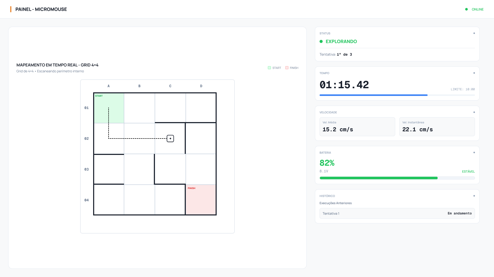

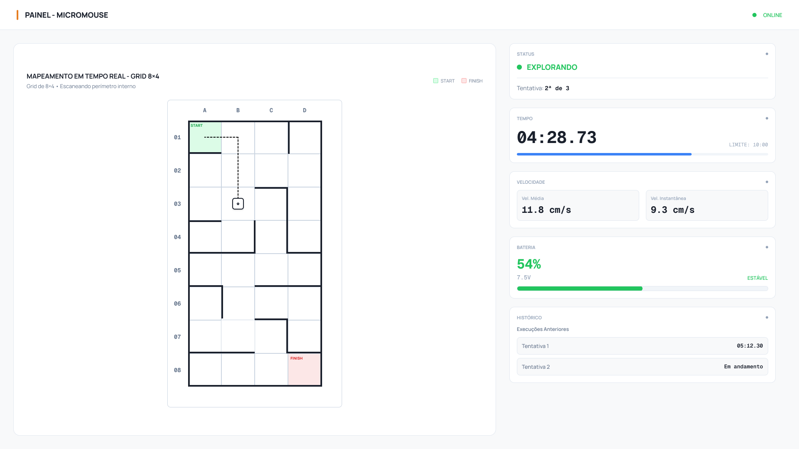

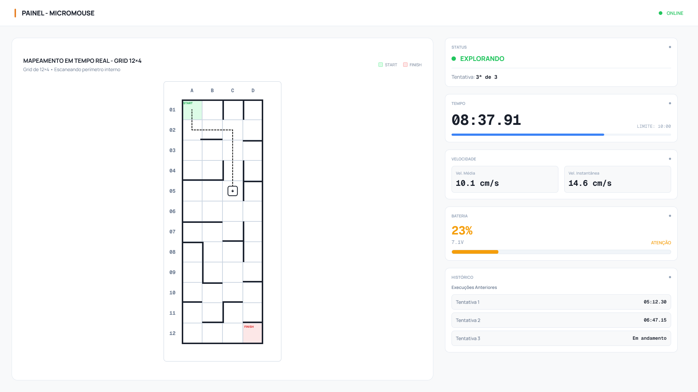

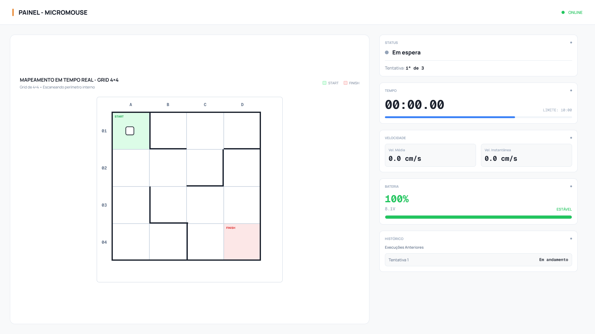

| Bloco | Conteúdo exibido | Origem do dado |
|:---|:---|:---|
| Cabeçalho | Indicador de conexão com o gateway receptor | Watchdog de enlace (seção 6.7) |
| Mapeamento em tempo real | Grade na geometria da prova, células de largada e chegada, paredes detectadas, rastro percorrido e posição e orientação atuais do robô | Campos `posicao`, `orientacao` e `paredes` do pacote |
| Status | Estado atual do robô e número da tentativa | Campo `status` e contagem de tentativas do backend |
| Tempo | Cronômetro da prova e barra de progresso até o limite de 10 minutos | Campo `timestamp_ms` |
| Velocidade | Velocidade média e instantânea | Campos `velocidade_media` e `velocidade_atual` |
| Bateria | Carga em porcentagem, tensão e faixa de alerta | Campos `bateria_pct` e `bateria_volts` |
| Histórico da sessão | Tentativas já realizadas no labirinto atual e seus tempos | Tabela Corrida (seção 4.6) |

**Convenção de exibição:** a coluna é identificada por letra (A a D) e a linha por número (1 a 12). A largada fica na célula A1, no canto superior esquerdo da grade, e o norte corresponde ao topo da tela.

**Estados exibidos no painel**

| Estado no protocolo | Rótulo na tela | Significado |
|:---|:---|:---|
| `AGUARDANDO` | Em espera | Robô ligado, aguardando a largada |
| `MAPEANDO` | Explorando | Exploração do labirinto em andamento |
| `SPEED_RUN` | Speed Run | Percurso otimizado após a exploração (RF-SFT09) |
| `CONCLUIDO` | Concluído | Robô alcançou a célula objetivo |
| `COLISAO` | Colisão | Prova encerrada por colisão |
| `TIMEOUT` | Tempo esgotado | Limite de 10 minutos atingido |
| `TRAVADO` | Travado | Corte de tração por travamento das rodas (RF-SFT11) |
| (estado do painel) | Conexão RF perdida | Nenhum pacote recebido há mais de 3 segundos |

#### 3.2.2 Tela de Histórico de Corridas

A tela de histórico lista todas as corridas persistidas e permite inspecionar individualmente cada uma delas.

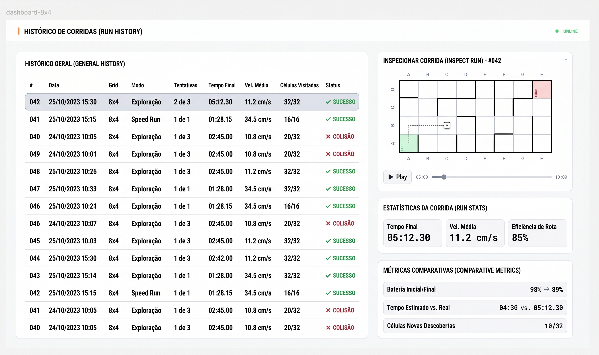

| Bloco | Conteúdo exibido | Origem do dado |
|:---|:---|:---|
| Histórico geral | Lista de corridas com identificador, data, geometria, modo, tentativa, tempo final, velocidade média, células visitadas e status final | Tabela Corrida |
| Filtros | Seleção por geometria do labirinto e por data de execução (RF-SFT08) | Consulta à tabela Corrida |
| Inspecionar corrida | Mapa final da corrida selecionada e reprodução do trajeto com controle de tempo | Tabelas Celula e Leitura |
| Estatísticas da corrida | Tempo final, velocidade média e eficiência de rota | Tabela Corrida |
| Métricas comparativas | Bateria inicial e final, tempo estimado e real, células novas descobertas | Tabelas Corrida e Celula |

A reprodução do trajeto percorre os registros da tabela Leitura em ordem de `timestamp_ms`, deslocando o marcador do robô pelas posições registradas. Com o campo `visitada_em_ms` da tabela Celula, o mapa pode ser revelado progressivamente conforme o instante reproduzido.

### 3.3 Requisitos Não Funcionais

Os requisitos não funcionais de software também integram o backlog do produto, cadastrados como issues independentes. A coluna de rastreabilidade relaciona cada RNF aos requisitos funcionais e às histórias de usuário que ele restringe.

| ID | Requisito | Descrição | Critério de aceitação | Prioridade | Rastreabilidade | Issue |
|:---|:---|:---|:---|:---|:---|:---|
| RNF-SFT01 | Autonomia Operacional Plena e Não-Intervenção | Uma vez acionada a largada física na pista, o robô deve operar de forma 100% autônoma, sendo estritamente proibida qualquer intervenção humana externa, pilotagem remota, envio manual de instruções ou carregamento de mapas prévios do traçado do labirinto durante a execução da prova. | Demonstração prática de corrida autônoma sem recepção de sinais de controle externo e auditoria do código-fonte para comprovar ausência de mapas pré-carregados. | P0 | RF-SFT03<br>HU-05, HU-06 | [#61](https://github.com/fcte-pi1/2026.2_PI1_Grupo1_Lui/issues/61) |
| RNF-SFT02 | Compatibilidade com as Geometrias Oficiais do Labirinto | O software embarcado e o sistema de telemetria devem ser plenamente compatíveis e capazes de explorar, mapear e exibir os dados para as três geometrias oficiais estipuladas pelo edital: labirintos de 4x4, 8x4 e 12x4 células (células de 180x180 mm, paredes de 12x50 mm e corredores de 168 mm). | Execução de baterias de testes de navegação autônoma e exibição correta no painel web nas três configurações oficiais (4x4, 8x4 e 12x4). | P0 | RF-SFT02, RF-SFT06<br>HU-04, HU-10 | [#62](https://github.com/fcte-pi1/2026.2_PI1_Grupo1_Lui/issues/62) |
| RNF-SFT03 | Taxa de Atualização e Latência da Telemetria Web | A aplicação web deve receber dados e atualizar os componentes do painel em tempo real com taxa mínima de 1 Hz e latência de exibição ponta a ponta inferior a 1,0 segundo em rede local. | Comparação por gravação em vídeo de alta taxa de quadros entre a movimentação física do robô na pista e a atualização do componente gráfico no painel web. | P0 | RF-SFT05, RF-SFT06<br>HU-09, HU-10 | [#63](https://github.com/fcte-pi1/2026.2_PI1_Grupo1_Lui/issues/63) |
| RNF-SFT04 | Tempo de Resposta de Consultas ao Histórico | As consultas e recuperação de corridas armazenadas no banco de dados devem apresentar tempo de renderização na interface web inferior a 2,0 segundos para bases com até 500 registros. | Medição do tempo de resposta (Time to First Byte e renderização completa) no console de desenvolvimento (DevTools) do navegador. | P1 | RF-SFT08<br>HU-13, HU-14 | [#64](https://github.com/fcte-pi1/2026.2_PI1_Grupo1_Lui/issues/64) |
| RNF-SFT05 | Compatibilidade e Responsividade Desktop | A aplicação web deve ser plenamente funcional e sem distorções visuais nos principais navegadores modernos (Google Chrome e Mozilla Firefox) em resoluções a partir de 1366 x 768 pixels. | Testes automatizados ou manuais de layout e redimensionamento de janela nos navegadores em resolução 1366x768 e 1920x1080. | P1 | RF-SFT06, RF-SFT08<br>HU-10, HU-11, HU-13 | [#65](https://github.com/fcte-pi1/2026.2_PI1_Grupo1_Lui/issues/65) |
| RNF-SFT06 | Responsividade para Dispositivos Móveis | A interface do dashboard web deve adaptar seus componentes principais (status, cronômetro e telemetria essencial) para visualização legível em telas verticais de smartphones (largura a partir de 360 px). | Emulação de viewport móvel (360x640 px a 412x915 px) com conferência de legibilidade e ausência de barra de rolagem horizontal desnecessária. | P2 | RF-SFT06<br>HU-11 | [#66](https://github.com/fcte-pi1/2026.2_PI1_Grupo1_Lui/issues/66) |

---

## 4. Arquitetura da Solução

### 4.1 Propósito e Padrão Adotado

**Propósito do software**

O software desempenha dois papéis no sistema. O **firmware embarcado** é o núcleo de decisão do robô: interpreta os sensores, mantém o mapa do labirinto, escolhe a trajetória e comanda os atuadores, garantindo a operação autônoma exigida pelo RNF-SFT01. A **aplicação web** é a camada de observação: recebe a telemetria, exibe a prova em tempo real e preserva o histórico das corridas para análise posterior. A aplicação web nunca envia comandos ao robô.

**Padrão arquitetural: monolito cliente-servidor em camadas**

A solução web adota uma arquitetura **monolítica cliente-servidor**: um único backend concentra ingestão da telemetria, regras de negócio, persistência e API, e um único frontend, do tipo aplicação de página única (SPA), consome esse backend. Internamente, o backend é organizado em **camadas** (interface, serviços e acesso a dados) e o frontend em **componentes** reutilizáveis.

Justificativa:

- **Escopo e equipe:** o sistema tem um único produtor de dados (o robô), poucos usuários simultâneos e uma equipe pequena. Microsserviços trariam custos de implantação, comunicação entre serviços e monitoramento sem benefício proporcional.
- **Implantação local:** todo o software web roda em um único computador na bancada de prova (seção 4.5). Um monolito é implantado com um só processo, o que reduz pontos de falha no dia da avaliação.
- **Tempo real simples:** como ingestão e difusão ocorrem no mesmo processo, o pacote recebido pela serial é repassado ao navegador sem intermediários, favorecendo a latência inferior a 1 segundo do RNF-SFT03.
- **Evolução:** a separação em camadas mantém o código organizado e permite extrair partes no futuro, caso o projeto cresça.

O firmware segue uma organização própria de sistemas embarcados: **módulos funcionais coordenados por uma máquina de estados**, executados como tarefas concorrentes do FreeRTOS, sistema operacional de tempo real já incluído no suporte ao ESP32.

**Resumo das tecnologias**

| Camada | Linguagem | Frameworks e bibliotecas | Justificativa |
|:---|:---|:---|:---|
| Firmware do robô | C++ | Arduino-ESP32 sobre FreeRTOS, compilado com PlatformIO | Suporte nativo ao ESP32, bibliotecas consolidadas para sensores ToF, encoders e ESP-NOW |
| Firmware do gateway | C++ | Arduino-ESP32, ArduinoJson | Recebe o pacote ESP-NOW e o converte em JSON na porta serial com pouco código |
| Backend | Python | FastAPI, Uvicorn, pySerial, SQLAlchemy | WebSocket e API REST nativos, documentação automática da API e acesso simples à porta serial |
| Frontend | JavaScript | React, Vite, Recharts | Componentização adequada à grade do labirinto e aos indicadores; grade desenhada em SVG |
| Banco de dados | SQL | MySQL | Ver justificativa abaixo |

**Banco de dados: relacional (MySQL) em vez de NoSQL**

Os dados de telemetria têm estrutura fixa e conhecida (dicionário de dados da seção 6.5), e as consultas exigidas pelo RF-SFT08 combinam filtros por geometria e intervalo de datas, além de junções entre corrida, leituras e células. Esse perfil favorece um banco relacional, que oferece integridade referencial entre as entidades (seção 4.6) e consultas por índice dentro do limite de 2 segundos do RNF-SFT04. Um banco orientado a documentos não traria vantagem, pois não há variação de esquema entre corridas.

### 4.2 Visão Lógica

A visão lógica apresenta os módulos do sistema e suas responsabilidades, organizados pelos quatro elementos de software.

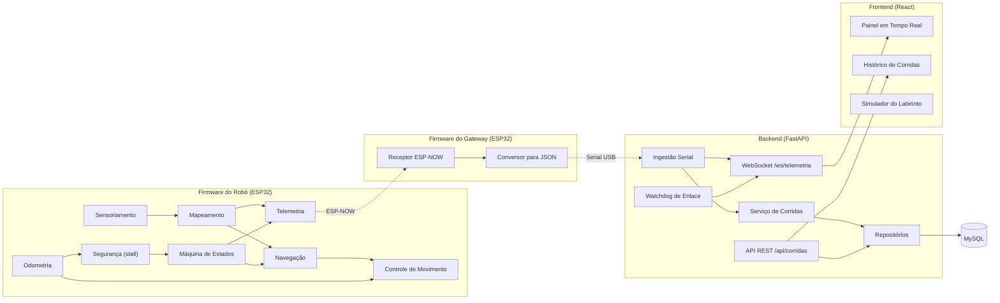

**Firmware do robô**

| Módulo | Responsabilidade | Requisitos |
|:---|:---|:---|
| Máquina de Estados | Controla o ciclo da prova: espera, exploração, speed run e encerramentos (seção 4.3) | RF-SFT03, RF-SFT04 |
| Sensoriamento | Lê os sensores de distância e converte as leituras em presença de parede | RF-SFT02 |
| Odometria | Lê encoders e IMU para estimar deslocamento, velocidade e orientação | RF-SFT01 |
| Mapeamento | Mantém a matriz do labirinto e registra as paredes de cada célula (seção 5.1) | RF-SFT02 |
| Navegação | Decide a próxima célula durante a exploração e calcula a rota ótima para o speed run | RF-SFT03, RF-SFT09, RF-SFT10 |
| Controle de Movimento | Executa retas centralizadas e rotações ortogonais (seção 5.2) | RF-SFT01 |
| Segurança | Detecta travamento das rodas e corta a tração (seção 5.3) | RF-SFT11 |
| Telemetria | Monta e transmite o pacote a cada segundo (seção 6.2) | RF-SFT05 |

**Firmware do gateway**

| Módulo | Responsabilidade | Requisitos |
|:---|:---|:---|
| Receptor ESP-NOW | Recebe e valida os pacotes binários enviados pelo robô | RF-ELE04 |
| Conversor para JSON | Converte o pacote para o formato de exibição e o envia pela porta serial (seções 6.2 e 6.3) | RF-SFT05 |

**Backend**

| Camada | Módulo | Responsabilidade | Requisitos |
|:---|:---|:---|:---|
| Interface | Ingestão Serial | Lê as linhas JSON da porta serial e valida cada pacote contra o dicionário de dados | RF-SFT05 |
| Interface | WebSocket | Difunde cada pacote válido aos navegadores conectados | RF-SFT06, RNF-SFT03 |
| Interface | API REST | Atende as consultas ao histórico com filtros | RF-SFT08 |
| Serviços | Serviço de Corridas | Aplica o ciclo de vida da corrida: abertura, registro de leituras, atualização de células e encerramento (seção 6.6) | RF-SFT07 |
| Serviços | Watchdog de Enlace | Sinaliza perda de conexão após 3 segundos sem pacotes (seção 6.7) | RF-SFT05 |
| Dados | Repositórios | Isolam o acesso ao banco de dados para Corrida, Leitura e Celula | RF-SFT07 |

**API REST prevista**

| Método | Rota | Função |
|:---|:---|:---|
| GET | `/api/corridas` | Lista corridas, com filtros opcionais por `labirinto`, `data_inicio` e `data_fim` |
| GET | `/api/corridas/{id}` | Retorna os dados consolidados de uma corrida |
| GET | `/api/corridas/{id}/leituras` | Retorna as leituras da corrida em ordem de tempo, usadas na reprodução do trajeto |
| GET | `/api/corridas/{id}/celulas` | Retorna o mapa final da corrida |
| WS | `/ws/telemetria` | Canal de tempo real do painel (seção 6.4) |

**Frontend**

| Módulo | Responsabilidade | Requisitos |
|:---|:---|:---|
| Painel em Tempo Real | Grade do labirinto, rastro, posição e indicadores da prova, alimentados pelo WebSocket | RF-SFT06 |
| Histórico de Corridas | Lista com filtros, inspeção e reprodução de corridas, alimentado pela API REST | RF-SFT08 |
| Simulador do Labirinto | Ambiente virtual para validar a lógica de navegação e a interface sem o robô físico, reaproveitando o componente de grade (pacote 5.1.3 da EAP) | RNF-SFT02 |

### 4.3 Visão de Processos

A visão de processos descreve o que executa em paralelo e como os elementos se comunicam ao longo do tempo.

**Estados do robô**

O comportamento do firmware é governado por uma máquina de estados, cujos estados são os mesmos transmitidos no campo `status` da telemetria.

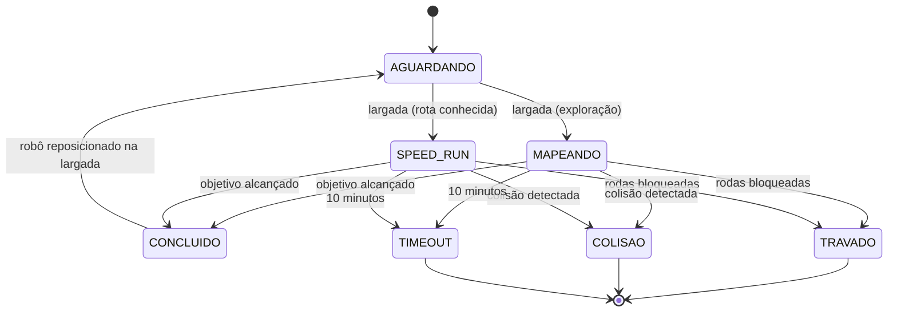

**Concorrência no firmware do robô**

O firmware executa tarefas independentes do FreeRTOS, de modo que a transmissão de telemetria nunca atrase o controle do robô:

| Tarefa | Frequência | Função |
|:---|:---|:---|
| Controle e navegação | Laço contínuo, com leitura de sensores a no mínimo 20 Hz (pacote 3.1.5 da EAP) | Sensoriamento, mapeamento, decisão de trajetória e controle dos motores |
| Monitor de segurança | Contínua, em paralelo ao controle | Verificação de travamento enquanto houver comando de tração |
| Telemetria | 1 Hz | Leitura do estado compartilhado e envio do pacote ESP-NOW |

O estado compartilhado entre as tarefas (posição, orientação, mapa e indicadores) é protegido por mecanismos de exclusão mútua do FreeRTOS, evitando que a telemetria leia um estado parcialmente atualizado.

**Concorrência no backend**

O backend opera de forma assíncrona em um único processo, com tarefas em paralelo:

- **Leitor serial:** aguarda continuamente novas linhas na porta USB e as encaminha para validação.
- **Processamento do pacote:** valida o pacote, difunde pelo WebSocket e registra no banco por meio do Serviço de Corridas.
- **Watchdog:** verifica a cada segundo o tempo desde o último pacote válido.
- **Requisições HTTP:** consultas ao histórico são atendidas em paralelo à ingestão, sem bloqueá-la.

**Fluxo de um pacote de telemetria**

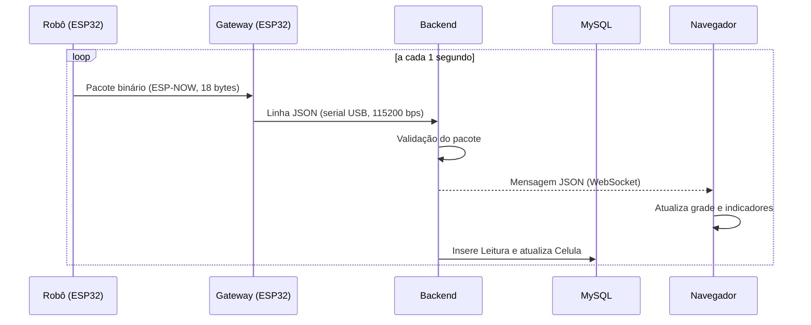

A difusão ao navegador ocorre antes da gravação no banco, para que eventuais atrasos de persistência não afetem a exibição. Estimativa do tempo total, frente ao limite de 1 segundo do RNF-SFT03:

| Etapa | Tempo estimado |
|:---|:---|
| Transmissão ESP-NOW | menos de 5 ms |
| Transmissão serial de cerca de 350 bytes a 115200 bps | cerca de 30 ms |
| Validação e difusão no backend | poucos milissegundos |
| Entrega WebSocket em rede local e renderização | dezenas de milissegundos |
| **Total** | **bem abaixo de 1 segundo** |

### 4.4 Visão de Implementação

A visão de implementação descreve como o código é organizado no repositório. A estrutura segue as pastas do template da disciplina, com uma subpasta por elemento de software:

```text
src/
├── firmware/
│   ├── robo/                  # Firmware do robô (PlatformIO)
│   │   ├── platformio.ini
│   │   ├── include/           # Cabeçalhos e estruturas compartilhadas (TelemetriaPacket)
│   │   └── src/
│   │       ├── main.cpp       # Inicialização e criação das tarefas
│   │       ├── estados/       # Máquina de estados
│   │       ├── sensores/      # Sensoriamento e odometria
│   │       ├── mapa/          # Matriz do labirinto
│   │       ├── navegacao/     # Exploração e rota ótima
│   │       ├── controle/      # Controle de movimento
│   │       ├── seguranca/     # Detecção de travamento
│   │       └── telemetria/    # Envio ESP-NOW
│   └── gateway/               # Firmware do receptor (PlatformIO)
│       ├── platformio.ini
│       └── src/main.cpp
├── backend/
│   ├── requirements.txt
│   └── app/
│       ├── main.py            # Inicialização do FastAPI e das tarefas
│       ├── api/               # Rotas REST e WebSocket
│       ├── ingestao/          # Leitura da porta serial e watchdog
│       ├── servicos/          # Ciclo de vida da corrida
│       ├── repositorios/      # Acesso ao banco
│       └── modelos/           # Entidades e esquemas de validação
└── frontend/
    ├── package.json
    └── src/
        ├── componentes/       # Grade, indicadores, tabela
        ├── paginas/           # Painel, Histórico, Simulador
        └── servicos/          # Clientes WebSocket e REST
```

**Principais dependências**

| Elemento | Dependência | Uso |
|:---|:---|:---|
| Firmware do robô | Arduino-ESP32 | Base de desenvolvimento, FreeRTOS e ESP-NOW |
| Firmware do robô | Biblioteca do sensor ToF (VL53L0X) | Leitura de distância às paredes |
| Firmware do gateway | ArduinoJson | Montagem da linha JSON |
| Backend | FastAPI e Uvicorn | API REST, WebSocket e servidor |
| Backend | pySerial | Leitura da porta USB do gateway |
| Backend | SQLAlchemy e PyMySQL | Mapeamento objeto-relacional e conexão com o MySQL |
| Frontend | React e Vite | Construção da interface |
| Frontend | Recharts | Gráficos de velocidade e bateria |

A estrutura `TelemetriaPacket` (seção 6.2) é definida em um único cabeçalho compartilhado entre o firmware do robô e o do gateway, garantindo que emissor e receptor usem exatamente o mesmo formato.

### 4.5 Visão de Implantação

Todo o sistema é implantado localmente na bancada de prova, sem dependência de internet ou de rede Wi-Fi externa.

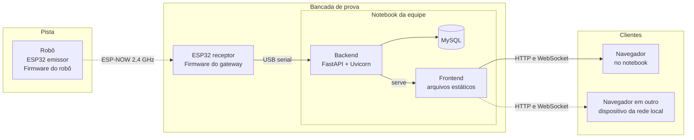

| Nó | Hardware | Software implantado |
|:---|:---|:---|
| Robô | ESP32 embarcado | Firmware do robô |
| Gateway | ESP32 na bancada, ligado ao notebook por cabo USB | Firmware do gateway |
| Notebook da equipe | Computador da bancada | Backend, banco MySQL e arquivos do frontend, servidos pelo próprio backend |
| Clientes | Navegador no notebook ou em outro dispositivo da mesma rede local | Aplicação web (SPA) |

**Observações de implantação**

- O backend identifica a porta serial do gateway por configuração (`COMx` no Windows, `/dev/ttyUSBx` no Linux).
- O frontend é compilado para arquivos estáticos e servido pelo próprio backend, de modo que a aplicação inteira é iniciada com um único comando.
- Recomenda-se executar o MySQL em contêiner Docker, padronizando o ambiente entre os computadores da equipe.
- Dispositivos móveis na mesma rede local podem acompanhar o painel pelo navegador, o que viabiliza o RNF-SFT06.

### 4.6 Visão de Dados (MER e DER)

A persistência utiliza banco de dados relacional (MySQL), adequado à natureza estruturada da telemetria e às consultas históricas com filtros exigidas pelo RF-SFT08.

#### 4.6.1 Modelo Entidade-Relacionamento (MER)

**Entidades**

**Corrida**: representa uma prova completa, da largada ao encerramento. É criada no início da prova e completada ao seu término.

| Atributo | Descrição |
|:---|:---|
| idCorrida | Identificador único da corrida |
| inicio | Data e hora da largada |
| fim | Data e hora do encerramento |
| tempo_total_ms | Duração total da prova em milissegundos |
| labirinto | Geometria da pista: 4x4, 8x4 ou 12x4 |
| modo | Exploração ou Speed Run |
| tentativa | Número sequencial da tentativa no mesmo labirinto |
| status_final | CONCLUIDO, COLISAO, TIMEOUT, TRAVADO ou INTERROMPIDA |
| desafio_cumprido | Indica se o robô alcançou a célula objetivo |
| velocidade_media | Velocidade média da prova em cm/s |
| celulas_visitadas | Quantidade de células fisicamente visitadas |
| bateria_inicial_pct | Carga da bateria na largada, em porcentagem |
| bateria_final_pct | Carga da bateria no encerramento, em porcentagem |

**Leitura**: representa um pacote de telemetria recebido, ou seja, o estado do robô em um instante da prova. Uma corrida de 5 minutos gera cerca de 300 leituras.

| Atributo | Descrição |
|:---|:---|
| idLeitura | Identificador único da leitura |
| Corrida_idCorrida | Corrida à qual a leitura pertence |
| timestamp_ms | Tempo decorrido de prova no momento da leitura |
| coluna | Coluna atual do robô: A, B, C ou D |
| linha | Linha atual do robô: 1 a 12 |
| orientacao | Direção para a qual o robô aponta: Norte, Sul, Leste ou Oeste |
| status | Estado do robô no instante da leitura |
| velocidade_atual | Velocidade instantânea em cm/s |
| velocidade_media | Velocidade média acumulada até o instante, em cm/s |
| bateria_pct | Carga da bateria em porcentagem |
| bateria_volts | Tensão da bateria em volts |

**Celula**: representa uma célula do labirinto e as paredes detectadas nela durante uma corrida. Todas as células da geometria são criadas no início da corrida.

| Atributo | Descrição |
|:---|:---|
| idCelula | Identificador único da célula |
| Corrida_idCorrida | Corrida à qual a célula pertence |
| coluna | Coluna da célula: A, B, C ou D |
| linha | Linha da célula: 1 a 12 |
| parede_norte, parede_sul, parede_leste, parede_oeste | Presença de parede em cada lado: detectada, ausente ou nulo quando ainda não observada |
| visitada_em_ms | Instante da primeira visita do robô à célula; nulo se a célula nunca foi visitada |

**Relacionamentos**

| Relacionamento | Cardinalidade | Descrição |
|:---|:---|:---|
| Corrida registra Leitura | 1 : N | Uma corrida possui várias leituras; cada leitura pertence a exatamente uma corrida |
| Corrida mapeia Celula | 1 : N | Uma corrida possui uma célula para cada posição da geometria (16, 32 ou 48); cada célula pertence a exatamente uma corrida |

**Regras de integridade**

- A combinação de Corrida_idCorrida, coluna e linha é única na entidade Celula, de modo que uma nova passagem do robô pela mesma posição atualiza a célula existente em vez de criar outra.
- O valor de linha deve respeitar a geometria da corrida: 1 a 4, 1 a 8 ou 1 a 12.
- O trajeto percorrido, um dos parâmetros obrigatórios do edital, é obtido pela sequência de posições da entidade Leitura ordenada por timestamp_ms, sem necessidade de armazenamento separado.

#### 4.6.2 Diagrama Entidade-Relacionamento (DER)

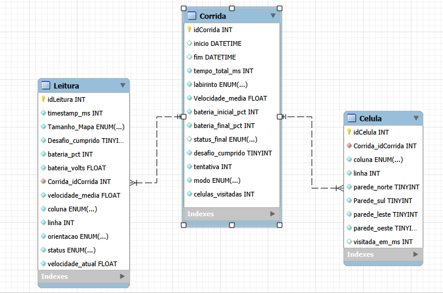

---

## 5. Detalhamento dos Algoritmos de Firmware

### 5.1 Mapeamento Topológico do Labirinto

**Requisitos atendidos:** RF-SFT02 e RNF-SFT02.

O labirinto é representado na memória como uma **matriz de células**, em que cada posição corresponde a uma célula física de 180 x 180 mm da pista. A célula inicial ocupa a posição (0,0) e a numeração cresce conforme o robô avança.

**Convenção de coordenadas**

Internamente, o firmware indexa linhas e colunas a partir de zero, com a célula de largada na posição (0,0), conforme o RF-SFT03. Na telemetria e no painel web, a mesma posição é exibida como **A1**: colunas identificadas pelas letras A a D e linhas numeradas de 1 a 12. A largada fica no canto superior esquerdo da grade, e o norte corresponde ao topo. A conversão entre os dois formatos é feita pelo gateway receptor (seção 6.2).

Cada célula armazena:

| Campo | Tamanho | Conteúdo |
|:---|:---|:---|
| Paredes | 4 bits | Presença de parede nas direções norte, sul, leste e oeste |
| Visitada | 1 bit | Indica se o robô já esteve fisicamente na célula |
| Distância ao objetivo | 1 byte | Valor usado pelo algoritmo de busca durante a navegação |

As três geometrias oficiais são atendidas por **parametrização**: o número de linhas e colunas é definido na inicialização, a partir da seleção feita pelo operador, e toda a lógica opera sobre esses limites. Isso evita qualquer código específico por tamanho de pista e atende o RNF-SFT02.

**Atualização do mapa**

1. Ao entrar em uma célula, o firmware marca o bit de visitada.
2. As leituras dos sensores frontal e laterais são convertidas em presença ou ausência de parede, considerando a orientação atual do robô.
3. A informação é gravada de forma simétrica: ao registrar parede a leste da célula (r, c), a mesma parede é registrada a oeste da célula (r, c+1), mantendo a consistência do mapa.
4. As paredes de perímetro são conhecidas de antemão, pois toda pista oficial é fechada nas bordas.

**Orientação e posição**

O firmware mantém dois estados internos: a célula atual e a direção apontada (norte, sul, leste ou oeste). Cada avanço incrementa a posição na direção corrente, e cada rotação ortogonal atualiza a direção. A consistência entre esses estados e a odometria é o que garante que o mapa gerado corresponda à pista real.

**Exemplo de representação**

Em uma pista 4x4 na qual o robô partiu de (0,0), seguiu para o leste até (0,2) e encontrou parede à frente, o estado parcial da matriz seria:

| Célula | Paredes registradas | Visitada |
|:---|:---|:---|
| (0,0) | Norte, Oeste | Sim |
| (0,1) | Norte | Sim |
| (0,2) | Norte, Leste | Sim |
| Demais | Não determinadas | Não |

Ao fim da exploração, essa matriz deve ser idêntica à configuração física da pista, que é o critério de aceitação do RF-SFT02.

### 5.2 Controle de Movimento e Alinhamento de Trajetória

**Requisitos atendidos:** RF-SFT01.

O robô não navega apenas apontando para frente: ele se guia pela **distância às paredes laterais** do corredor. Durante o avanço em linha reta, os sensores ToF laterais medem continuamente a distância até a parede esquerda e até a parede direita.

- Se as duas distâncias forem iguais, o robô está centralizado no corredor e mantém a mesma velocidade nas duas rodas.
- Se uma distância for menor que a outra, o robô está se aproximando de um dos lados. O firmware reduz a velocidade da roda do lado mais próximo da parede, ou aumenta a do lado oposto, trazendo o robô de volta ao centro.
- A correção é proporcional ao tamanho do desvio, com um termo adicional que reage à velocidade de variação do erro, caracterizando um controle **proporcional e derivativo (PD)**. O erro é a diferença entre as distâncias laterais, e a saída ajusta a velocidade diferencial entre as rodas até que o erro tenda a zero.

O critério de aceitação do RF-SFT01 exige que o robô percorra três células consecutivas em reta mantendo desvio lateral inferior a **15 mm** em relação à linha de centro, sem contato com as paredes. Como o corredor livre tem 168 mm, um desvio de 15 mm para cada lado só ocorre sem contato se a largura do robô for de no máximo 138 mm (168 mm menos 2 x 15 mm). Essa restrição deve ser compatibilizada com o projeto estrutural, já que o TAP admite largura de até 165 mm.

**Trechos sem parede de referência**

Em cruzamentos e entradas de corredores a comparação lateral deixa de ser confiável. Nesses trechos o firmware recorre a um critério auxiliar, mantendo o rumo pela referência angular da IMU e pela diferença de contagem entre os encoders, até voltar a ter parede nos dois lados.

**Rotações ortogonais**

As curvas de 90° são executadas por rotação diferencial das rodas, com o ângulo controlado por encoders e IMU. O RF-SFT01 limita o **erro angular acumulado a ±3°**, o que exige que cada rotação seja verificada ao final e corrigida antes do próximo avanço, evitando que pequenos desvios se somem ao longo da prova.

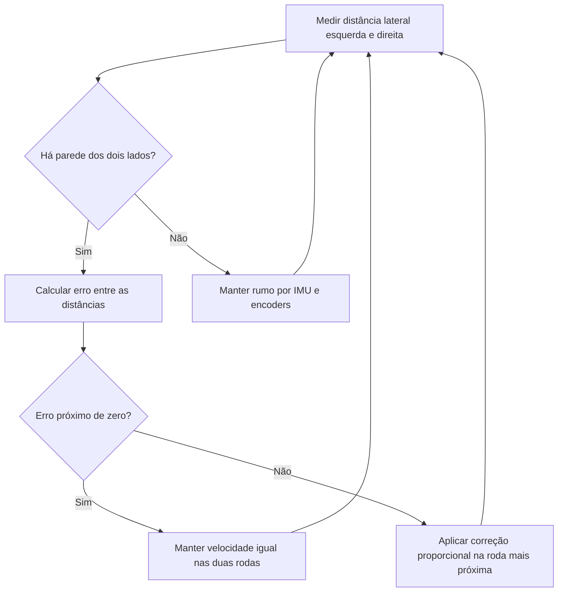

### 5.3 Detecção e Tratamento de Travamento (Stall)

**Requisitos atendidos:** RF-SFT11.

Se o firmware está comandando os motores e a odometria não registra rotação das rodas por mais de **1,0 segundo**, considera-se que o robô está travado, seja por roda presa, obstáculo ou perda de contato com o piso. Nessa condição a tração deve ser cortada para prevenir danos aos motores e ao driver.

O monitoramento ocorre em paralelo ao controle de movimento:

1. A cada pulso de encoder registrado, o firmware guarda o instante da última rotação detectada.
2. Enquanto houver comando de tração ativo, verifica-se periodicamente o tempo decorrido desde esse instante.
3. Ultrapassado 1,0 segundo sem rotação, o travamento é confirmado: a potência dos motores é zerada, o robô entra em estado de erro e a condição é sinalizada por indicador local e pelo status `TRAVADO` na telemetria (seção 6).
4. Se a odometria continuar respondendo, o temporizador é reiniciado e a navegação segue normalmente.

O critério de aceitação do RF-SFT11 admite o corte em até **1,2 segundo** após o bloqueio físico das rodas, o que reserva 200 ms para o ciclo de verificação e a atuação do corte.

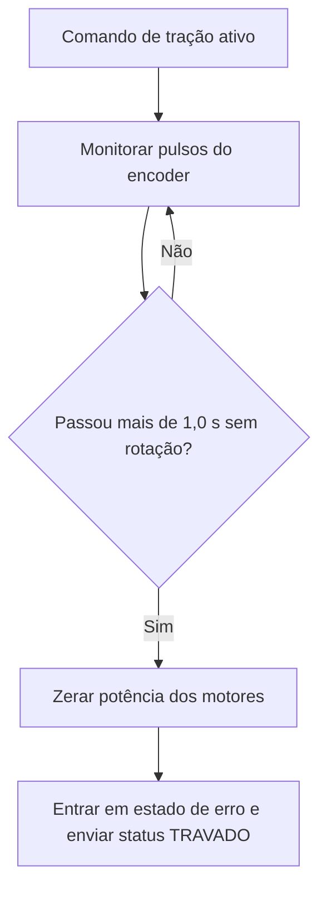

---

## 6. Protocolo de Telemetria

**Requisitos atendidos:** RF-SFT05, RF-ELE04 e RNF-SFT03.

### 6.1 Visão Geral da Arquitetura de Comunicação

A telemetria opera via protocolo de rádio **ESP-NOW**, protocolo de camada de enlace em 2,4 GHz da Espressif que dispensa roteador ou rede Wi-Fi. A transmissão ocorre na frequência nominal de **1 Hz**, com um envio a cada 1000 ms.

A integração com o computador de monitoramento utiliza um **gateway receptor dedicado**:

```text
+--------------------------+                      +--------------------------+
|   ESP32 Emissor (Robo)   |       ESP-NOW        | ESP32 Receptor (Bancada) |
|   - Amostragem a 1 Hz    | ===================> | - Gateway / Bridge       |
|   - Payload: Struct C    |   (Pacote Binario)   | - Valida e converte      |
+--------------------------+                      +--------------------------+
                                                               |
                                                               | Serial / USB (JSON a 115200 bps)
                                                               v
+--------------------------+                      +--------------------------+
|      Dashboard Web       |      WebSocket       |     Servidor Backend     |
|  - Renderizacao da grade | <=================== | - Leitura da porta serial|
|  - Rastro e Metricas     |    ws://... (JSON)   | - Broadcast e Banco      |
+--------------------------+                      +--------------------------+
```

1. **ESP32 emissor (robô):** coleta dados dos sensores, odometria, paredes e bateria, empacota em uma estrutura binária em C e transmite via ESP-NOW para o endereço MAC do receptor a cada 1 segundo.
2. **ESP32 receptor (gateway USB):** conectado à porta USB da estação base. Recebe a estrutura binária, converte para JSON e envia pela interface serial.
3. **Servidor backend:** lê continuamente a porta serial (`/dev/ttyUSBx` ou `COMx`), valida o pacote, redistribui via **WebSocket** para o front-end e persiste os dados no banco.
4. **Dashboard web:** consome o WebSocket e atualiza o mapa e os indicadores em tempo real.

### 6.2 Camada de Rádio: Payload Binário ESP-NOW

No firmware do robô, a transmissão utiliza uma estrutura compactada de 18 bytes, bem abaixo do limite de 250 bytes por pacote do ESP-NOW. Posição e velocidade trafegam em formato interno do firmware e são convertidas pelo gateway para o formato de exibição.

```c
typedef struct __attribute__((packed)) {
    uint32_t timestamp_ms;     // Tempo decorrido de corrida (ms)
    uint8_t  labirinto_id;     // 1: 4x4, 2: 8x4, 3: 12x4
    uint8_t  status_id;        // 0: AGUARDANDO, 1: MAPEANDO, 2: SPEED_RUN, 3: COLISAO,
                               // 4: CONCLUIDO, 5: TIMEOUT, 6: TRAVADO
    uint8_t  desafio_cumprido; // 0: Nao, 1: Sim
    uint8_t  bateria_pct;      // 0 a 100 %
    uint16_t bateria_mv;       // Tensao em milivolts (ex: 7420 mV = 7.42 V)
    int16_t  velocidade_atual; // Velocidade instantanea em mm/s
    int16_t  velocidade_media; // Velocidade media acumulada em mm/s
    uint8_t  coluna;           // Indice interno 0 a 3 (exibido como A a D)
    uint8_t  linha;            // Indice interno 0 a 11 (exibido como 1 a 12)
    uint8_t  orientacao;       // 0: Norte, 1: Sul, 2: Leste, 3: Oeste
    uint8_t  paredes;          // Bitmask: bit0=N, bit1=S, bit2=L, bit3=O
} TelemetriaPacket;
```

**Conversões realizadas pelo gateway**

| Campo | No pacote binário | No JSON |
|:---|:---|:---|
| Coluna | Índice 0 a 3 | Letra A a D |
| Linha | Índice 0 a 11 | Número 1 a 12 |
| Velocidades | Inteiro em mm/s | Decimal em cm/s |
| Bateria | Inteiro em mV | Decimal em V |
| Paredes | Bitmask de 4 bits | Quatro campos booleanos |

As direções de parede e de orientação são **absolutas**, isto é, referenciadas ao labirinto e não à frente do robô. O firmware converte as leituras dos sensores a partir da orientação atual antes de montar o pacote.

### 6.3 Camada Serial (Gateway para Backend)

O ESP32 receptor emite pela porta USB uma linha de texto em JSON a cada pacote recebido:

- **Taxa de transmissão:** 115200 bps
- **Delimitador de quadro:** quebra de linha (`\n`)

### 6.4 Camada de Aplicação: WebSocket

- **Protocolo:** WebSocket (RFC 6455)
- **Endpoint:** `ws://<host>:<porta>/ws/telemetria`
- **Frequência:** 1 Hz
- **Formato:** JSON em UTF-8

Exemplo de mensagem:

```json
{
  "timestamp_ms": 142000,
  "labirinto": "8x4",
  "status": "MAPEANDO",
  "desafio_cumprido": false,
  "bateria_pct": 78,
  "bateria_volts": 7.42,
  "velocidade_atual": 35.0,
  "velocidade_media": 28.5,
  "posicao": {
    "coluna": "B",
    "linha": 4
  },
  "orientacao": "LESTE",
  "paredes": {
    "norte": false,
    "sul": true,
    "leste": true,
    "oeste": false
  }
}
```

### 6.5 Dicionário de Dados

Todos os campos são obrigatórios.

| Campo | Tipo | Unidade | Descrição e restrições |
|:---|:---|:---|:---|
| `timestamp_ms` | Inteiro | ms | Tempo decorrido de prova, de 0 a 600.000 ms (limite de 10 minutos) |
| `labirinto` | String | - | Geometria em execução: `"4x4"`, `"8x4"` ou `"12x4"` |
| `status` | String | - | Estado do robô: `"AGUARDANDO"`, `"MAPEANDO"`, `"SPEED_RUN"`, `"COLISAO"`, `"CONCLUIDO"`, `"TIMEOUT"` ou `"TRAVADO"` |
| `desafio_cumprido` | Booleano | - | `true` se o robô alcançou a célula objetivo |
| `bateria_pct` | Inteiro | % | Carga restante estimada, de 0 a 100 |
| `bateria_volts` | Decimal | V | Tensão da bateria medida via ADC |
| `velocidade_atual` | Decimal | cm/s | Velocidade instantânea estimada pela odometria |
| `velocidade_media` | Decimal | cm/s | Velocidade média acumulada na prova |
| `posicao.coluna` | String | - | Coluna atual: `"A"`, `"B"`, `"C"` ou `"D"` |
| `posicao.linha` | Inteiro | - | Linha atual: 1 a 4, 1 a 8 ou 1 a 12, conforme a geometria |
| `orientacao` | String | - | Direção absoluta do robô: `"NORTE"`, `"SUL"`, `"LESTE"` ou `"OESTE"` |
| `paredes.norte` | Booleano | - | Parede detectada ao norte da célula atual |
| `paredes.sul` | Booleano | - | Parede detectada ao sul da célula atual |
| `paredes.leste` | Booleano | - | Parede detectada a leste da célula atual |
| `paredes.oeste` | Booleano | - | Parede detectada a oeste da célula atual |

### 6.6 Ciclo de Vida da Corrida no Backend

O backend identifica o início e o fim de cada corrida a partir das transições de status recebidas:

1. **Início:** a transição de `AGUARDANDO` para `MAPEANDO` ou `SPEED_RUN` cria um registro na tabela Corrida, com o modo derivado do status e a tentativa numerada sequencialmente para o mesmo labirinto na sessão de monitoramento. No mesmo momento são criadas todas as células da geometria (16, 32 ou 48), com paredes ainda não observadas.
2. **Durante a prova:** cada pacote recebido gera uma nova Leitura e atualiza a Celula correspondente à posição atual, registrando as paredes detectadas e o instante da primeira visita.
3. **Encerramento:** um status terminal (`CONCLUIDO`, `COLISAO`, `TIMEOUT` ou `TRAVADO`) fecha a corrida, preenchendo horário de fim, tempo total, status final, velocidade média, células visitadas e bateria final.

O trajeto percorrido é reconstruído pela sequência de leituras ordenada por `timestamp_ms`.

### 6.7 Confiabilidade e Watchdog

- **Watchdog de enlace (3 segundos):** se o backend passar 3000 ms consecutivos sem receber um pacote válido, o painel passa a exibir o estado `CONEXAO RF PERDIDA`, retornando ao normal quando a recepção for retomada.
- **Descarte de pacotes corrompidos:** o ESP-NOW possui verificação CRC em hardware, e pacotes com ruído são descartados pelo receptor antes do envio à porta serial.
- **Persistência incremental:** cada leitura é gravada no momento em que é recebida, e não apenas ao final da prova, preservando os dados em caso de falha. Uma corrida que não receba status terminal, por perda definitiva de conexão ou início de uma nova corrida, é encerrada com status final `INTERROMPIDA`, atendendo ao RF-SFT07 para corridas concluídas ou interrompidas.

---

## 7. Roteiro de Testes Funcionais

Os casos de teste abaixo verificam os requisitos funcionais de software a partir dos critérios de aceitação definidos no documento de requisitos e nas histórias de usuário (seção 3.1). Cada caso referencia as issues correspondentes no GitHub.

**Resumo**

| Código | Caso de teste | Rastreabilidade | Prioridade |
|:---|:---|:---|:---|
| CT-01 | Centralização do robô em reta | [RF-SFT01](https://github.com/fcte-pi1/2026.2_PI1_Grupo1_Lui/issues/31), [HU-01](https://github.com/fcte-pi1/2026.2_PI1_Grupo1_Lui/issues/32) | P0 |
| CT-02 | Precisão das rotações de 90° | [RF-SFT01](https://github.com/fcte-pi1/2026.2_PI1_Grupo1_Lui/issues/31), [HU-02](https://github.com/fcte-pi1/2026.2_PI1_Grupo1_Lui/issues/33) | P0 |
| CT-03 | Fidelidade do mapeamento nas três geometrias | [RF-SFT02](https://github.com/fcte-pi1/2026.2_PI1_Grupo1_Lui/issues/34), [HU-03](https://github.com/fcte-pi1/2026.2_PI1_Grupo1_Lui/issues/35), [RNF-SFT02](https://github.com/fcte-pi1/2026.2_PI1_Grupo1_Lui/issues/62) | P0 |
| CT-04 | Seleção da geometria antes da largada | [RF-SFT02](https://github.com/fcte-pi1/2026.2_PI1_Grupo1_Lui/issues/34), [HU-04](https://github.com/fcte-pi1/2026.2_PI1_Grupo1_Lui/issues/36) | P0 |
| CT-05 | Largada e navegação autônoma | [RF-SFT03](https://github.com/fcte-pi1/2026.2_PI1_Grupo1_Lui/issues/37), [HU-05](https://github.com/fcte-pi1/2026.2_PI1_Grupo1_Lui/issues/38), [HU-06](https://github.com/fcte-pi1/2026.2_PI1_Grupo1_Lui/issues/39), [RNF-SFT01](https://github.com/fcte-pi1/2026.2_PI1_Grupo1_Lui/issues/61) | P0 |
| CT-06 | Parada automática no objetivo | [RF-SFT04](https://github.com/fcte-pi1/2026.2_PI1_Grupo1_Lui/issues/40), [HU-07](https://github.com/fcte-pi1/2026.2_PI1_Grupo1_Lui/issues/41) | P0 |
| CT-07 | Transmissão da telemetria a 1 Hz | [RF-SFT05](https://github.com/fcte-pi1/2026.2_PI1_Grupo1_Lui/issues/42), [HU-08](https://github.com/fcte-pi1/2026.2_PI1_Grupo1_Lui/issues/43) | P0 |
| CT-08 | Aviso de perda de conexão | [RF-SFT05](https://github.com/fcte-pi1/2026.2_PI1_Grupo1_Lui/issues/42), [HU-09](https://github.com/fcte-pi1/2026.2_PI1_Grupo1_Lui/issues/44) | P0 |
| CT-09 | Painel sincronizado com a pista | [RF-SFT06](https://github.com/fcte-pi1/2026.2_PI1_Grupo1_Lui/issues/45), [HU-10](https://github.com/fcte-pi1/2026.2_PI1_Grupo1_Lui/issues/46), [HU-11](https://github.com/fcte-pi1/2026.2_PI1_Grupo1_Lui/issues/47), [RNF-SFT03](https://github.com/fcte-pi1/2026.2_PI1_Grupo1_Lui/issues/63) | P0 |
| CT-10 | Persistência de corridas concluídas e interrompidas | [RF-SFT07](https://github.com/fcte-pi1/2026.2_PI1_Grupo1_Lui/issues/48), [HU-12](https://github.com/fcte-pi1/2026.2_PI1_Grupo1_Lui/issues/49) | P1 |
| CT-11 | Filtragem do histórico | [RF-SFT08](https://github.com/fcte-pi1/2026.2_PI1_Grupo1_Lui/issues/50), [HU-13](https://github.com/fcte-pi1/2026.2_PI1_Grupo1_Lui/issues/51), [RNF-SFT04](https://github.com/fcte-pi1/2026.2_PI1_Grupo1_Lui/issues/64) | P1 |
| CT-12 | Reprodução de corrida passada | [RF-SFT08](https://github.com/fcte-pi1/2026.2_PI1_Grupo1_Lui/issues/50), [HU-14](https://github.com/fcte-pi1/2026.2_PI1_Grupo1_Lui/issues/52) | P1 |
| CT-13 | Speed run mais rápido que a exploração | [RF-SFT09](https://github.com/fcte-pi1/2026.2_PI1_Grupo1_Lui/issues/53), [HU-15](https://github.com/fcte-pi1/2026.2_PI1_Grupo1_Lui/issues/54), [HU-16](https://github.com/fcte-pi1/2026.2_PI1_Grupo1_Lui/issues/55) | P1 |
| CT-14 | Curva em movimento contínuo | [RF-SFT10](https://github.com/fcte-pi1/2026.2_PI1_Grupo1_Lui/issues/56), [HU-17](https://github.com/fcte-pi1/2026.2_PI1_Grupo1_Lui/issues/57) | P2 |
| CT-15 | Corte de tração por travamento | [RF-SFT11](https://github.com/fcte-pi1/2026.2_PI1_Grupo1_Lui/issues/58), [HU-18](https://github.com/fcte-pi1/2026.2_PI1_Grupo1_Lui/issues/59), [HU-19](https://github.com/fcte-pi1/2026.2_PI1_Grupo1_Lui/issues/60) | P0 |

### CT-01: Centralização do robô em reta

| Campo | Descrição |
|:---|:---|
| Código | CT-01 |
| Nome | Centralização do robô em reta |
| Rastreabilidade | [RF-SFT01](https://github.com/fcte-pi1/2026.2_PI1_Grupo1_Lui/issues/31), [HU-01](https://github.com/fcte-pi1/2026.2_PI1_Grupo1_Lui/issues/32) |
| Objetivo | Verificar se o controle de movimento mantém o robô centralizado no corredor durante trechos retos. |
| Pré-condições | • Robô calibrado e com bateria acima de 50%<br>• Pista montada com um corredor reto de pelo menos 3 células com paredes nos dois lados<br>• Linha de centro do corredor marcada no piso para referência |
| Procedimento | 1. Posicionar o robô no início do corredor, alinhado à linha de centro<br>2. Acionar a largada<br>3. Filmar o percurso de cima, com régua milimetrada visível ao lado do corredor<br>4. Medir no vídeo o maior afastamento lateral em relação à linha de centro<br>5. Repetir o ensaio 5 vezes |
| Resultado esperado | Em todas as repetições, o desvio lateral máximo é inferior a 15 mm e não há contato com as paredes. |

### CT-02: Precisão das rotações de 90°

| Campo | Descrição |
|:---|:---|
| Código | CT-02 |
| Nome | Precisão das rotações de 90° |
| Rastreabilidade | [RF-SFT01](https://github.com/fcte-pi1/2026.2_PI1_Grupo1_Lui/issues/31), [HU-02](https://github.com/fcte-pi1/2026.2_PI1_Grupo1_Lui/issues/33) |
| Objetivo | Verificar se as rotações ortogonais mantêm o erro angular acumulado dentro do limite. |
| Pré-condições | • Robô calibrado e com bateria acima de 50%<br>• Área livre com marcação de referência angular no piso |
| Procedimento | 1. Posicionar o robô sobre a marcação de referência<br>2. Comandar uma sequência de 8 rotações de 90° no mesmo sentido (duas voltas completas)<br>3. Medir o ângulo final do robô em relação à orientação inicial<br>4. Repetir no sentido oposto |
| Resultado esperado | O erro angular acumulado ao final de cada sequência é de no máximo ±3°. |

### CT-03: Fidelidade do mapeamento nas três geometrias

| Campo | Descrição |
|:---|:---|
| Código | CT-03 |
| Nome | Fidelidade do mapeamento nas três geometrias |
| Rastreabilidade | [RF-SFT02](https://github.com/fcte-pi1/2026.2_PI1_Grupo1_Lui/issues/34), [HU-03](https://github.com/fcte-pi1/2026.2_PI1_Grupo1_Lui/issues/35), [RNF-SFT02](https://github.com/fcte-pi1/2026.2_PI1_Grupo1_Lui/issues/62) |
| Objetivo | Verificar se a matriz registrada pelo firmware ao final da exploração corresponde à pista física. |
| Pré-condições | • Pistas 4x4, 8x4 e 12x4 montadas com traçados conhecidos e desenhados em papel<br>• Painel web em execução para leitura do mapa final |
| Procedimento | 1. Selecionar a geometria correspondente à pista<br>2. Executar a exploração completa<br>3. Ao final, comparar célula a célula as paredes exibidas no mapa final com o desenho da pista<br>4. Repetir para as três geometrias |
| Resultado esperado | Em todas as geometrias, as paredes registradas nas células visitadas são 100% idênticas à configuração física da pista. |

### CT-04: Seleção da geometria antes da largada

| Campo | Descrição |
|:---|:---|
| Código | CT-04 |
| Nome | Seleção da geometria antes da largada |
| Rastreabilidade | [RF-SFT02](https://github.com/fcte-pi1/2026.2_PI1_Grupo1_Lui/issues/34), [HU-04](https://github.com/fcte-pi1/2026.2_PI1_Grupo1_Lui/issues/36) |
| Objetivo | Verificar se a geometria escolhida pelo operador é aplicada ao mapa e informada na telemetria. |
| Pré-condições | • Robô ligado no estado AGUARDANDO<br>• Painel web conectado ao gateway |
| Procedimento | 1. Selecionar a geometria 8x4 no robô<br>2. Observar a grade exibida no painel<br>3. Acionar a largada e conferir o campo labirinto da telemetria<br>4. Repetir para 4x4 e 12x4 |
| Resultado esperado | O painel exibe a grade com as dimensões da geometria selecionada e a telemetria informa o valor correspondente em todos os casos. |

### CT-05: Largada e navegação autônoma

| Campo | Descrição |
|:---|:---|
| Código | CT-05 |
| Nome | Largada e navegação autônoma |
| Rastreabilidade | [RF-SFT03](https://github.com/fcte-pi1/2026.2_PI1_Grupo1_Lui/issues/37), [HU-05](https://github.com/fcte-pi1/2026.2_PI1_Grupo1_Lui/issues/38), [HU-06](https://github.com/fcte-pi1/2026.2_PI1_Grupo1_Lui/issues/39), [RNF-SFT01](https://github.com/fcte-pi1/2026.2_PI1_Grupo1_Lui/issues/61) |
| Objetivo | Verificar se o robô inicia a prova pelo botão físico e alcança o objetivo sem intervenção externa. |
| Pré-condições | • Pista 4x4 com traçado desconhecido pela equipe de firmware<br>• Robô sem mapa pré-carregado<br>• Robô ligado no estado AGUARDANDO |
| Procedimento | 1. Verificar que o robô permanece parado antes do acionamento<br>2. Acionar o botão de largada e iniciar um cronômetro externo<br>3. Acompanhar a prova sem qualquer interação com o robô<br>4. Registrar o tempo até a chegada à célula objetivo |
| Resultado esperado | O robô permanece parado até a largada, muda para o status MAPEANDO ao ser acionado e alcança o objetivo em menos de 3 minutos sem intervenção. |

### CT-06: Parada automática no objetivo

| Campo | Descrição |
|:---|:---|
| Código | CT-06 |
| Nome | Parada automática no objetivo |
| Rastreabilidade | [RF-SFT04](https://github.com/fcte-pi1/2026.2_PI1_Grupo1_Lui/issues/40), [HU-07](https://github.com/fcte-pi1/2026.2_PI1_Grupo1_Lui/issues/41) |
| Objetivo | Verificar se o robô para e congela o cronômetro ao entrar na célula de chegada. |
| Pré-condições | • Pista 4x4 montada<br>• Câmera com gravação de alta taxa de quadros posicionada sobre a célula de chegada |
| Procedimento | 1. Executar uma prova completa<br>2. No vídeo, identificar o quadro em que o robô cruza a entrada da célula de chegada e o quadro em que as rodas param<br>3. Calcular o intervalo entre os dois quadros<br>4. Conferir no painel o status e o tempo final |
| Resultado esperado | A tração é interrompida em menos de 200 ms após a entrada na célula, o cronômetro é congelado e a telemetria informa CONCLUIDO com desafio cumprido. |

### CT-07: Transmissão da telemetria a 1 Hz

| Campo | Descrição |
|:---|:---|
| Código | CT-07 |
| Nome | Transmissão da telemetria a 1 Hz |
| Rastreabilidade | [RF-SFT05](https://github.com/fcte-pi1/2026.2_PI1_Grupo1_Lui/issues/42), [HU-08](https://github.com/fcte-pi1/2026.2_PI1_Grupo1_Lui/issues/43) |
| Objetivo | Verificar se o robô envia os 6 parâmetros obrigatórios do edital na frequência especificada. |
| Pré-condições | • Gateway conectado ao computador<br>• Monitor serial ou registro do backend ativo |
| Procedimento | 1. Executar uma prova de pelo menos 60 segundos<br>2. Registrar todos os pacotes recebidos pelo backend com seus horários de chegada<br>3. Conferir em cada pacote a presença dos campos de tipo de labirinto, posição, bateria, velocidade média, tempo e desafio cumprido<br>4. Calcular o intervalo médio entre pacotes e a quantidade de pacotes perdidos |
| Resultado esperado | Todos os pacotes contêm os 6 parâmetros do edital, o intervalo médio entre pacotes é de 1 segundo e não há perda de pacotes ao longo do percurso. |

### CT-08: Aviso de perda de conexão

| Campo | Descrição |
|:---|:---|
| Código | CT-08 |
| Nome | Aviso de perda de conexão |
| Rastreabilidade | [RF-SFT05](https://github.com/fcte-pi1/2026.2_PI1_Grupo1_Lui/issues/42), [HU-09](https://github.com/fcte-pi1/2026.2_PI1_Grupo1_Lui/issues/44) |
| Objetivo | Verificar se o painel sinaliza a interrupção da telemetria e se o robô continua a prova. |
| Pré-condições | • Prova em andamento com o painel recebendo dados |
| Procedimento | 1. Durante a prova, desconectar o cabo USB do gateway<br>2. Cronometrar o tempo até a mudança de estado no painel<br>3. Reconectar o cabo após 10 segundos<br>4. Observar o comportamento do robô durante todo o intervalo |
| Resultado esperado | O painel exibe Conexão RF perdida cerca de 3 segundos após a desconexão, volta ao normal ao reconectar, e o robô continua navegando sem interrupção. |

### CT-09: Painel sincronizado com a pista

| Campo | Descrição |
|:---|:---|
| Código | CT-09 |
| Nome | Painel sincronizado com a pista |
| Rastreabilidade | [RF-SFT06](https://github.com/fcte-pi1/2026.2_PI1_Grupo1_Lui/issues/45), [HU-10](https://github.com/fcte-pi1/2026.2_PI1_Grupo1_Lui/issues/46), [HU-11](https://github.com/fcte-pi1/2026.2_PI1_Grupo1_Lui/issues/47), [RNF-SFT03](https://github.com/fcte-pi1/2026.2_PI1_Grupo1_Lui/issues/63) |
| Objetivo | Verificar se o painel reflete a movimentação e as paredes descobertas em tempo real. |
| Pré-condições | • Prova em andamento<br>• Câmera gravando simultaneamente a pista e a tela do painel |
| Procedimento | 1. Executar uma prova de exploração<br>2. No vídeo, comparar o instante em que o robô entra em cada célula com o instante em que o painel atualiza a posição<br>3. Conferir se paredes, rastro, orientação, tempo, velocidade, bateria e status são exibidos<br>4. Medir o maior atraso observado |
| Resultado esperado | Todos os indicadores são exibidos, a grade reflete as paredes descobertas e o atraso entre a pista e o painel é inferior a 1 segundo. |

### CT-10: Persistência de corridas concluídas e interrompidas

| Campo | Descrição |
|:---|:---|
| Código | CT-10 |
| Nome | Persistência de corridas concluídas e interrompidas |
| Rastreabilidade | [RF-SFT07](https://github.com/fcte-pi1/2026.2_PI1_Grupo1_Lui/issues/48), [HU-12](https://github.com/fcte-pi1/2026.2_PI1_Grupo1_Lui/issues/49) |
| Objetivo | Verificar se as corridas são gravadas integralmente no banco de dados, inclusive quando interrompidas. |
| Pré-condições | • Backend e banco de dados em execução |
| Procedimento | 1. Executar uma prova completa até o objetivo<br>2. Consultar a corrida no histórico logo após o encerramento<br>3. Iniciar uma nova prova e desligar o robô no meio do percurso<br>4. Consultar a segunda corrida no histórico |
| Resultado esperado | A primeira corrida aparece com status CONCLUIDO e todas as leituras; a segunda aparece com status INTERROMPIDA e as leituras recebidas até a interrupção. |

### CT-11: Filtragem do histórico

| Campo | Descrição |
|:---|:---|
| Código | CT-11 |
| Nome | Filtragem do histórico |
| Rastreabilidade | [RF-SFT08](https://github.com/fcte-pi1/2026.2_PI1_Grupo1_Lui/issues/50), [HU-13](https://github.com/fcte-pi1/2026.2_PI1_Grupo1_Lui/issues/51), [RNF-SFT04](https://github.com/fcte-pi1/2026.2_PI1_Grupo1_Lui/issues/64) |
| Objetivo | Verificar se os filtros por geometria e data retornam as corridas corretas no tempo exigido. |
| Pré-condições | • Banco de dados populado com corridas nas três geometrias e em datas diferentes, totalizando até 500 registros<br>• Ferramentas de desenvolvedor do navegador abertas na aba de rede |
| Procedimento | 1. Abrir a tela de histórico<br>2. Aplicar o filtro de geometria 8x4<br>3. Aplicar um intervalo de datas<br>4. Registrar o tempo de resposta e renderização |
| Resultado esperado | Somente as corridas que atendem aos filtros são listadas e o resultado é exibido em menos de 2 segundos. |

### CT-12: Reprodução de corrida passada

| Campo | Descrição |
|:---|:---|
| Código | CT-12 |
| Nome | Reprodução de corrida passada |
| Rastreabilidade | [RF-SFT08](https://github.com/fcte-pi1/2026.2_PI1_Grupo1_Lui/issues/50), [HU-14](https://github.com/fcte-pi1/2026.2_PI1_Grupo1_Lui/issues/52) |
| Objetivo | Verificar se uma corrida salva pode ser inspecionada e reproduzida. |
| Pré-condições | • Ao menos uma corrida concluída registrada no banco |
| Procedimento | 1. Selecionar a corrida na tela de histórico<br>2. Conferir o mapa final e as estatísticas exibidas<br>3. Acionar a reprodução e usar a barra de tempo para avançar e retroceder<br>4. Comparar o trajeto reproduzido com o vídeo da prova original |
| Resultado esperado | O mapa e as estatísticas carregam em menos de 2 segundos, e a reprodução percorre as posições na mesma ordem da prova real. |

### CT-13: Speed run mais rápido que a exploração

| Campo | Descrição |
|:---|:---|
| Código | CT-13 |
| Nome | Speed run mais rápido que a exploração |
| Rastreabilidade | [RF-SFT09](https://github.com/fcte-pi1/2026.2_PI1_Grupo1_Lui/issues/53), [HU-15](https://github.com/fcte-pi1/2026.2_PI1_Grupo1_Lui/issues/54), [HU-16](https://github.com/fcte-pi1/2026.2_PI1_Grupo1_Lui/issues/55) |
| Objetivo | Verificar se a corrida pela rota ótima reduz o tempo em relação à exploração. |
| Pré-condições | • Exploração completa realizada na pista, com o mapa mantido na memória do robô |
| Procedimento | 1. Registrar o tempo da exploração<br>2. Reposicionar o robô na largada<br>3. Acionar a largada do speed run<br>4. Registrar o tempo do speed run e conferir o modo registrado no histórico |
| Resultado esperado | O tempo do speed run é pelo menos 20% menor que o da exploração, e a corrida é registrada com modo Speed Run. |

### CT-14: Curva em movimento contínuo

| Campo | Descrição |
|:---|:---|
| Código | CT-14 |
| Nome | Curva em movimento contínuo |
| Rastreabilidade | [RF-SFT10](https://github.com/fcte-pi1/2026.2_PI1_Grupo1_Lui/issues/56), [HU-17](https://github.com/fcte-pi1/2026.2_PI1_Grupo1_Lui/issues/57) |
| Objetivo | Verificar se as curvas suavizadas reduzem o tempo de transição entre células. |
| Pré-condições | • Trecho de pista com uma curva de 90° entre dois corredores<br>• Câmera com gravação de alta taxa de quadros |
| Procedimento | 1. Percorrer o trecho com giro parado e medir o tempo de transição na curva<br>2. Percorrer o mesmo trecho com curva contínua e medir o tempo<br>3. Repetir cada modo 5 vezes e calcular as médias |
| Resultado esperado | A curva contínua é executada sem parada total, sem contato com as paredes e com tempo médio pelo menos 300 ms menor que o giro parado. |

### CT-15: Corte de tração por travamento

| Campo | Descrição |
|:---|:---|
| Código | CT-15 |
| Nome | Corte de tração por travamento |
| Rastreabilidade | [RF-SFT11](https://github.com/fcte-pi1/2026.2_PI1_Grupo1_Lui/issues/58), [HU-18](https://github.com/fcte-pi1/2026.2_PI1_Grupo1_Lui/issues/59), [HU-19](https://github.com/fcte-pi1/2026.2_PI1_Grupo1_Lui/issues/60) |
| Objetivo | Verificar se o robô corta os motores ao detectar as rodas bloqueadas e se o painel informa o travamento. |
| Pré-condições | • Robô em movimento em trecho reto<br>• Painel conectado<br>• Câmera gravando o robô e a tela |
| Procedimento | 1. Bloquear manualmente as rodas motrizes com o robô em movimento<br>2. No vídeo, medir o tempo entre o bloqueio e o corte dos motores<br>3. Conferir o status exibido no painel e o registro da corrida no histórico |
| Resultado esperado | Os motores são cortados em no máximo 1,2 segundo após o bloqueio, o painel exibe o status Travado e a corrida é encerrada com status final TRAVADO. |