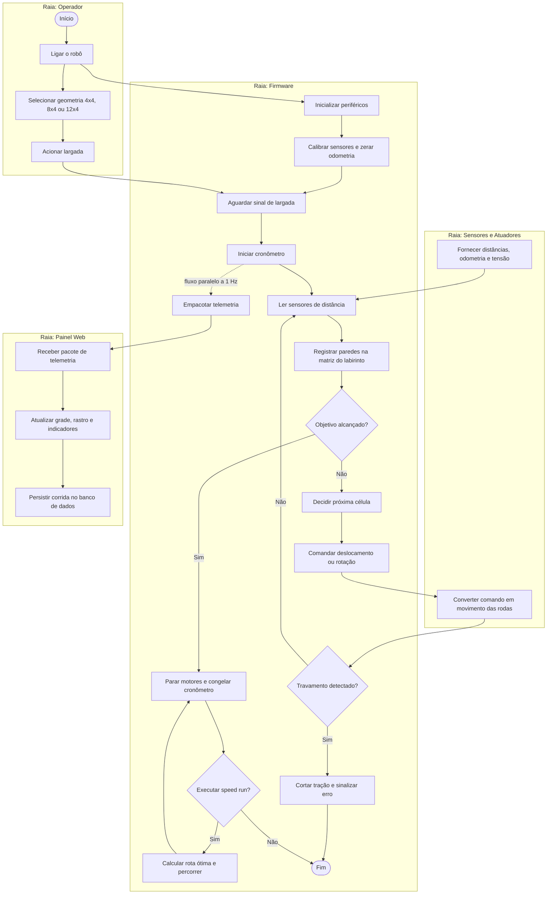

# Projeto Conceitual de Software

## 1. Visão Geral e Premissas

### 1.1 Propósito

O software do Grupo 1 é responsável por duas frentes complementares:

1. **Firmware embarcado**, executado no microcontrolador do robô, responsável por perceber o ambiente, mapear o labirinto, decidir a trajetória, acionar os atuadores e empacotar a telemetria.
2. **Aplicação web de telemetria**, executada fora do robô, responsável por receber os pacotes transmitidos durante a prova, exibir o estado da corrida em tempo real e persistir o histórico para consulta posterior.

As duas frentes são independentes em execução: o robô cumpre a prova de forma autônoma mesmo sem o painel web conectado, conforme o RNF-SFT01. A aplicação web é um observador do processo, nunca um controlador.

### 1.2 Premissas de hardware

As decisões deste documento partem das definições registradas no TAP e na EAP. Os itens abaixo dependem de confirmação do núcleo de Eletrônica (issues #20 a #22) e devem ser revisados caso a especificação mude.

| Premissa | Origem | Impacto no software |
|:---|:---|:---|
| Microcontrolador ESP32 no robô | TAP / EAP | Linguagem do firmware e rádio integrado para a telemetria |
| Segundo ESP32 na bancada, conectado por USB ao computador, atuando como receptor ESP-NOW | Proposta do núcleo de Software (seção 6) | Canal de telemetria sem dependência de rede Wi-Fi, atendendo ao RF-ELE04 |
| Sensores de distância do tipo ToF (VL53L0X) nas laterais e à frente | TAP | Base do controle de trajetória e da detecção de paredes |
| Motores com encoder acoplado | TAP / RF-ELE02 | Odometria, controle de deslocamento e detecção de travamento |
| Unidade inercial (IMU) para referência angular | EAP | Precisão das rotações ortogonais |
| Botão físico de largada e seleção de geometria | RF-SFT02 / regulamento | Estados iniciais do fluxo de operação |

### 1.3 Escopo do documento

Este documento trata do projeto conceitual, ou seja, da definição de comportamento, estrutura e arquitetura que antecede a implementação. Não contém código-fonte, que será produzido na fase de desenvolvimento prevista na EAP.

---

## 2. Diagrama de Atividades UML

O diagrama a seguir representa o comportamento funcional do produto, do acionamento do robô até o encerramento da corrida, organizado em raias por ator.

**Atores e responsabilidades**

| Raia | Papel |
|:---|:---|
| Operador | Aciona o robô, seleciona a geometria da pista e dá a largada física. Não interfere durante a prova (RNF-SFT01). |
| Firmware | Executa a lógica de mapeamento, decisão de trajetória, monitoramento de segurança e empacotamento da telemetria. |
| Sensores e Atuadores | Fornecem leituras de distância, odometria e tensão de bateria, e convertem comandos em movimento. |
| Painel Web | Recebe os pacotes de telemetria, atualiza a interface em tempo real e persiste a corrida. |

**Entradas e saídas do fluxo**

- Entradas: geometria selecionada, sinal de largada, leituras de distância, pulsos de encoder, leitura de tensão da bateria.
- Saídas: comandos de tração, matriz de paredes descobertas, pacotes de telemetria a 1 Hz, registro histórico da corrida.



> Observação: o envio de telemetria ocorre em paralelo ao laço de navegação, a uma taxa fixa de 1 Hz, conforme RF-SFT05 e RNF-SFT03. A verificação de travamento acompanha continuamente qualquer comando de tração ativo.

---

## 3. Backlog do Produto

### 3.1 Requisitos Funcionais

*(a preencher: histórias de usuário agrupadas por RF ou épico, exportadas do GitHub Projects)*

### 3.2 Protótipos de Interface

**Requisitos atendidos:** RF-SFT05, RF-SFT06, RF-SFT07 e RF-SFT08.

A aplicação web é composta por duas telas: a **tela de monitoramento**, usada durante a prova, e a **tela de histórico**, usada para consulta posterior das corridas registradas.

#### 3.2.1 Tela de Monitoramento em Tempo Real

A tela de monitoramento é atualizada a cada pacote de telemetria recebido (1 Hz) e se adapta às três geometrias oficiais do edital.


| Bloco | Conteúdo exibido | Origem do dado |
|:---|:---|:---|
| Cabeçalho | Indicador de conexão com o gateway receptor | Watchdog de enlace (seção 6.7) |
| Mapeamento em tempo real | Grade na geometria da prova, células de largada e chegada, paredes detectadas, rastro percorrido e posição e orientação atuais do robô | Campos `posicao`, `orientacao` e `paredes` do pacote |
| Status | Estado atual do robô e número da tentativa | Campo `status` e contagem de tentativas do backend |
| Tempo | Cronômetro da prova e barra de progresso até o limite de 10 minutos | Campo `timestamp_ms` |
| Velocidade | Velocidade média e instantânea | Campos `velocidade_media` e `velocidade_atual` |
| Bateria | Carga em porcentagem, tensão e faixa de alerta | Campos `bateria_pct` e `bateria_volts` |
| Histórico da sessão | Tentativas já realizadas no labirinto atual e seus tempos | Tabela Corrida (seção 4.6) |

**Convenção de exibição:** a coluna é identificada por letra (A a D) e a linha por número (1 a 12). A largada fica na célula A1, no canto superior esquerdo da grade, e o norte corresponde ao topo da tela.

**Estados exibidos no painel**

| Estado no protocolo | Rótulo na tela | Significado |
|:---|:---|:---|
| `AGUARDANDO` | Em espera | Robô ligado, aguardando a largada |
| `MAPEANDO` | Explorando | Exploração do labirinto em andamento |
| `SPEED_RUN` | Speed Run | Percurso otimizado após a exploração (RF-SFT09) |
| `CONCLUIDO` | Concluído | Robô alcançou a célula objetivo |
| `COLISAO` | Colisão | Prova encerrada por colisão |
| `TIMEOUT` | Tempo esgotado | Limite de 10 minutos atingido |
| `TRAVADO` | Travado | Corte de tração por travamento das rodas (RF-SFT11) |
| (estado do painel) | Conexão RF perdida | Nenhum pacote recebido há mais de 3 segundos |

#### 3.2.2 Tela de Histórico de Corridas

A tela de histórico lista todas as corridas persistidas e permite inspecionar individualmente cada uma delas.


| Bloco | Conteúdo exibido | Origem do dado |
|:---|:---|:---|
| Histórico geral | Lista de corridas com identificador, data, geometria, modo, tentativa, tempo final, velocidade média, células visitadas e status final | Tabela Corrida |
| Filtros | Seleção por geometria do labirinto e por data de execução (RF-SFT08) | Consulta à tabela Corrida |
| Inspecionar corrida | Mapa final da corrida selecionada e reprodução do trajeto com controle de tempo | Tabelas Celula e Leitura |
| Estatísticas da corrida | Tempo final, velocidade média e eficiência de rota | Tabela Corrida |
| Métricas comparativas | Bateria inicial e final, tempo estimado e real, células novas descobertas | Tabelas Corrida e Celula |

A reprodução do trajeto percorre os registros da tabela Leitura em ordem de `timestamp_ms`, deslocando o marcador do robô pelas posições registradas. Com o campo `visitada_em_ms` da tabela Celula, o mapa pode ser revelado progressivamente conforme o instante reproduzido.

### 3.3 Requisitos Não Funcionais

*(a preencher: tabela de RNFs com rastreabilidade)*

---

## 4. Arquitetura da Solução

### 4.1 Propósito e Padrão Adotado

*(a preencher)*

### 4.2 Visão Lógica

*(a preencher)*

### 4.3 Visão de Processos

*(a preencher)*

### 4.4 Visão de Implementação

*(a preencher)*

### 4.5 Visão de Implantação

*(a preencher)*

### 4.6 Visão de Dados (MER e DER)

A persistência utiliza banco de dados relacional (MySQL), adequado à natureza estruturada da telemetria e às consultas históricas com filtros exigidas pelo RF-SFT08.

#### 4.6.1 Modelo Entidade-Relacionamento (MER)

**Entidades**

**Corrida**: representa uma prova completa, da largada ao encerramento. É criada no início da prova e completada ao seu término.

| Atributo | Descrição |
|:---|:---|
| idCorrida | Identificador único da corrida |
| inicio | Data e hora da largada |
| fim | Data e hora do encerramento |
| tempo_total_ms | Duração total da prova em milissegundos |
| labirinto | Geometria da pista: 4x4, 8x4 ou 12x4 |
| modo | Exploração ou Speed Run |
| tentativa | Número sequencial da tentativa no mesmo labirinto |
| status_final | CONCLUIDO, COLISAO, TIMEOUT, TRAVADO ou INTERROMPIDA |
| desafio_cumprido | Indica se o robô alcançou a célula objetivo |
| velocidade_media | Velocidade média da prova em cm/s |
| celulas_visitadas | Quantidade de células fisicamente visitadas |
| bateria_inicial_pct | Carga da bateria na largada, em porcentagem |
| bateria_final_pct | Carga da bateria no encerramento, em porcentagem |

**Leitura**: representa um pacote de telemetria recebido, ou seja, o estado do robô em um instante da prova. Uma corrida de 5 minutos gera cerca de 300 leituras.

| Atributo | Descrição |
|:---|:---|
| idLeitura | Identificador único da leitura |
| Corrida_idCorrida | Corrida à qual a leitura pertence |
| timestamp_ms | Tempo decorrido de prova no momento da leitura |
| coluna | Coluna atual do robô: A, B, C ou D |
| linha | Linha atual do robô: 1 a 12 |
| orientacao | Direção para a qual o robô aponta: Norte, Sul, Leste ou Oeste |
| status | Estado do robô no instante da leitura |
| velocidade_atual | Velocidade instantânea em cm/s |
| velocidade_media | Velocidade média acumulada até o instante, em cm/s |
| bateria_pct | Carga da bateria em porcentagem |
| bateria_volts | Tensão da bateria em volts |

**Celula**: representa uma célula do labirinto e as paredes detectadas nela durante uma corrida. Todas as células da geometria são criadas no início da corrida.

| Atributo | Descrição |
|:---|:---|
| idCelula | Identificador único da célula |
| Corrida_idCorrida | Corrida à qual a célula pertence |
| coluna | Coluna da célula: A, B, C ou D |
| linha | Linha da célula: 1 a 12 |
| parede_norte, parede_sul, parede_leste, parede_oeste | Presença de parede em cada lado: detectada, ausente ou nulo quando ainda não observada |
| visitada_em_ms | Instante da primeira visita do robô à célula; nulo se a célula nunca foi visitada |

**Relacionamentos**

| Relacionamento | Cardinalidade | Descrição |
|:---|:---|:---|
| Corrida registra Leitura | 1 : N | Uma corrida possui várias leituras; cada leitura pertence a exatamente uma corrida |
| Corrida mapeia Celula | 1 : N | Uma corrida possui uma célula para cada posição da geometria (16, 32 ou 48); cada célula pertence a exatamente uma corrida |

**Regras de integridade**

- A combinação de Corrida_idCorrida, coluna e linha é única na entidade Celula, de modo que uma nova passagem do robô pela mesma posição atualiza a célula existente em vez de criar outra.
- O valor de linha deve respeitar a geometria da corrida: 1 a 4, 1 a 8 ou 1 a 12.
- O trajeto percorrido, um dos parâmetros obrigatórios do edital, é obtido pela sequência de posições da entidade Leitura ordenada por timestamp_ms, sem necessidade de armazenamento separado.

#### 4.6.2 Diagrama Entidade-Relacionamento (DER)


---

## 5. Detalhamento dos Algoritmos de Firmware

### 5.1 Mapeamento Topológico do Labirinto

**Requisitos atendidos:** RF-SFT02 e RNF-SFT02.

O labirinto é representado na memória como uma **matriz de células**, em que cada posição corresponde a uma célula física de 180 x 180 mm da pista. A célula inicial ocupa a posição (0,0) e a numeração cresce conforme o robô avança.

**Convenção de coordenadas**

Internamente, o firmware indexa linhas e colunas a partir de zero, com a célula de largada na posição (0,0), conforme o RF-SFT03. Na telemetria e no painel web, a mesma posição é exibida como **A1**: colunas identificadas pelas letras A a D e linhas numeradas de 1 a 12. A largada fica no canto superior esquerdo da grade, e o norte corresponde ao topo. A conversão entre os dois formatos é feita pelo gateway receptor (seção 6.2).

Cada célula armazena:

| Campo | Tamanho | Conteúdo |
|:---|:---|:---|
| Paredes | 4 bits | Presença de parede nas direções norte, sul, leste e oeste |
| Visitada | 1 bit | Indica se o robô já esteve fisicamente na célula |
| Distância ao objetivo | 1 byte | Valor usado pelo algoritmo de busca durante a navegação |

As três geometrias oficiais são atendidas por **parametrização**: o número de linhas e colunas é definido na inicialização, a partir da seleção feita pelo operador, e toda a lógica opera sobre esses limites. Isso evita qualquer código específico por tamanho de pista e atende o RNF-SFT02.

**Atualização do mapa**

1. Ao entrar em uma célula, o firmware marca o bit de visitada.
2. As leituras dos sensores frontal e laterais são convertidas em presença ou ausência de parede, considerando a orientação atual do robô.
3. A informação é gravada de forma simétrica: ao registrar parede a leste da célula (r, c), a mesma parede é registrada a oeste da célula (r, c+1), mantendo a consistência do mapa.
4. As paredes de perímetro são conhecidas de antemão, pois toda pista oficial é fechada nas bordas.

**Orientação e posição**

O firmware mantém dois estados internos: a célula atual e a direção apontada (norte, sul, leste ou oeste). Cada avanço incrementa a posição na direção corrente, e cada rotação ortogonal atualiza a direção. A consistência entre esses estados e a odometria é o que garante que o mapa gerado corresponda à pista real.

**Exemplo de representação**

Em uma pista 4x4 na qual o robô partiu de (0,0), seguiu para o leste até (0,2) e encontrou parede à frente, o estado parcial da matriz seria:

| Célula | Paredes registradas | Visitada |
|:---|:---|:---|
| (0,0) | Norte, Oeste | Sim |
| (0,1) | Norte | Sim |
| (0,2) | Norte, Leste | Sim |
| Demais | Não determinadas | Não |

Ao fim da exploração, essa matriz deve ser idêntica à configuração física da pista, que é o critério de aceitação do RF-SFT02.

### 5.2 Controle de Movimento e Alinhamento de Trajetória

**Requisitos atendidos:** RF-SFT01.

O robô não navega apenas apontando para frente: ele se guia pela **distância às paredes laterais** do corredor. Durante o avanço em linha reta, os sensores ToF laterais medem continuamente a distância até a parede esquerda e até a parede direita.

- Se as duas distâncias forem iguais, o robô está centralizado no corredor e mantém a mesma velocidade nas duas rodas.
- Se uma distância for menor que a outra, o robô está se aproximando de um dos lados. O firmware reduz a velocidade da roda do lado mais próximo da parede, ou aumenta a do lado oposto, trazendo o robô de volta ao centro.
- A correção é proporcional ao tamanho do desvio, com um termo adicional que reage à velocidade de variação do erro, caracterizando um controle **proporcional e derivativo (PD)**. O erro é a diferença entre as distâncias laterais, e a saída ajusta a velocidade diferencial entre as rodas até que o erro tenda a zero.

O critério de aceitação do RF-SFT01 exige que o robô percorra três células consecutivas em reta mantendo desvio lateral inferior a **15 mm** em relação à linha de centro, sem contato com as paredes. Considerando corredores de 168 mm, esse é o limite prático de tolerância do controle.

**Trechos sem parede de referência**

Em cruzamentos e entradas de corredores a comparação lateral deixa de ser confiável. Nesses trechos o firmware recorre a um critério auxiliar, mantendo o rumo pela referência angular da IMU e pela diferença de contagem entre os encoders, até voltar a ter parede nos dois lados.

**Rotações ortogonais**

As curvas de 90° são executadas por rotação diferencial das rodas, com o ângulo controlado por encoders e IMU. O RF-SFT01 limita o **erro angular acumulado a ±3°**, o que exige que cada rotação seja verificada ao final e corrigida antes do próximo avanço, evitando que pequenos desvios se somem ao longo da prova.


### 5.3 Detecção e Tratamento de Travamento (Stall)

**Requisitos atendidos:** RF-SFT11.

Se o firmware está comandando os motores e a odometria não registra rotação das rodas por mais de **1,0 segundo**, considera-se que o robô está travado, seja por roda presa, obstáculo ou perda de contato com o piso. Nessa condição a tração deve ser cortada para prevenir danos aos motores e ao driver.

O monitoramento ocorre em paralelo ao controle de movimento:

1. A cada pulso de encoder registrado, o firmware guarda o instante da última rotação detectada.
2. Enquanto houver comando de tração ativo, verifica-se periodicamente o tempo decorrido desde esse instante.
3. Ultrapassado 1,0 segundo sem rotação, o travamento é confirmado: a potência dos motores é zerada, o robô entra em estado de erro e a condição é sinalizada por indicador local e pelo status `TRAVADO` na telemetria (seção 6).
4. Se a odometria continuar respondendo, o temporizador é reiniciado e a navegação segue normalmente.

O critério de aceitação do RF-SFT11 admite o corte em até **1,2 segundo** após o bloqueio físico das rodas, o que reserva 200 ms para o ciclo de verificação e a atuação do corte.


---

## 6. Protocolo de Telemetria

**Requisitos atendidos:** RF-SFT05, RF-ELE04 e RNF-SFT03.

### 6.1 Visão Geral da Arquitetura de Comunicação

A telemetria opera via protocolo de rádio **ESP-NOW**, protocolo de camada de enlace em 2,4 GHz da Espressif que dispensa roteador ou rede Wi-Fi. A transmissão ocorre na frequência nominal de **1 Hz**, com um envio a cada 1000 ms.

A integração com o computador de monitoramento utiliza um **gateway receptor dedicado**:

```text
+--------------------------+                      +--------------------------+
|   ESP32 Emissor (Robo)   |       ESP-NOW        | ESP32 Receptor (Bancada) |
|   - Amostragem a 1 Hz    | ===================> | - Gateway / Bridge       |
|   - Payload: Struct C    |   (Pacote Binario)   | - Valida e converte      |
+--------------------------+                      +--------------------------+
                                                               |
                                                               | Serial / USB (JSON a 115200 bps)
                                                               v
+--------------------------+                      +--------------------------+
|      Dashboard Web       |      WebSocket       |     Servidor Backend     |
|  - Renderizacao da grade | <=================== | - Leitura da porta serial|
|  - Rastro e Metricas     |    ws://... (JSON)   | - Broadcast e Banco      |
+--------------------------+                      +--------------------------+
```

1. **ESP32 emissor (robô):** coleta dados dos sensores, odometria, paredes e bateria, empacota em uma estrutura binária em C e transmite via ESP-NOW para o endereço MAC do receptor a cada 1 segundo.
2. **ESP32 receptor (gateway USB):** conectado à porta USB da estação base. Recebe a estrutura binária, converte para JSON e envia pela interface serial.
3. **Servidor backend:** lê continuamente a porta serial (`/dev/ttyUSBx` ou `COMx`), valida o pacote, redistribui via **WebSocket** para o front-end e persiste os dados no banco.
4. **Dashboard web:** consome o WebSocket e atualiza o mapa e os indicadores em tempo real.

### 6.2 Camada de Rádio: Payload Binário ESP-NOW

No firmware do robô, a transmissão utiliza uma estrutura compactada de 18 bytes, bem abaixo do limite de 250 bytes por pacote do ESP-NOW. Posição e velocidade trafegam em formato interno do firmware e são convertidas pelo gateway para o formato de exibição.

```c
typedef struct __attribute__((packed)) {
    uint32_t timestamp_ms;     // Tempo decorrido de corrida (ms)
    uint8_t  labirinto_id;     // 1: 4x4, 2: 8x4, 3: 12x4
    uint8_t  status_id;        // 0: AGUARDANDO, 1: MAPEANDO, 2: SPEED_RUN, 3: COLISAO,
                               // 4: CONCLUIDO, 5: TIMEOUT, 6: TRAVADO
    uint8_t  desafio_cumprido; // 0: Nao, 1: Sim
    uint8_t  bateria_pct;      // 0 a 100 %
    uint16_t bateria_mv;       // Tensao em milivolts (ex: 7420 mV = 7.42 V)
    int16_t  velocidade_atual; // Velocidade instantanea em mm/s
    int16_t  velocidade_media; // Velocidade media acumulada em mm/s
    uint8_t  coluna;           // Indice interno 0 a 3 (exibido como A a D)
    uint8_t  linha;            // Indice interno 0 a 11 (exibido como 1 a 12)
    uint8_t  orientacao;       // 0: Norte, 1: Sul, 2: Leste, 3: Oeste
    uint8_t  paredes;          // Bitmask: bit0=N, bit1=S, bit2=L, bit3=O
} TelemetriaPacket;
```

**Conversões realizadas pelo gateway**

| Campo | No pacote binário | No JSON |
|:---|:---|:---|
| Coluna | Índice 0 a 3 | Letra A a D |
| Linha | Índice 0 a 11 | Número 1 a 12 |
| Velocidades | Inteiro em mm/s | Decimal em cm/s |
| Bateria | Inteiro em mV | Decimal em V |
| Paredes | Bitmask de 4 bits | Quatro campos booleanos |

As direções de parede e de orientação são **absolutas**, isto é, referenciadas ao labirinto e não à frente do robô. O firmware converte as leituras dos sensores a partir da orientação atual antes de montar o pacote.

### 6.3 Camada Serial (Gateway para Backend)

O ESP32 receptor emite pela porta USB uma linha de texto em JSON a cada pacote recebido:

- **Taxa de transmissão:** 115200 bps
- **Delimitador de quadro:** quebra de linha (`\n`)

### 6.4 Camada de Aplicação: WebSocket

- **Protocolo:** WebSocket (RFC 6455)
- **Endpoint:** `ws://<host>:<porta>/ws/telemetria`
- **Frequência:** 1 Hz
- **Formato:** JSON em UTF-8

Exemplo de mensagem:

```json
{
  "timestamp_ms": 142000,
  "labirinto": "8x4",
  "status": "MAPEANDO",
  "desafio_cumprido": false,
  "bateria_pct": 78,
  "bateria_volts": 7.42,
  "velocidade_atual": 35.0,
  "velocidade_media": 28.5,
  "posicao": {
    "coluna": "B",
    "linha": 4
  },
  "orientacao": "LESTE",
  "paredes": {
    "norte": false,
    "sul": true,
    "leste": true,
    "oeste": false
  }
}
```

### 6.5 Dicionário de Dados

Todos os campos são obrigatórios.

| Campo | Tipo | Unidade | Descrição e restrições |
|:---|:---|:---|:---|
| `timestamp_ms` | Inteiro | ms | Tempo decorrido de prova, de 0 a 600.000 ms (limite de 10 minutos) |
| `labirinto` | String | - | Geometria em execução: `"4x4"`, `"8x4"` ou `"12x4"` |
| `status` | String | - | Estado do robô: `"AGUARDANDO"`, `"MAPEANDO"`, `"SPEED_RUN"`, `"COLISAO"`, `"CONCLUIDO"`, `"TIMEOUT"` ou `"TRAVADO"` |
| `desafio_cumprido` | Booleano | - | `true` se o robô alcançou a célula objetivo |
| `bateria_pct` | Inteiro | % | Carga restante estimada, de 0 a 100 |
| `bateria_volts` | Decimal | V | Tensão da bateria medida via ADC |
| `velocidade_atual` | Decimal | cm/s | Velocidade instantânea estimada pela odometria |
| `velocidade_media` | Decimal | cm/s | Velocidade média acumulada na prova |
| `posicao.coluna` | String | - | Coluna atual: `"A"`, `"B"`, `"C"` ou `"D"` |
| `posicao.linha` | Inteiro | - | Linha atual: 1 a 4, 1 a 8 ou 1 a 12, conforme a geometria |
| `orientacao` | String | - | Direção absoluta do robô: `"NORTE"`, `"SUL"`, `"LESTE"` ou `"OESTE"` |
| `paredes.norte` | Booleano | - | Parede detectada ao norte da célula atual |
| `paredes.sul` | Booleano | - | Parede detectada ao sul da célula atual |
| `paredes.leste` | Booleano | - | Parede detectada a leste da célula atual |
| `paredes.oeste` | Booleano | - | Parede detectada a oeste da célula atual |

### 6.6 Ciclo de Vida da Corrida no Backend

O backend identifica o início e o fim de cada corrida a partir das transições de status recebidas:

1. **Início:** a transição de `AGUARDANDO` para `MAPEANDO` ou `SPEED_RUN` cria um registro na tabela Corrida, com o modo derivado do status e a tentativa numerada sequencialmente para o mesmo labirinto na sessão de monitoramento. No mesmo momento são criadas todas as células da geometria (16, 32 ou 48), com paredes ainda não observadas.
2. **Durante a prova:** cada pacote recebido gera uma nova Leitura e atualiza a Celula correspondente à posição atual, registrando as paredes detectadas e o instante da primeira visita.
3. **Encerramento:** um status terminal (`CONCLUIDO`, `COLISAO`, `TIMEOUT` ou `TRAVADO`) fecha a corrida, preenchendo horário de fim, tempo total, status final, velocidade média, células visitadas e bateria final.

O trajeto percorrido é reconstruído pela sequência de leituras ordenada por `timestamp_ms`.

### 6.7 Confiabilidade e Watchdog

- **Watchdog de enlace (3 segundos):** se o backend passar 3000 ms consecutivos sem receber um pacote válido, o painel passa a exibir o estado `CONEXAO RF PERDIDA`, retornando ao normal quando a recepção for retomada.
- **Descarte de pacotes corrompidos:** o ESP-NOW possui verificação CRC em hardware, e pacotes com ruído são descartados pelo receptor antes do envio à porta serial.
- **Persistência incremental:** cada leitura é gravada no momento em que é recebida, e não apenas ao final da prova, preservando os dados em caso de falha. Uma corrida que não receba status terminal, por perda definitiva de conexão ou início de uma nova corrida, é encerrada com status final `INTERROMPIDA`, atendendo ao RF-SFT07 para corridas concluídas ou interrompidas.

---

## 7. Roteiro de Testes Funcionais

*(a preencher: casos de teste com rastreabilidade aos RFs e HUs)*

---

## 8. Referências

*(a preencher)*