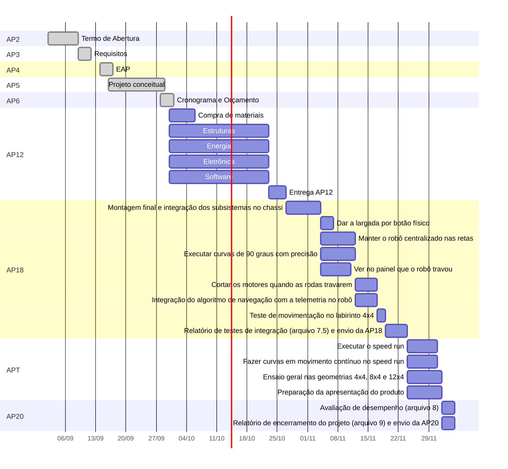

# Cronograma

O cronograma abaixo foi exportado do [GitHub Projects](https://github.com/orgs/fcte-pi1/projects/35) da equipe e segue a mesma estrutura da [EAP](3%20-%20EAP.md). Cada tarefa corresponde a uma issue do repositório:

- **ID** é o código da EAP da tarefa (o mesmo do campo *Código EAP* no Projects e do título da issue, como `[EAP 2.2.2.1]`). As histórias de usuário de software usam o próprio código (HU-XX) e ficam dentro dos pacotes 5.1 e 5.2 da EAP.
- **Fase** segue o ciclo de vida do projeto: Iniciação, Planejamento, Execução e Encerramento.
- **Entrega** é o macro-pacote da EAP ao qual a tarefa pertence.
- **Milestone** é a entrega do calendário da disciplina (AP) em que a tarefa é cobrada.
- Cada tarefa tem no máximo dois responsáveis, conforme as regras da disciplina.

Feriados considerados: 12/10, 28/10, 02/11, 15/11 e 20/11.

## Visão geral

## Tarefas

| **ID** | **Fase** | **Entrega** | **Tarefa** | **Data de Início** | **Data de Fim** | **Responsável** | **Predecessor** | **% de Execução** | **Status** | **_Milestone_** |
|:------:|:------|:--------|:-----------|:-----------------|:----------------|:--------------------|:----------------|:-----------------:|:------------|:--------------|
| **AP2** | **Iniciação** | **-** | **Termo de Abertura** | **02/09/2026** | **08/09/2026** | **-** | **-** | **100%** | **Concluído** | **AP2 · Termo de Abertura** |
| 1.4.1 | Iniciação | 1. Documentação | Termo de Abertura do Projeto (TAP) | 02/09/2026 | 08/09/2026 | Pedro Ian / Antônio Lucas | - | 100% | Concluído | AP2 · Termo de Abertura |
| **AP3** | **Planejamento** | **-** | **Requisitos** | **09/09/2026** | **11/09/2026** | **-** | **-** | **100%** | **Concluído** | **AP3 · Requisitos** |
| 1.3.1 | Planejamento | 1. Documentação | Documentação de Requisitos (RF e RNF) | 09/09/2026 | 11/09/2026 | Gustavo Antônio / Eduardo Lobo | 1.4.1 | 100% | Concluído | AP3 · Requisitos |
| **AP4** | **Planejamento** | **-** | **EAP** | **14/09/2026** | **16/09/2026** | **-** | **-** | **100%** | **Concluído** | **AP4 · EAP** |
| 1.4.2 | Planejamento | 1. Documentação | Elaboração e aprovação da EAP | 14/09/2026 | 16/09/2026 | Antônio Lucas | 1.3.1 | 100% | Concluído | AP4 · EAP |
| 1.4.3 | Planejamento | 1. Documentação | Revisão da EAP: Software | 14/09/2026 | 16/09/2026 | Pedro Ian / Gustavo Antônio | 1.3.1 | 100% | Concluído | AP4 · EAP |
| 1.4.4 | Planejamento | 1. Documentação | Revisão da EAP: Energia | 14/09/2026 | 16/09/2026 | Lucas Oliveira / Rafaela Trajano | 1.3.1 | 100% | Concluído | AP4 · EAP |
| 1.4.5 | Planejamento | 1. Documentação | Revisão da EAP: Eletrônica | 14/09/2026 | 16/09/2026 | Leonardo Augusto / Eduardo Lobo | 1.3.1 | 100% | Concluído | AP4 · EAP |
| 1.4.6 | Planejamento | 1. Documentação | Revisão da EAP: Estruturas | 14/09/2026 | 16/09/2026 | Carlos Henrique / Mariana Solano | 1.3.1 | 100% | Concluído | AP4 · EAP |
| **AP5** | **Planejamento** | **-** | **Projeto conceitual** | **16/09/2026** | **28/09/2026** | **-** | **-** | **100%** | **Concluído** | **AP5 · Projeto conceitual** |
| 2.1.1.1 | Planejamento | 2. Estrutura | Projeto conceitual de estruturas (arquivo 4.1) | 16/09/2026 | 28/09/2026 | Carlos Henrique | 1.4.6 | 100% | Concluído | AP5 · Projeto conceitual |
| 2.1.2.1 | Planejamento | 2. Estrutura | Modelagem CAD e restrições dimensionais | 16/09/2026 | 28/09/2026 | João Vitor / Humberto Alencar | 1.4.6 | 100% | Concluído | AP5 · Projeto conceitual |
| 2.1.3.1 | Planejamento | 2. Estrutura | Especificação do sistema de tração e rodagem | 16/09/2026 | 28/09/2026 | Carlos Henrique / Mariana Solano | 1.4.6 | 100% | Concluído | AP5 · Projeto conceitual |
| 4.1.3 | Planejamento | 4. Sistema Energético | Projeto conceitual de energia (arquivo 4.2) | 16/09/2026 | 26/09/2026 | Rafaela Trajano | 1.4.4 | 100% | Concluído | AP5 · Projeto conceitual |
| 4.1.4 | Planejamento | 4. Sistema Energético | Diagrama de distribuição de potência | 16/09/2026 | 26/09/2026 | Antônio Lucas / Rafaela Trajano | 1.4.4 | 100% | Concluído | AP5 · Projeto conceitual |
| 4.2.1 | Planejamento | 4. Sistema Energético | Dimensionamento da bateria e proteções | 16/09/2026 | 26/09/2026 | Lucas Peixoto / Lucas Oliveira | 1.4.4 | 100% | Concluído | AP5 · Projeto conceitual |
| 3.1.3.2 | Planejamento | 3. Firmware / Eletrônica | Projeto conceitual de hardware (arquivo 4.3) | 16/09/2026 | 26/09/2026 | Leonardo Augusto / Eduardo Lobo | 1.4.5 | 100% | Concluído | AP5 · Projeto conceitual |
| 3.1.3.3 | Planejamento | 3. Firmware / Eletrônica | Esquemático do microcontrolador e sensores | 16/09/2026 | 26/09/2026 | Daniel Almeida / Pedro Franco | 1.4.5 | 100% | Concluído | AP5 · Projeto conceitual |
| 3.1.2.2 | Planejamento | 3. Firmware / Eletrônica | Especificação da interface de potência e rádio | 16/09/2026 | 26/09/2026 | Leonardo Augusto / Breno Teixeira | 1.4.5 | 100% | Concluído | AP5 · Projeto conceitual |
| 5.3.1.2 | Planejamento | 5. Lógica e Processamento | Projeto conceitual de software (arquivo 4.4) | 16/09/2026 | 26/09/2026 | Pedro Ian / Gustavo Antônio | 1.4.3 | 100% | Concluído | AP5 · Projeto conceitual |
| 5.2.2.1 | Planejamento | 5. Lógica e Processamento | Arquitetura do firmware de navegação autônoma | 16/09/2026 | 26/09/2026 | João Pedro Jaime / Davi Sakai | 1.4.3 | 100% | Concluído | AP5 · Projeto conceitual |
| 5.1.1.1 | Planejamento | 5. Lógica e Processamento | Mockup e estrutura do painel web de telemetria | 16/09/2026 | 26/09/2026 | Antônio José / Alexandre Henrique | 1.4.3 | 100% | Concluído | AP5 · Projeto conceitual |
| 5.3.2.3 | Planejamento | 5. Lógica e Processamento | Backlog, arquitetura e roteiro de testes do software | 25/09/2026 | 26/09/2026 | Pedro Ian | 1.4.3 | 100% | Concluído | AP5 · Projeto conceitual |
| **AP6** | **Planejamento** | **-** | **Cronograma e Orçamento** | **28/09/2026** | **30/09/2026** | **-** | **-** | **100%** | **Concluído** | **AP6 · Cronograma e Orçamento** |
| 1.5.1 | Planejamento | 1. Documentação | Elaboração do orçamento (arquivo 6) | 28/09/2026 | 29/09/2026 | Pedro Ian / Antônio Lucas | 2.1.1.1, 3.1.3.2, 4.1.3 | 100% | Concluído | AP6 · Cronograma e Orçamento |
| 1.2.1 | Planejamento | 1. Documentação | Elaboração e exportação do cronograma (arquivo 5) | 28/09/2026 | 30/09/2026 | Pedro Ian / Antônio Lucas | 1.4.2 | 100% | Concluído | AP6 · Cronograma e Orçamento |
| **AP12** | **Execução** | **-** | **Testes de subsistemas** | **30/09/2026** | **26/10/2026** | **-** | **-** | **0%** | **A fazer** | **AP12 · Testes de subsistemas** |
| 1.5.2 | Execução | 1. Documentação | Compra dos componentes e materiais | 30/09/2026 | 05/10/2026 | Antônio Lucas / Daniel Almeida | 1.5.1 | 0% | A fazer | AP12 · Testes de subsistemas |
| 2.1.6.1 | Execução | 2. Estrutura | Impressão 3D, montagem e aferição dimensional | 30/09/2026 | 09/10/2026 | Humberto Alencar / João Vitor | 2.1.2.1 | 0% | A fazer | AP12 · Testes de subsistemas |
| 2.2.2.1 | Execução | 2. Estrutura | Construção do labirinto de testes 4x4 | 06/10/2026 | 09/10/2026 | Mariana Solano / João Vitor | 1.5.2 | 0% | A fazer | AP12 · Testes de subsistemas |
| 2.1.7.1 | Execução | 2. Estrutura | Teste dinâmico de atrito e giro no corredor | 13/10/2026 | 19/10/2026 | Mariana Solano / Carlos Henrique | 2.1.6.1, 2.2.2.1 | 0% | A fazer | AP12 · Testes de subsistemas |
| 2.1.7.2 | Execução | 2. Estrutura | Escrita do relatório 7.1 | 20/10/2026 | 22/10/2026 | Carlos Henrique / Humberto Alencar | 2.1.7.1 | 0% | A fazer | AP12 · Testes de subsistemas |
| 4.1.1 | Execução | 4. Sistema Energético | Alinhar o 4.2 com a comunicação ESP-NOW | 30/09/2026 | 02/10/2026 | Lucas Peixoto / Rafaela Trajano | 4.1.3 | 0% | A fazer | AP12 · Testes de subsistemas |
| 4.1.2 | Execução | 4. Sistema Energético | Montagem do circuito e aferição de tensão | 06/10/2026 | 14/10/2026 | Lucas Oliveira / Rafaela Trajano | 1.5.2 | 0% | A fazer | AP12 · Testes de subsistemas |
| 4.7.1 | Execução | 4. Sistema Energético | Teste de carga, autonomia e proteção | 15/10/2026 | 19/10/2026 | Lucas Peixoto / Lucas Oliveira | 4.1.2 | 0% | A fazer | AP12 · Testes de subsistemas |
| 4.7.2 | Execução | 4. Sistema Energético | Escrita do relatório 7.2 | 20/10/2026 | 22/10/2026 | Rafaela Trajano / Antônio Lucas | 4.7.1 | 0% | A fazer | AP12 · Testes de subsistemas |
| 3.1.3.1 | Execução | 3. Firmware / Eletrônica | Alinhar o 4.3 com a comunicação ESP-NOW (BOM e OTA) | 30/09/2026 | 02/10/2026 | Daniel Almeida / Leonardo Augusto | 3.1.3.2 | 0% | A fazer | AP12 · Testes de subsistemas |
| 3.1.2.1 | Execução | 3. Firmware / Eletrônica | Acionamento da ponte H e leitura dos encoders | 06/10/2026 | 16/10/2026 | Breno Teixeira / Eduardo Lobo | 1.5.2 | 0% | A fazer | AP12 · Testes de subsistemas |
| 3.1.1.1 | Execução | 3. Firmware / Eletrônica | Calibração e leitura dos sensores VL53L0X | 13/10/2026 | 19/10/2026 | Pedro Franco / Daniel Almeida | 2.2.2.1 | 0% | A fazer | AP12 · Testes de subsistemas |
| 3.1.5.1 | Execução | 3. Firmware / Eletrônica | Enlace ESP-NOW: perda de pacotes a 8 m | 14/10/2026 | 19/10/2026 | Pedro Franco / Eduardo Lobo | 3.2.1.1 | 0% | A fazer | AP12 · Testes de subsistemas |
| 3.1.5.2 | Execução | 3. Firmware / Eletrônica | Escrita do relatório 7.3 | 20/10/2026 | 22/10/2026 | Leonardo Augusto / Eduardo Lobo | 3.1.1.1, 3.1.2.1, 3.1.5.1 | 0% | A fazer | AP12 · Testes de subsistemas |
| 5.3.1.1 | Execução | 5. Lógica e Processamento | Contrato de dados, estrutura do src e CI com cobertura | 30/09/2026 | 06/10/2026 | Pedro Ian / Alexandre Henrique | 5.3.2.3 | 0% | A fazer | AP12 · Testes de subsistemas |
| 3.2.1.1 | Execução | 3. Firmware / Eletrônica | Protocolo de telemetria e firmware do gateway ESP-NOW | 07/10/2026 | 13/10/2026 | João Pedro Jaime / Davi Sakai | 5.3.1.1 | 0% | A fazer | AP12 · Testes de subsistemas |
| 5.1.3.1 | Execução | 5. Lógica e Processamento | Simulador de corridas para testes | 07/10/2026 | 13/10/2026 | Pedro Ian / Alexandre Henrique | 5.3.1.1 | 0% | A fazer | AP12 · Testes de subsistemas |
| HU-08 | Execução | 5. Lógica e Processamento | Transmitir os dados da prova a cada segundo | 07/10/2026 | 14/10/2026 | Pedro Ian / Alexandre Henrique | 5.3.1.1 | 0% | A fazer | AP12 · Testes de subsistemas |
| HU-09 | Execução | 5. Lógica e Processamento | Ser avisado quando a conexão com o robô cair | 07/10/2026 | 14/10/2026 | Pedro Ian / Alexandre Henrique | 5.3.1.1 | 0% | A fazer | AP12 · Testes de subsistemas |
| HU-12 | Execução | 5. Lógica e Processamento | Salvar automaticamente cada corrida | 07/10/2026 | 13/10/2026 | Pedro Ian / Alexandre Henrique | 5.3.1.1 | 0% | A fazer | AP12 · Testes de subsistemas |
| 5.1.2.1 | Execução | 5. Lógica e Processamento | API do histórico e replay | 14/10/2026 | 16/10/2026 | Pedro Ian / Alexandre Henrique | HU-12 | 0% | A fazer | AP12 · Testes de subsistemas |
| HU-04 | Execução | 5. Lógica e Processamento | Selecionar a geometria da pista antes da largada | 07/10/2026 | 16/10/2026 | Antônio José / Gustavo Antônio | 5.3.1.1 | 0% | A fazer | AP12 · Testes de subsistemas |
| HU-10 | Execução | 5. Lógica e Processamento | Visualizar o mapa do labirinto em tempo real | 07/10/2026 | 16/10/2026 | Antônio José / Gustavo Antônio | 5.3.1.1 | 0% | A fazer | AP12 · Testes de subsistemas |
| HU-11 | Execução | 5. Lógica e Processamento | Acompanhar os indicadores da prova | 07/10/2026 | 16/10/2026 | Antônio José / Gustavo Antônio | 5.3.1.1 | 0% | A fazer | AP12 · Testes de subsistemas |
| HU-13 | Execução | 5. Lógica e Processamento | Filtrar as corridas anteriores | 14/10/2026 | 20/10/2026 | Antônio José / Gustavo Antônio | 5.3.1.1 | 0% | A fazer | AP12 · Testes de subsistemas |
| HU-14 | Execução | 5. Lógica e Processamento | Rever o trajeto de uma corrida passada | 14/10/2026 | 20/10/2026 | Antônio José / Gustavo Antônio | 5.3.1.1 | 0% | A fazer | AP12 · Testes de subsistemas |
| HU-03 | Execução | 5. Lógica e Processamento | Registrar as paredes de cada célula visitada | 07/10/2026 | 20/10/2026 | João Pedro Jaime / Davi Sakai | 5.3.1.1 | 0% | A fazer | AP12 · Testes de subsistemas |
| HU-06 | Execução | 5. Lógica e Processamento | Decidir o caminho de forma autônoma | 07/10/2026 | 20/10/2026 | João Pedro Jaime / Davi Sakai | 5.3.1.1 | 0% | A fazer | AP12 · Testes de subsistemas |
| HU-07 | Execução | 5. Lógica e Processamento | Parar automaticamente ao chegar no objetivo | 07/10/2026 | 20/10/2026 | João Pedro Jaime / Davi Sakai | 5.3.1.1 | 0% | A fazer | AP12 · Testes de subsistemas |
| HU-15 | Execução | 5. Lógica e Processamento | Calcular a rota mais curta após a exploração | 07/10/2026 | 20/10/2026 | João Pedro Jaime / Davi Sakai | 5.3.1.1 | 0% | A fazer | AP12 · Testes de subsistemas |
| 5.3.2.1 | Execução | 5. Lógica e Processamento | Testes E2E com Playwright | 14/10/2026 | 20/10/2026 | Antônio José / Gustavo Antônio | 5.1.3.1 | 0% | A fazer | AP12 · Testes de subsistemas |
| 5.3.2.2 | Execução | 5. Lógica e Processamento | Escrita do relatório 7.4 | 21/10/2026 | 22/10/2026 | Pedro Ian / Gustavo Antônio | 5.3.2.1, HU-15 | 0% | A fazer | AP12 · Testes de subsistemas |
| 1.1.1 | Execução | 1. Documentação | Revisão dos PRs, geração do PDF e envio da AP12 | 23/10/2026 | 26/10/2026 | Antônio Lucas / Breno Teixeira | 2.1.7.2, 3.1.5.2, 4.7.2, 5.3.2.2 | 0% | A fazer | AP12 · Testes de subsistemas |
| **AP18** | **Execução** | **-** | **Testes de integração** | **27/10/2026** | **23/11/2026** | **-** | **-** | **0%** | **A fazer** | **AP18 · Testes de integração** |
| 2.1.6.2 | Execução | 2. Estrutura | Montagem final e integração dos subsistemas no chassi | 27/10/2026 | 03/11/2026 | Humberto Alencar / Lucas Oliveira | 1.1.1 | 0% | A fazer | AP18 · Testes de integração |
| HU-05 | Execução | 5. Lógica e Processamento | Dar a largada por botão físico | 04/11/2026 | 06/11/2026 | Pedro Ian / Alexandre Henrique | 2.1.6.2 | 0% | A fazer | AP18 · Testes de integração |
| HU-01 | Execução | 5. Lógica e Processamento | Manter o robô centralizado nas retas | 04/11/2026 | 11/11/2026 | João Pedro Jaime / Davi Sakai | 2.1.6.2 | 0% | A fazer | AP18 · Testes de integração |
| HU-02 | Execução | 5. Lógica e Processamento | Executar curvas de 90 graus com precisão | 04/11/2026 | 11/11/2026 | João Pedro Jaime / Davi Sakai | 2.1.6.2 | 0% | A fazer | AP18 · Testes de integração |
| HU-19 | Execução | 5. Lógica e Processamento | Ver no painel que o robô travou | 04/11/2026 | 10/11/2026 | Antônio José / Gustavo Antônio | 2.1.6.2 | 0% | A fazer | AP18 · Testes de integração |
| HU-18 | Execução | 5. Lógica e Processamento | Cortar os motores quando as rodas travarem | 12/11/2026 | 16/11/2026 | João Pedro Jaime / Davi Sakai | HU-01, HU-02 | 0% | A fazer | AP18 · Testes de integração |
| 5.3.1.3 | Execução | 5. Lógica e Processamento | Integração do algoritmo de navegação com a telemetria no robô | 12/11/2026 | 16/11/2026 | Pedro Ian / Alexandre Henrique | HU-01, HU-02 | 0% | A fazer | AP18 · Testes de integração |
| 6.2.1 | Execução | 6. Validação | Teste de movimentação no labirinto 4x4 | 17/11/2026 | 18/11/2026 | Antônio Lucas / Leonardo Augusto | 5.3.1.3, HU-18 | 0% | A fazer | AP18 · Testes de integração |
| 6.1.1 | Execução | 6. Validação | Relatório de testes de integração (arquivo 7.5) e envio da AP18 | 19/11/2026 | 23/11/2026 | Antônio Lucas / João Vitor | 6.2.1 | 0% | A fazer | AP18 · Testes de integração |
| **APT** | **Encerramento** | **-** | **Apresentação do produto** | **24/11/2026** | **01/12/2026** | **-** | **-** | **0%** | **A fazer** | **APT · Apresentação do produto** |
| HU-16 | Encerramento | 5. Lógica e Processamento | Executar o speed run | 24/11/2026 | 30/11/2026 | João Pedro Jaime / Davi Sakai | 6.2.1 | 0% | A fazer | APT · Apresentação do produto |
| HU-17 | Encerramento | 5. Lógica e Processamento | Fazer curvas em movimento contínuo no speed run | 24/11/2026 | 30/11/2026 | João Pedro Jaime / Davi Sakai | 6.2.1 | 0% | A fazer | APT · Apresentação do produto |
| 6.2.2 | Encerramento | 6. Validação | Ensaio geral nas geometrias 4x4, 8x4 e 12x4 | 24/11/2026 | 01/12/2026 | Mariana Solano / Breno Teixeira | 6.2.1 | 0% | A fazer | APT · Apresentação do produto |
| 1.1.2 | Encerramento | 1. Documentação | Preparação da apresentação do produto | 24/11/2026 | 01/12/2026 | Antônio Lucas / Carlos Henrique | 6.2.1 | 0% | A fazer | APT · Apresentação do produto |
| **AP20** | **Encerramento** | **-** | **Encerramento** | **02/12/2026** | **04/12/2026** | **-** | **-** | **0%** | **A fazer** | **AP20 · Encerramento** |
| 6.2.3 | Encerramento | 6. Validação | Avaliação de desempenho (arquivo 8) | 02/12/2026 | 04/12/2026 | Rafaela Trajano / Lucas Peixoto | 1.1.2, 6.2.2 | 0% | A fazer | AP20 · Encerramento |
| 1.1.3 | Encerramento | 1. Documentação | Relatório de encerramento do projeto (arquivo 9) e envio da AP20 | 02/12/2026 | 04/12/2026 | Antônio Lucas / Pedro Franco | 1.1.2 | 0% | A fazer | AP20 · Encerramento |