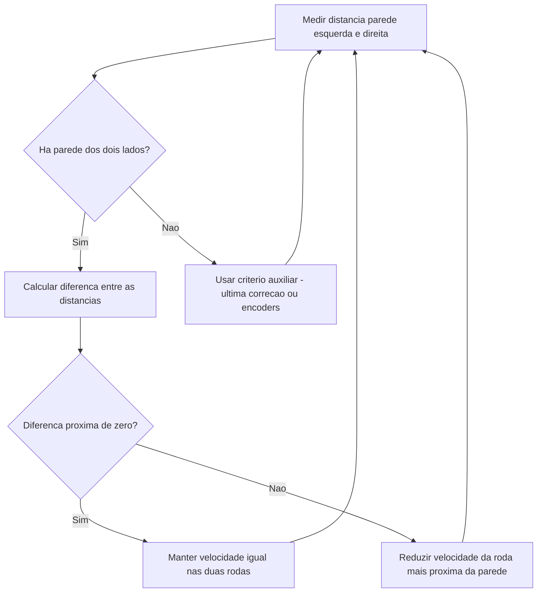
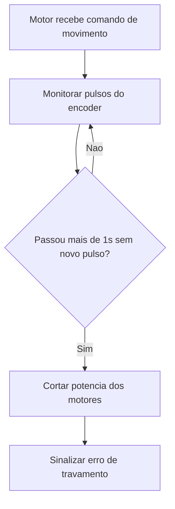

# Tópicos 3 e 4 — Projeto Conceitual de Software

> Parte da sub-issue de estruturação conceitual dos algoritmos do robô, vinculada à Issue Mãe #NUMERO_DA_ISSUE_PRINCIPAL. Cobre apenas os tópicos 3 e 4 do checklist.

---

## 3. Controle de Movimento

**Ideia central:** o robô não navega "olhando para frente" — ele se guia pela **distância às paredes laterais** do corredor. Enquanto avança em linha reta, dois sensores (um de cada lado, geralmente IR ou ultrassônico) medem continuamente a distância até a parede esquerda e até a parede direita.

- Se essas duas distâncias forem **iguais**, o robô está centralizado no corredor e mantém a mesma velocidade nas duas rodas.
- Se uma distância for **menor que a outra**, significa que o robô está se aproximando de um dos lados. Nesse caso, o firmware reduz um pouco a velocidade da roda do lado mais próximo da parede (ou aumenta a do lado mais afastado), fazendo o robô "corrigir" de volta para o centro.
- Essa correção é constante e proporcional ao tamanho do desvio: quanto mais perto de uma parede, maior a correção aplicada — é essa relação proporcional (e, se necessário, com um componente que reage à rapidez da variação) que caracteriza o controle como um **PID**, aplicado aqui de forma conceitual: erro = diferença entre as distâncias lateral esquerda e direita; a correção ajusta a velocidade diferencial entre as duas rodas até esse erro tender a zero.

**E quando não há parede de um dos lados?** Em trechos abertos (cruzamentos, entrada de outro corredor), a comparação de distâncias laterais deixa de ser confiável. Nesse caso o robô precisa de um critério auxiliar para não perder a referência de "reto" — por exemplo, manter momentaneamente a última correção aplicada, ou usar a diferença de giro entre as rodas (encoders) como estimativa de desvio, até voltar a ter parede dos dois lados.

---

## 4. Tratamento de Travamento (Stall)

**Regra conceitual:** se o firmware está comandando os motores a girar, mas o encoder não registra nenhum giro por mais de **1 segundo**, o robô está travado (roda presa, obstáculo, perda de contato com o chão) — e os motores devem ser cortados por segurança.

Na prática, isso funciona como uma vigilância paralela ao controle normal de movimento:

1. Sempre que o encoder detecta um novo pulso (giro real da roda), guarda-se o instante desse pulso.
2. Enquanto houver um comando de movimento ativo (motor não está em "parado"), verifica-se periodicamente: já passou mais de 1 segundo desde o último pulso registrado?
3. Se sim → **travamento confirmado**: corta-se a potência dos dois motores (PWM = 0) imediatamente, e o robô entra em um estado de erro, sinalizando isso de alguma forma (LED, buzzer, ou aviso na telemetria) até ser reiniciado manualmente.
4. Se o encoder continuar respondendo normalmente, o temporizador nunca chega a 1 segundo, e o robô segue o movimento normal.

---

### Observação sobre o padrão do documento

O template principal da disciplina (seção "Itens fundamentais") pede um **Diagrama de Atividades UML** geral, **Backlog do Produto** e **Arquitetura**. Os tópicos 3 e 4 acima são um nível de detalhe mais específico (algoritmos de firmware), então fazem sentido como uma subseção complementar dentro do "Projeto Conceitual de Software" — não substituem os itens fundamentais, apenas os aprofundam na parte de controle/segurança do robô.
